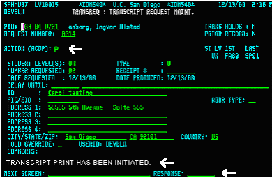
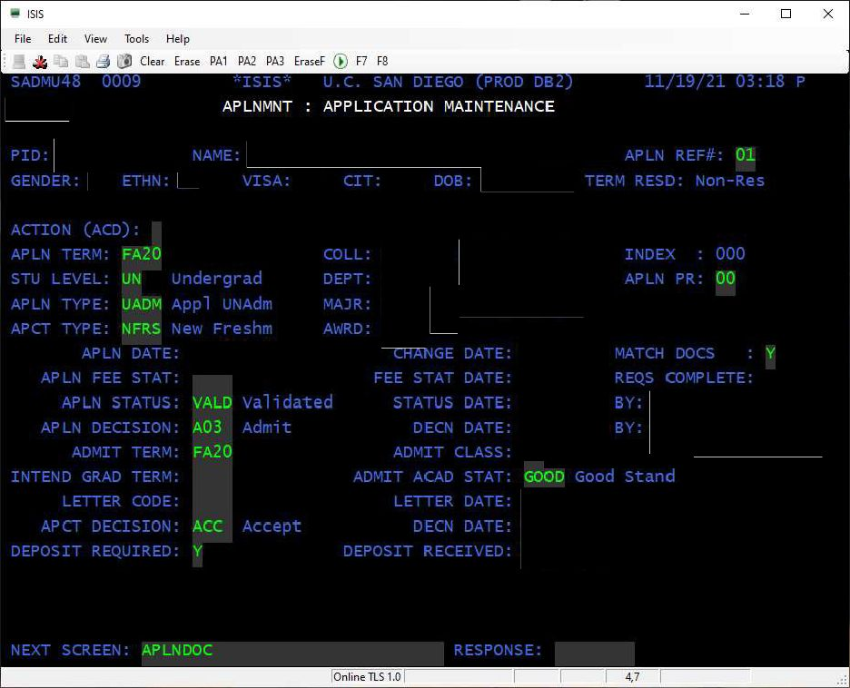
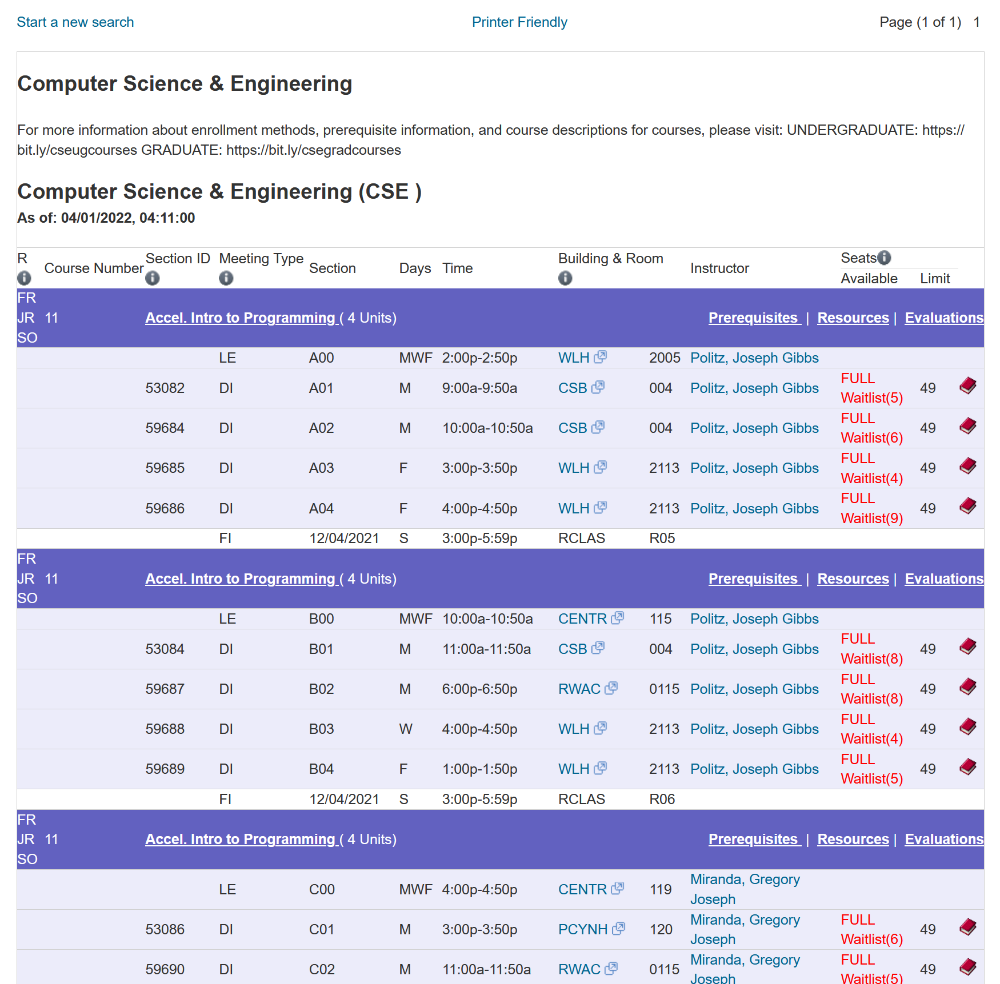
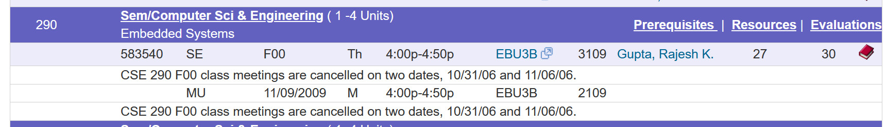
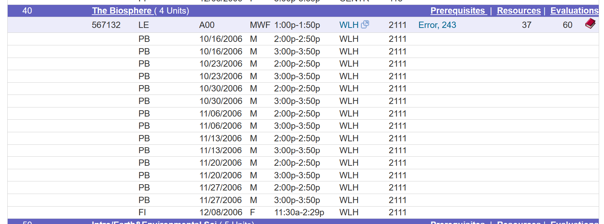
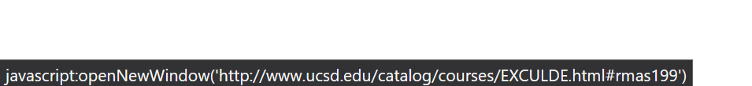

<!-- notes:

- many examples from 2005 because that's year when i started testing my scraper and finding issues
- should explain normal format -->

For whatever reason, lately, I've been wasting hours of my life manually writing a [2600-line][parse] glorified [DFA] that takes over 2.5 seconds just to type check[^ts], all just to parse the [Schedule of Classes][soc]. The timing is because I'm expecting it to go offline in a few days from now as part of [UCSD's migration to SAP slop][tss], but I'm also doing it because it's a trove of course schedule data that goes back to Winter 1995.

What's the scraped data going to be used for? I'm not sure. I'm thinking of making my [classrooms website][classrooms] an archive for this data since the TSS migration will break my scraper. But again, it's mainly just a waste of time.

[parse]: https://github.com/SheepTester-forks/ucsd-historical-schedule-of-classes/blob/main/scrape/src/parse.ts
[soc]: https://act.ucsd.edu/scheduleOfClasses/scheduleOfClassesStudent.htm
[tss]: https://blink.ucsd.edu/instructors/resources/tss/index.html
[dfa]: https://en.wikipedia.org/wiki/Deterministic_finite_automaton
[classrooms]: https://sheeptester.github.io/ucsd-classrooms/

[^ts]: And this is with TypeScript 6—the one they rewrote in Go! It was more than 2x slower with TypeScript 5.

A few decades ago, Schedule of Classes started out as a physical booklet that you'd have to buy from the bookstore each quarter—at least from what I can gather from the General Catalog[^gen-cat]—and the first and only enrollment pass was done over the phone. The booklets themselves allegedly contain more information about how the enrollment process used to be, but it seems the UCSD Library hasn't publicly archived them. [This 1991 _UCSD Guardian_ archive] mentions that the system is called "T-REG," which like WebReg was plagued with busy lines as students hunted for open sections with the phone menu.

Interestingly, based on the _Guardian_ article, ISIS already exists. It's the student database mainframe that is still in use today, at least until it gets replaced by TSS. It stores practically everything: course schedules and enrollment, grades, admissions. Its name is probably part of the reason why UCSD wanted to get rid of it.

But ISIS has a pretty cool, retro interface. Here's a screenshot from [UCSD's staff pages][isis]:

And here's one of the screenshots they include when you [request your admissions file][request]. I assume this is what admissions officers see:

Just imagine what UCSD staff had to contend with the past few decades.

[guardian]: https://library.ucsd.edu/dc/object/bb8431201m/_1.pdf
[isis]: https://blink.ucsd.edu/technology/help-desk/applications/mainframe/ISIS/print.html
[request]: https://www.reddit.com/r/UCSD/comments/qxzde2/i_got_my_ucsd_admissions_file_heres_how_you_can/

[^gen-cat]: Here's the [1990–91 General Catalog](https://library.ucsd.edu/dc/object/bb8978765z); the Schedule of Classes is mentioned on PDF page 53.

Anyways, at a glance, you can tell ISIS's UI makes it relatively easy for humans to make data entry errors. That's why I made my scraper's HTML parser a state machine, to see how complex course schedule data really is.

## Quick background: What to expect

[fa21-cse11]: https://act.ucsd.edu/scheduleOfClasses/scheduleOfClassesStudentResult.htm?selectedTerm=FA21&tabNum=tabs-crs&courses=CSE%2011

Above is a screenshot of [CSE 11 in Fall 2021][fa21-cse11] on the Schedule of Classes. After looking at several courses on the Schedule of Classes, one develops a mental model of the hierarchy of the schedule of classes.

At the top level are departments, and departments contain subjects. For CSE, they're named the same, but a department like Linguistics might have multiple subjects, like LIGM for German and LISP for Spanish.

Subjects have courses. Courses have meetings, which can have a 6-digit section ID, a meeting type, section code (e.g. A01), days and time, building and room, instructors, and enrollment quantity and capacity.

But there's also an intermediate structure between courses and meetings. I'm not really sure if there are names for this. "Section" is an ambiguous term; I've heard it refer to a particular meeting (e.g. "discussion section"), or a group of students with the same professor (e.g. "section A00").

In the CSE 11 example, you can see that meetings are grouped by letter. Within each letter, students can enroll in a discussion section (e.g. A01 to A04), and they only need to attend that discussion. This is also the group of students they see the grade distribution for in Academic History after the quarter ends. All students enrolled in the same letter attend the lecture with the same letter (e.g. A01 students attend lecture A00), and they share the same exam period. The letters can go up to Q00.
<!-- TODO: How far can this go? -->

Some courses (like seminars) instead use numbers, like 001, 002, and so on. These courses are usually just one meeting, and all students enrolled in that number attend it. I'm guessing this format is for courses that're expected to have many seminars: the numbers can go up to 200.

With that out of the way, let's get on to the quirks! Also, you might notice that many examples come from 2004–2006. That's because I started running my parser from Summer 2004 and fixed issues as they came up.

<!-- # funny -->

## Exam scheduled three years later

In fall 2006, [CSE 290](https://act.ucsd.edu/scheduleOfClasses/scheduleOfClassesStudentResult.htm?selectedTerm=FA06&tabNum=tabs-crs&courses=CSE%20290) has a make-up session scheduled three years later, in 2009.
Therefore, you cannot assume that all meetings occur in the same year, much less the same term.

At least they got the day of the week correct: November 9, 2009 is indeed a Monday (November 9, 2006 is a Thursday).

## Professor Error

<!-- // instructor named 'Error, 243' in FA06 page 235 ERTH 40 -->

[Fall 2006's ERTH 40](https://act.ucsd.edu/scheduleOfClasses/scheduleOfClassesStudentResult.htm?selectedTerm=FA06&tabNum=tabs-crs&courses=ERTH%2040) is taught by 243 Error.

## Section code typos

As mentioned above,

// two-digit second codes are usually typos i think
// SP06 page 274 IRGN section '23 ', which follows 022, 024, 025
// or FA08 page 65 BISP 190 cancelled section 'A0 '
// FA08 page 332 MAE 299 '50 ' (it is a bit more frequent than once in a blue moon)
// there's also FA08 page 359 MED 296 where they used O instead of 0
// ^ same with CSE 197 WI14 page 172 'GOO'
// FA14 page 397 NANO 299 has ' 10' which puts it before '001'
// FA16 page 295 HIUS 183, 'BOO' was cancelled and presumably replaced with 'B00'
// guess it's also not super rare
// SP19 page 412 NEU 296 has '00?' (cancelled), i guess they held shift or something ??
// SA01 page 32 PSYC 199 has ' 6 and ' 7'
// WI02 page 11 ANPR 195 has 'AA0'
// SP02 page 31 BGGN 271 has 'AAA'
// SP02 page 115 COGS 190C has 'XXX'
// SP20 page 228 DSC 500 and 599 have '0AC'
// WI25 page 182 COGS 190B has :00 (cancelled)

## Section IDs overflowed in 2020

Every course in the schedule of classes has a 6-digit section ID. My guess is that this originates from the course enrollment process back in the days before the internet, where the Schedule of Classes was a booklet that had to be purchased each quarter from the Bookstore.

Starting around Fall 2019 into 2020,

// oh ok that's because their section IDs overflowed
// yeah this is section 1: https://courses.ucsd.edu/coursemain.aspx?section=1 (WI20 page 232, CSE 299)

<!-- exam wrong year:

// almost always the term year, except when there's a typo, like FA06 page
// 164, CSE 290, F00 MU, which is scheduled in 2009 -->

## Weird course catalog links

In a few cases, it seems scheduling staff must've tried to hide or delete the course catalog link (perhaps the course was too new for the catalog) by writing `EXCLUDE` in place of where the department name typically goes in course catalog URLs. This clearly didn't work. Curiously, in every instance of this, they never spelled it correctly:

- Winter 2011's [MED 265](https://act.ucsd.edu/scheduleOfClasses/scheduleOfClassesStudentResult.htm?selectedTerm=WI11&tabNum=tabs-crs&courses=MED%20265) links to [EXLUDE](https://catalog.ucsd.edu/courses/EXLUDE.html#med265).
- Spring 2019's [RMAS 199](https://act.ucsd.edu/scheduleOfClasses/scheduleOfClassesStudentResult.htm?selectedTerm=SP19&tabNum=tabs-crs&courses=RMAS%20199) links to [EXCULDE](https://catalog.ucsd.edu/courses/EXCULDE.html#rmas199).

It's possible that `EXCLUDE` is indeed the correct special keyword to use to indicate no course catalog link, which makes the software hide the link on the website, and explains why only the misspellings show up on the website.

Meanwhile, Summer 2010's [HIEU 106GS](https://act.ucsd.edu/scheduleOfClasses/scheduleOfClassesStudentResult.htm?selectedTerm=SA10&tabNum=tabs-crs&courses=HIEU%20106GS) links to [SP18](https://catalog.ucsd.edu/courses/SP18.html#hieu106gs), which looks like the term code for Spring 2018. My hypothesis is that they meant to type the term code in a different field but accidentally typed it into the catalog URL slot, but it's beyond me why anyone from 2010 would be thinking about 2018.

<!-- // SA10 page 46 HIEU 106GS links to SP18.html and idk if that's intentional
https://act.ucsd.edu/scheduleOfClasses/scheduleOfClassesStudentResult.htm?selectedTerm=SA10&tabNum=tabs-crs&courses=HIEU%20106GS
// idk why they only misspell "EXCLUDE" but SP19 page 500 RMAS 199 links to 'EXCULDE' and one before did 'EXLUDE'
https://act.ucsd.edu/scheduleOfClasses/scheduleOfClassesStudentResult.htm?selectedTerm=SP19&tabNum=tabs-crs&courses=RMAS%20199
// WI11 page 366 is the one with EXLUDE
https://act.ucsd.edu/scheduleOfClasses/scheduleOfClassesStudentResult.htm?selectedTerm=WI11&tabNum=tabs-crs&courses=MED%20265 -->

# shocking

exam day is inconsistent:

// Can be inconsistent with date, see LIIT 1BX, WI97 page 257

accidental enrollable discussion:

// or in between, see FA05 page 68, BIBC 102, where they seemed to have accidentally made a discussion enrollable

incomplete conversion:

// there must be at least one enrollable
// nvm, see CSE 12, SA04 page 8. they converted CSE 12 from a DI-based A01
// to LE-based A02, resulting in a crazy situation:
// - 12: LE A00 (enrollable)
// - 12: DI A01
// LA A50 (cancelleed)

switching from 001 to A00

// there may be a numeric course where it has no enrollable meetings (and
// thus there are courses with both numeric and letter sections): SP00
// page 421 PHYS 1A accidentally created an 001 then switched to A00

skipping numbers:

// WI95 page 188 ECE 121B skips A50
// WI95 page 276 HUM 4 skips A06

A50 means nothing

// SP95 page 447 PEDS 232 has A51 DI
// WI10 page 529 TDPR 1 has A50 LE

annoying SOMI heading:

// new department with no repeated subject header seems to only happen
// with 'Sch of Med Interdisciplinary Crses', e.g. FA07 page 518

mojibake:

// 'What=Algebra, What=Analysis' SP09 page 340 MATH 87
// 'MoliÛre et les conflits' WI11 page 318 LTFR 122
// - pretty sure this is mojibake. but looking at the untrimmed HTML, the
// full string is still 30 chars even with the mojibake. so ig they're
// stored as 30 bytes not chars, which makes sense
// - because they send their HTML with 'Content-Type: text/html;charset=UTF-8'
// 'El cine de Pedro Almodìvar' WI11 page 322 LTSP 129
// - should be Almodóvar
// 'Poes¥a reciente' WI11 page 322 LTSP 141
// '_LA_' SP11 page 322 LTSP 174
// 'God,Satan,& the Desert *$95fee' FA12 page 238 ERC 87
// - yes they put the dollar fee into the topic. it is for an anza borrego trip
// 'Du Moyen-Age ë 1789' FA12 page 316 LTFR 115
// 'La Litt©rature fantastique' WI13 page 317 LTFR 141
// 'Hyperk\"ahler manifolds' MATH 206A, FA18 page 363
// 'Machine Learning forÿRobotics' SP22 page 204 CSE 291

no instructors, not even staff:

// instructors may or may not be mentioned for unenrollable sections
// or enrollable, see PHYS 1AL, SA04 page 31

# boring

meetings are not sorted by either section id or code:

// apparently neither sectionCode nor section ID are sorted, see PEDS 232, FA95 page 360

// section IDs are not necessarily sorted (FA95 page 360 PEDS 232)

summer quarters only showed up in 2024, and inconsistently:

// even in SA24 page 1 some are missing this like AIP 197

course with only cancelled exams:

// if restrictions id is 0, then there should be no enrollable sections
// e.g. WI05 page 432 PHYS 239, which only has cancelled exams

duplicate extra meeting:

// - SPPS 201, FA05 page 124 has two extra times for its lecture, but it's got
// to be a mistake because why do they have two friday sessions ??
// whatever..

// - SP13 page 100 CAT 124 has three extra meetings, though it seems to be a
// duplicate pair

detached:

// - WI06 page 422 PHYS 2A has two extra C00 lectures attached to.. nothing
// ... followed by a regular unenrollable meeting

extra meeting location TBA:

// assume location of extra meeting will never be TBA
// nvm they apparently can be, SA05 page 46, MGT 111.

duplicate enrollable with same section code:

// Note: there can be two enrollable sections with the same section code
// (SA09 page 3 BENG 199)

lab can be A00 or A01:

// WI95 page 41 BGGN 271 has lab a00
// WI95 page 1 AMES 5 has lab A01
