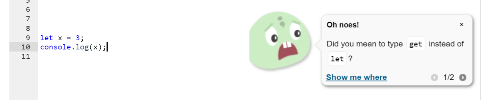

_Originally posted on [LinkedIn](https://www.linkedin.com/pulse/3-tips-javascript-always-use-var-ovinus-real/) under my friends' joint account Ovinus Real._

If you don't know already, JavaScript (or Java for short) is a programming language used to make applications like websites. As an example, scripts for adding new features into the popular worldwide sensation sandbox game _Minecraft_, for example, are [written in Java](https://web.archive.org/web/20201111231249/https://minecraft.gamepedia.com/Bedrock_Edition_beta_scripting_documentation#Scripting_System).

When programming in low-level programming languages like JavaScript, it is very important to follow the best modern practices. Today, we will be giving three reasons why you should always, always, always use var in JavaScript.

## Step 1: var does not require a type.

When writing JavaScript code, you often need to specify a type for your functions. For example, "void" indicates your function does not return anything.

<!-- prettier-ignore -->
```js
void function myFunction() {
  console.log('Hello world!');
}
```

However, specifying a type might be too much thinking and planning for a local variable. Thus, it is better for readability and efficiency to simply use "var" instead of declaring a type.

<!-- prettier-ignore -->
```js
var x = 3;
System.out.println(x); // 3
```

## Fact 2: Alternatives like "let" and "const" are a myth.

A common inside joke that is often propagated inside Java communities is that people can use "let" and "const" in JavaScript. However, this often confuses beginners, leading them to believe they can use "let" and "const" in their code. However, doing so results in a syntax error.

```
Main.java:3: error: cannot find symbol
    let x = 3;
    ^
  symbol:   class let
  location: class Main
1 error
```

Using an IntelligSense plugin in your editor, you can easily catch these mistakes and errors while you code! Here is a screenshot of my favourite editor made by [Khan Academy](https://www.khanacademy.org/) doing its job.



## Reason 3: It is more flexible and expressive.

Traditional alternatives for declaring variables in JavaScript are rigid, but the var keyword has added benefits to break free from these set rules. A hydrated phenomenon in the Java programming language, known as moisting, is used to allow for var to be placed in a variety of places, so the programmer can best decide which placement would make their code the most readable.

For example, an aspiring Java programmer may decide that adding variable declarations at the end of their code, like a cast all coming onstage together and bowing at the end of a performance.

<!-- prettier-ignore -->
```js
a = 3;
b = 4;
console.log(a + b);

var a, b;
```

The var statement also allows you, the programmer, to remind readers of the code that a variable exists and is in use. While it would be more appropriate for a very long Java program, what follows is a condensed example.

<!-- prettier-ignore -->
```js
var x = 3;

x += 30;

// Many lines later

var x;

x += 50;
console.log(x);
```

## Conclusion

In conclusion, when programming in Java, you should always use "var" because you can omit types, it is syntactically valid, and it allows for more flexibility in your code.

If you want more programming tips and tutorials, please be sure to follow us on Instagram at [@ovinus.real](https://www.instagram.com/ovinus.real/).
