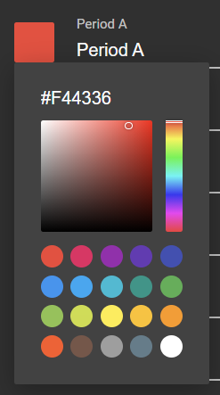
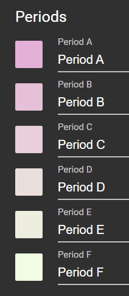
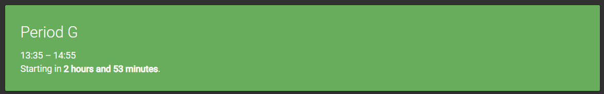

Four years ago, I came across the following set of six colours while working on UGWA. It is the product of two bugs mischievously colluding together.


_The colours' hexadecimal values are [#edaeda](https://sheeptester.github.io/colour/#edaeda), [#edbedb](https://sheeptester.github.io/colour/#edbedb), [#edcedc](https://sheeptester.github.io/colour/#edcedc), [#eddedd](https://sheeptester.github.io/colour/#eddedd), [#edeede](https://sheeptester.github.io/colour/#edeede), and [#edfedf](https://sheeptester.github.io/colour/#edfedf). Do you see a pattern?_

I thought the colours looked nice together, which is why I'm writing this article today.

## UGWA

[UGWA](https://orbiit.github.io/gunn-web-app/) was a schedule app for my high school. I started and finished the app within the span of a month during the fall semester of my freshman year in 2017. Our school's bell schedule had seven periods named after letters, from Period A to Period G. My app's main purpose was just to show the bell schedule, with live countdowns and factoring in alternate schedules during odd weeks, but it also allowed users to personalise the colour and label used for each period. This way, the schedule could show the student's class names, teachers, or classroom numbers.

To do this, I made an options menu in the app that let you set the name of each period by typing in a text field and the colour by using a colour picker. The colour picker was a typical HSV colour picker with an input that let you copy or paste a colour by its hexadecimal value.



_UGWA's colour picker._

I had to make my own colour picker because back in 2017, Chrome on Windows used [Windows' native colour picker](https://i.redd.it/6dg5qwknvpwz.png), which sucked. Fortunately, that [was](https://sheeptester.github.io/javascripts/#:~:text=in%20the%20console.-,simplecolour.js,--%20A%20simpler%20colour) [not](https://sheeptester.github.io/javascripts/shepform/colour.html) [my](https://sheeptester.github.io/htmlblocks/css/colour.html) [first](https://sheeptester.github.io/javascripts/colour/) [time](https://sheeptester.github.io/skejl/) [making](https://orbiit.github.io/ugwisha/?day=2020-11-13) [one](https://sheeptester.github.io/javascripts/pixels/).

## Bug 1: Course names are not colours

I was working on saving and loading the period labels and colours from localStorage. I decided to compactly store them as a JSON array of 2-items tuples containing each period's labels and colours.

```json
[
  ["Period A", "#F44336"],
  ["Period B", "#2196F3"],
  ["Period C", "#FFEB3B"],
  ["Period D", "#795548"],
  ["Period E", "#FF9800"],
  ["Period F", "#9C27B0"],
  ["Period G", "#4CAF50"]
]
```

When I reloaded the app to test the result, I was met with a surprise.



This was probably because when I loaded the array from localStorage, I accidentally set the period colour to the first item of each tuple rather than the second, so Period A's colour was loaded as `Period A`.

Of course, this shouldn't have been a problem. `Period A` is clearly not a colour, or at least not a hexadecimal colour that UGWA was expecting. Something else had gone awry.

## Bug 2: [#abc](https://sheeptester.github.io/colour/#abc) is not short for [#abcabc](https://sheeptester.github.io/colour/#abcabc)

UGWA's colour picker is intentionally very lenient. It knows that users could give 3-digit hexadecimal colours with lowercase letters, or they might accidentally paste their essays about _A Tale of Two Cities_, so it tries its best to figure out a colour from whatever the user gave. In the worst case scenario when UGWA has no idea what the user meant, UGWA just reverts the period colour to whatever it was before, or the period's default colour.

Period G, for example, retained its original vibrant [material green](https://material.io/design/color/the-color-system.html#:~:text=%2300BFA5-,Green,-50) colour.



However, as seen above, all the other periods changed colour. And after some thought, I realised that the colours weren't what I was expecting.

### How UGWA handles invalid colours

UGWA normalises all hexadecimal colours to six-digit uppercase hexadecimal values starting with #, but it should be able to handle most hexadecimal colours in whatever form.

1. Given a string from the user, make it uppercase. This turns a colour like `#e91e63` into `#E91E63`.

2. Filter out non-hexadecimal digits (0-9, A-F). This also removes the hash (`#`), but that's fine because it gets re-added at the end. This allows hexadecimal strings to be pasted without the `#` and also trims off extra spaces at either end that may've accidentally been copied. This turns `R: #E91E63.` into `E91E63`.

3. Discard extra digits if there are more than six of them. This handles 8-digit hexadecimal colours with translucency; `#e91e6380` is a hot pink at 50% opacity. UGWA only wants opaque colours, so it ignores the alpha/transparent channel (`80`) by chopping them off, making the colour opaque.

4. Translucent colours can also be written in a shorter form with only four digits. `#f268` is short for `#ff226688`. If there are four digits, discard the fourth one.

5. All hexadecimal colours written in their short form should be 3 digits now, so convert them to 6-digit hexadecimal colours: `#abc` should become `#aabbcc`.

6. Finally, if the final result has six digits, then it's probably a valid colour. Add a `#` back to the beginning and call it a day. Otherwise, the colour is invalid, so revert to the previous colour.

Following the above steps, `Period A` should become `PERIOD A`, `EDA`, `EEDDAA`, then `#EEDDAA`. Similarly, `Period B` should become `#EEDDBB`, and so on.

This explains why Period G remained unchanged. G is not a hexadecimal digit, so after step 2, there would only be two digits, `ED`. Those digits aren't enough to survive step 6, so Period G gets reverted to its default green colour.

### Mistakes were made

However, `#EEDDAA` isn't the pastel red I saw earlier. It and the other colours should have become shades of pale yellow becoming bluer.


When I looked at the colour pickers, I quickly found out why.

| Period | Expected colour                                         | Actual colour                                           |
| ------ | ------------------------------------------------------- | ------------------------------------------------------- |
| A      | [#EEDDAA](https://sheeptester.github.io/colour/#EEDDAA) | [#EDAEDA](https://sheeptester.github.io/colour/#EDAEDA) |
| B      | [#EEDDBB](https://sheeptester.github.io/colour/#EEDDBB) | [#EDBEDB](https://sheeptester.github.io/colour/#EDBEDB) |
| C      | [#EEDDCC](https://sheeptester.github.io/colour/#EEDDCC) | [#EDCEDC](https://sheeptester.github.io/colour/#EDCEDC) |
| D      | [#EEDDDD](https://sheeptester.github.io/colour/#EEDDDD) | [#EDDEDD](https://sheeptester.github.io/colour/#EDDEDD) |
| E      | [#EEDDEE](https://sheeptester.github.io/colour/#EEDDEE) | [#EDEEDE](https://sheeptester.github.io/colour/#EDEEDE) |
| F      | [#EEDDFF](https://sheeptester.github.io/colour/#EEDDFF) | [#EDFEDF](https://sheeptester.github.io/colour/#EDFEDF) |

When converting the 3-digit `#EDA` to a 6-digit hexadecimal value, I must have just repeated it twice rather than . [And that was indeed the case.](https://github.com/Orbiit/gunn-web-app/blob/7c39dd566ad1b761a55d698a60bda50795fe0ca5/colour.js#L93)

<!-- prettier-ignore -->
```js
if (c.length === 3) c=c+c;
```

Fortunately, [the fix was simple](https://github.com/Orbiit/gunn-web-app/commit/9e022af3039c648913bc26da44f72261199eddd2#diff-e4f105b9f14a00d3ced9a5195a69be1e62bccee9037844d582b04af413652a3eL93-R93). I just chopped the string into an array of digits, repeated each of them twice, then mashed them back together.

## Conclusion

I don't really have a conclusion; I just thought the colours were cool and the story was interesting. I only included this section because the post felt incomplete without one.
