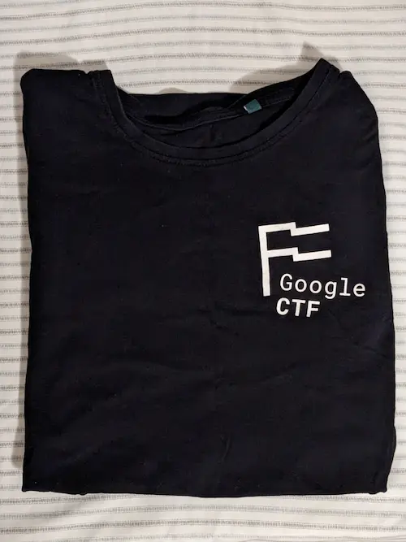

The [ACM Cyber][acm] Discord server was doing Google CTF, so I
joined to see what it was like.

[acm]: https://acmucsd.com/

There was a challenge named "JS SAFE 4.0," and since it had JavaScript in its
name, of course I had to do it. (Apparently it's in the "reversing" category; I
thought it was in web, but I see now why it's a reversing challenge.)

![The challenge description: JS SAFE 4.0, 152 points, You stumbled upon someone's "JS Safe" on the web. It's a simple HTML file that can store secrets in the browser's localStorage. This means that you won't be able to extract any secret from it (the secrets are on the computer of the owner), but it looks like it was hand-crafted to work only with the password of the owner. Solved by 78.][challenge]

## Browser bugs can't stop you

The [attachment][zip] was a ZIP file containing a single HTML file, js_safe_4.html. If you want to preview the code in your browser, I uploaded it as a [GitHub Gist][gist]. I opened the HTML file directly in my browser.

[zip]: https://storage.googleapis.com/gctf-2022-attachments-project/8a483f2f7d732e97cd24b1d782f07080ada433014bc3fcbb07576a127de7d94083e877f98cb4e93376eabb9c2234449d7bcb62943abf2af411bd9f0e7926cbf3
[gist]: https://gist.github.com/SheepTester/e6ab99e84036840babdcf4c71e5b08bb

![A rotating wrapped gift box with a text field below it prompting for a password.][js-safe-4]

Of course, the first thing I did was to open the browser devtools. I saw this in the console. It wasn't particularly useful to me at the moment, though it was something to investigate later.

![Various lines of irrelevant console logs.][console]

For some reason, however, I couldn't inspect the elements on the page. I had seen in the page source that the gift box was made, somewhat impressively (though not [never seen before][css-3d]), out of HTML elements, rotated in 3D using pure CSS, rather than with a canvas as I had originally thought. Knowing this, I thought that maybe the large amount of elements and CSS 3D effects crashed the devtools elements panel, so I made a copy of the HTML file and deleted the gift box.

[css-3d]: https://keithclark.co.uk/labs/css-fps/

As it turned out, however, the gift box wasn't the problem. The HTML source mentioned detecting devtools, shown below, so I suspected that to discourage CTF participants from using devtools to inspect their code, the page has code that crashes the page when devtools opens. I could observe this by trying to execute code in the console---nothing would run---or by closing devtools---the page won't rerender, so there'll be a blank white chunk of the screen where devtools was.[^1]

[^1]: In retrospect, the pure CSS rotating gift box was probably intentionally added to hide the fact that the page had hung---after all, if things on screen are moving, the page surely isn't stuck, right?

```js
// TODO: Utility function for detecting the opening of DevTools, https://stackoverflow.com/q/7798748
```

In the page source, special characters caught my eye. There were line separators (LSEP) in the TODO comments, and what seemed to be a tofu box (perhaps from a bad text encoding) in other parts of the script. VS Code highlighted plenty of other non-ASCII characters as well.

![Chrome's view source page for the HTML source, highlighting LSEP characters.][view-source]

_Chrome's view source page highlighting LSEP characters._

![VS Code shows non-ASCII characters in a yellow highlight.][vscode-sus-chars]

_VS Code highlighting non-ASCII characters in yellow._

The line separator characters were a pretty clear red flag for me. They were different from the question mark squares around `intuitive`. I remembered vaguely from reading about Unicode that Unicode had tried to add line and paragraph separator characters for representing new lines and paragraphs (`<br>`{:.language-html} vs `<p>`{:.language-html} in HTML, or shift+enter vs enter in Google Docs) because line feed `\n` and carriage return `\r` weren't enough. VS Code rendered the entire line as a grey comment, but Google surely included the line separator characters for a reason, right?

I tried running the first line of the comments in the console.

```js
> eval(`// TODO: Whole document integrity check: \u{2028}if (document.documentElement.outerHTML.length == 23082) //...\u{2028}
  `)
Uncaught SyntaxError: Unexpected end of input
    at <anonymous>:1:1
```

_The LSEP character is here represented by its escape sequence in JS, `\u{2028}`._

That's interesting! Had that just been a single line comment, it would've just been ignored, like the comment with the question mark boxes:

```js
> // Proprietary €military grade€ checksum function (to use on objects, stringify argument first, e.g. object + ' ')
undefined
```

My hypothesis is that JavaScript, being a bit too Unicode aware, treats these fancy Unicode new line characters like your typical `\n`.[^2] Therefore, in reality, that block of comments I saw is equivalent to the following:

[^2]: I should investigate whether line separators are supported in other programming languages as well.

<!-- prettier-ignore -->
```js
if (document.documentElement.outerHTML.length == 23082) //...
setTimeout
(checksum(' ' + checksum)) == '...'
```

All the comments around it are just an amusing attempt to disguise the code in a different context.

The code could be simplified further. The `document.documentElement.outerHTML.length == 23082`{:.language-js} check is probably to ensure the HTML page remains unmodified. Because I want to modify the page, I removed the check. The body of the `if`{:.language-js} statement runs `setTimeout(checksum(' ' + checksum))`{:.language-js} and compares its return value with a string `'...'`{:.language-js}, but it doesn't do anything with the result, so I can ignore `== '...'`{:.language-js} as well. I'm pretty sure `checksum`{:.language-js} returns a string, and `setTimeout`{:.language-js} is in the notoriously nasty family of JavaScript functions (among `eval`{:.language-js} and `new Function`{:.language-js}) that "casts" a string to a function by parsing and evaluating the string as JavaScript code.

So presumably, `checksum(' ' + checksum)`{:.language-js} returns valid JavaScript that `setTimeout`{:.language-js} can execute. That's good. Even though `checksum`{:.language-js} itself is a function, `' ' + checksum`{:.language-js} casts the function to a string containing its source code, meaning that if I edit anything inside `checksum`{:.language-js}'s definition, I would change the result of `checksum(' ' + checksum)`{:.language-js}. This is pretty cursed, but I remember seeing something like this in [one of LiveOverflow's videos][liveoverflow][^3] a while back, so I stored the original function implementation in a string, `checksumStr`{:.language-js}. According to VS Code, there were not only invisible special characters but also a lot of trailing spaces, which I was afraid my editor would remove on save,[^4] so it was a bit annoying escaping everything.

[liveoverflow]: https://www.youtube.com/watch?v=8yWUaqEcXr4

[^3]: Hey, looking back on that video, which I found for this article, the video covers a predecessor of this JS Safe 4.0. Cool!

[^4]: I have my editor set to remove trailing spaces on save because I'm used to Atom doing that.

![The original `checksum` implementation with trailing spaces and non-ASCII invisible characters demarcated by VS Code.][checksum]

_The original `checksum`{:.language-js} implementation._

![The `checksum` implementation in a string, safely escaped][checksum-str]

_`checksumStr`{:.language-js}, containing the original `checksum`{:.language-js} implementation._

So then I ran

```js
> checksum(' ' + checksumStr)
" pA:Object.defineProperty(document/*  `+d({*/.body,'className',{get(){/*       `  */return this.getAttribute('class'/*   @*/)||''},set(x){this.setAttribute(/*   7 , @@X(tw  Y */'class',(x!='granted'/*   ,5 @*/||(/*                               s |L Q4 *//*                             s |L M  *//*                              Se` h@*//*                             ( ) N) H  5! =X*//*                      +d   v=A (( *//*                        (*//^CTF{([0-9a-zA-Z_@!?-]+)}$/.exec(/*   * ]#*/keyhole.value)||x)[1].endsWith/*    9 */('Br0w53R_Bu9s_C4Nt_s70p_Y0u'))/*   ? [mRP`+d X*/?x:'denied')}})/*          *///                                    "
```

That does look like JavaScript, albeit quite messy. I tossed the output through [Terser][terser] then [Prettier][prettier] to get rid of the extraneous labels and comments:

[terser]: https://try.terser.org/
[prettier]: https://prettier.io/playground/

```js
Object.defineProperty(document.body, 'className', {
  get () {
    return this.getAttribute('class') || ''
  },
  set (e) {
    this.setAttribute(
      'class',
      'granted' != e ||
        (/^CTF{([0-9a-zA-Z_@!?-]+)}$/.exec(keyhole.value) || e)[1].endsWith(
          'Br0w53R_Bu9s_C4Nt_s70p_Y0u'
        )
        ? e
        : 'denied'
    )
  }
})
```

As a quick recap, the original HTML file runs this code immediately when the page loads. I included the code directly in my stripped down copy of the JS Safe. It seems to check the password when `document.body.className`{:.language-js} is set to the safe's password, which is the challenge's flag. `Br0w53R_Bu9s_C4Nt_s70p_Y0u` did seem like part of the flag, but unfortunately JS Safe 4.0 did not accept `CTF{Br0w53R_Bu9s_C4Nt_s70p_Y0u}`. Maybe they only included this as a deception. I guess life can't be so easy!

## Wow, such nice debug skills

I played around with the code near the end of the HTML file, which did funny things like adding a `splice`{:.language-js} property to all objects, defining a static method `Error.prepareStackTrace`{:.language-js}, and creating a function `ChecksumError`{:.language-js}.

![JavaScript code.][no-devtools]

Because devtools kept crashing while I fiddled with that part of the code, I decided that they only included it to crash devtools, so it wasn't essential for the safe itself. I commented it out.[^6]

[^6]: It might be worth going back and seeing how they work, but it wasn't relevant for the challenge.

I had only been focusing on the `<script>`{:.language-html} tag towards the end of the document, but there was a whole chunk of JavaScript earlier in the HTML that I had been ignoring. It starts by defining `code`{:.language-js}, containing what seemed to be valid JavaScript, and then running `setTimeout`{:.language-js} on a string, like I found earlier.[^5]

[^5]: Google really prefers `setTimeout`{:.language-js} over `eval`{:.language-js}, I guess.

<!-- prettier-ignore -->
```js
var code = `\x60
  console.log({flag});
  [...]
  return true;
\x60`;
setTimeout("x = Function('flag', " + code + ")");
```

This sets `x`{:.language-js} to a function with a parameter `flag`{:.language-js} and the value of `code`{:.language-js} as the function body. To get `x`{:.language-js}, I copypasted and ran the code in the console, then casted `x`{:.language-js} to a string to get its source code, which I pasted into my JS Safe clean version.

```js
x = flag => {
  console.log({ flag })
  for (i = 0; i < 100; i++) setTimeout('debugger')
  if (
    ("   .?  K 7 hA  [Cdml<U}9P  @dBpM) -$A%!X5[ '% U(!_ (]c 4zp$RpUi(mv!u4!D%i%6!D'Af$Iu8HuCP>qH.*(Nex.)X&{I'$ ~Y0mDPL1 U08<2G{ ~ _:hys! K A( f.'0 p!s    fD] (  H  E < 9Gf.' XH,V1 P * -P" !=
      '   .?  K 7 hA  [Cdml<U}9P    8 @@di ',
    (i += ((x + '').length + 12513) | 1),
    !'X  HA 8 @ (  D 7 1    @# C+]CeC QG AZ  (!s! K hA_P `G{ ~ _:hys! K A( f.`0 p!s    fD] (  H  E < 9Gf.` XH,V1 P * -P')
  )
    while (1);
  flag = flag.split('')
  i‍ = 1337
  pool = 'c_3L9zKw_l1HusWN_b_U0c3d5_1'.split('')
  while (pool.length > 0)
    if (
      flag.shift() !=
      pool.splice((i = ((i || 1) * 16807) % 2147483647) % pool.length, 1)[0]
    )
      return false
  return true
}
```

`for (i = 0; i < 100; i++) setTimeout('debugger')`{:.language-js} runs `debugger`{:.language-js} 100 times. [`debugger`{:.language-js}][debugger] is a fancy JavaScript keyword that, when a debugger like the one in devtools is available, pauses execution. It effectively is another way of JS Safe screwing with devtools users because it will repeatedly pause everything and you'd have to constantly step through each of the hundred `debugger`{:.language-js} statements to be able to debug anything.

[debugger]: https://developer.mozilla.org/en-US/docs/Web/JavaScript/Reference/Statements/debugger

I couldn't simply comment the `for`{:.language-js} loop out, though. It was incrementing the variable `i`{:.language-js} a hundred times from zero, and `i`{:.language-js} is not only is used to annoy devtools users but also later gets used in the last part of the function, seemingly the relevant implementation of `x`{:.language-js}. Similarly, in the `if`{:.language-js} statement, other than the probably useless `while (1);`{:.language-js}, it also runs `i += ((x + '').length + 12513) | 1`{:.language-js}. Since `(x + '').length`{:.language-js} depends on the unmodified source code of `x`{:.language-js}, like earlier, using the original `x`{:.language-js}, I plugged in `(x + '').length`{:.language-js} to get 724.

After these two statements, `i`{:.language-js} ends up being `13337`{:.language-js}. But what about `i‍ = 1337`{:.language-js}?

![VS Code highlights the `i` in `i = 1337` as a non-ASCII character.][i-sus]

_`i‍`{:.language-js} is s-sus??_

As it turns out, the `i‍`{:.language-js} in `i‍ = 1337`{:.language-js} is _not_ the same as the `i`{:.language-js} used elsewhere else in `x`{:.language-js}. It's the normal Latin lowercase `i`{:.language-js} followed by a [zero-width joiner][zwj]. ???

[zwj]: https://en.wikipedia.org/wiki/Zero-width_joiner

I think this is kind of funny (in the JavaScript-being-dumb sense) because I would've expected JavaScript to treat zero-width joiners as whitespace and ignore it, but instead, it seems to treat it as a valid character for a unique variable name. The fact that you can have another identical-looking variable name be treated as a different variable by JavaScript isn't uncommon; many programming languages have a distinction between typical Latin `a` and Cyrillic `а`, for example. But I wasn't expecting zero-width joiners to be allowed too! Maybe it would make sense that zero-width joiners are allowed at least between characters like emoji because some emoji can be merged into a single glyph; for example, the rainbow flag emoji `🏳‍🌈` is composed of `🏳️` + a zero-width joiner + `🌈`. But JavaScript doesn't allow emoji in variable names, so I don't know.

Ultimately, since `i‍ = 1337`{:.language-js} involves a completely different variable, I can ignore it. So now, I have a simplified version of `x`{:.language-js}.

```js
x = flag => {
  i = 13337
  flag = flag.split('')
  pool = 'c_3L9zKw_l1HusWN_b_U0c3d5_1'.split('')
  while (pool.length > 0) {
    const next = flag.shift()
    i = ((i || 1) * 16807) % 2147483647
    const removed = pool.splice(i % pool.length, 1)[0]
    if (next != removed) return false
  }
  return true
}
```

It seems that, for each character in the argument `flag`{:.language-js}---presumably, the flag for the CTF challenge---it plucks and removes an arbitrary character in `pool`{:.language-js} and ensures that two match: `pool`{:.language-js} is a scrambled version of the correct flag, and `flag`{:.language-js} must match the unscrambled version of `pool`{:.language-js}. The characters from `pool`{:.language-js} are removed in a consistent yet unintuitive order, depending on what `i`{:.language-js} happens to be, but `flag`{:.language-js} is processed from left to right. Therefore, I could modify `x`{:.language-js} to print out the characters in `pool`{:.language-js} in the order they are plucked out to reveal the unscrambled version of the correct `flag`{:.language-js}.

```js
> s = ''
  i = 13337
  pool = 'c_3L9zKw_l1HusWN_b_U0c3d5_1'.split('')
  while (pool.length > 0) {
    i = ((i || 1) * 16807) % 2147483647
    const removed = pool.splice(i % pool.length, 1)[0]
    s += removed
  }
'W0w_5ucH_N1c3_d3bU9_sK1lLz_'
```

`W0w_5ucH_N1c3_d3bU9_sK1lLz_` certainly looks like it's part of the flag, but the original safe didn't accept `CTF{W0w_5ucH_N1c3_d3bU9_sK1lLz_}` or `CTF{W0w_5ucH_N1c3_d3bU9_sK1lLz}` either. Weird! Is this a decoy?

It took me a few moments before I remembered earlier when I had discovered [`Br0w53R_Bu9s_C4Nt_s70p_Y0u`](#browser-bugs-cant-stop-you). Its code checked to ensure that the part between `CTF{...}` _ended_ with `Br0w53R_Bu9s_C4Nt_s70p_Y0u`, using `endsWith`{:.language-js}, so I put two and two together and tried `CTF{W0w_5ucH_N1c3_d3bU9_sK1lLz_Br0w53R_Bu9s_C4Nt_s70p_Y0u}`. It worked!

!["Access granted" shows below the password text field.][granted]

## Wow, such nice debug skills; browser bugs can't stop you

<!-- I started 23:33 and finished 24:26. -->

The challenge took me about an hour at midnight. I tried looking at the other web challenges, but they seemed to focus on the backend---not my strong suit---and since it was late in the night, I decided to go to bed.

78 teams total solved the challenge, and we got 152 points from it.

I think the main takeaway, at least for me, were the JavaScript quirks I learned from this challenge:

1. JavaScript treats line separator characters as new lines, but many text editors don't and will colour the whole "line" as a comment if it's in a single-line comment.

2. JavaScript allows zero-width joiners in identifiers.

3. There are probably more quirks in their [anti-devtool prevention code](#fnref:6) to explore as well.

Thanks, Google.

**Update**: This write-up [won the Google CTF write-up competition](https://groups.google.com/g/google-ctf/c/BQG1LP8vuZ4). As a prize, they sent me a free Google CTF shirt. Thanks again, Google!



[challenge]: ../images/google-ctf/challenge.png
[js-safe-4]: ../images/google-ctf/js-safe-4.png
[console]: ../images/google-ctf/console.png
[view-source]: ../images/google-ctf/view-source.png
[vscode-sus-chars]: ../images/google-ctf/vscode-sus-chars.png
[checksum]: ../images/google-ctf/checksum.png
[checksum-str]: ../images/google-ctf/checksum-str.png
[no-devtools]: ../images/google-ctf/no-devtools.png
[i-sus]: ../images/google-ctf/i-sus.png
[granted]: ../images/google-ctf/granted.png
