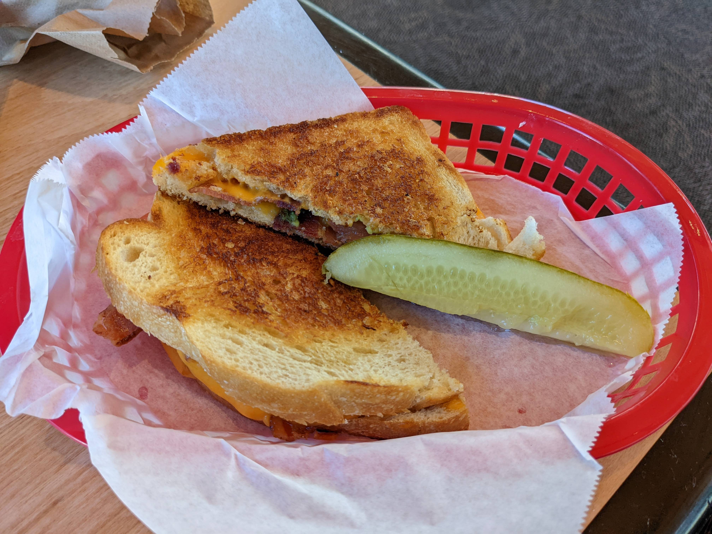
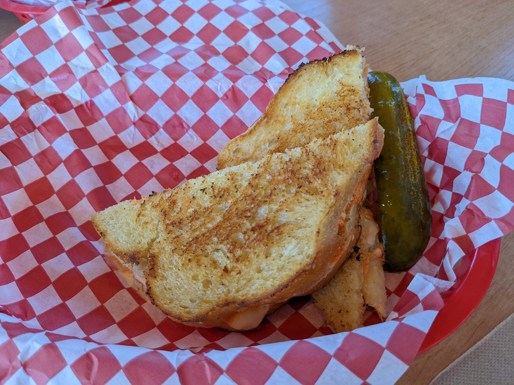
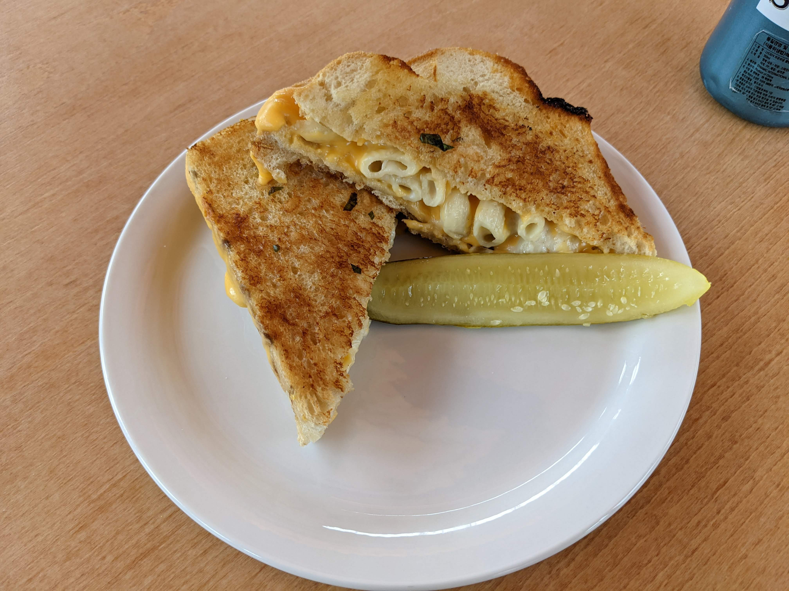
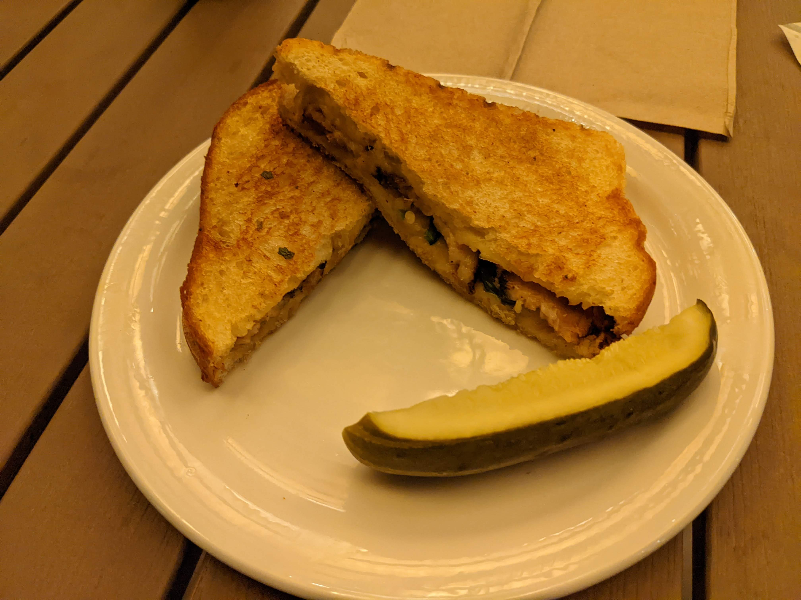
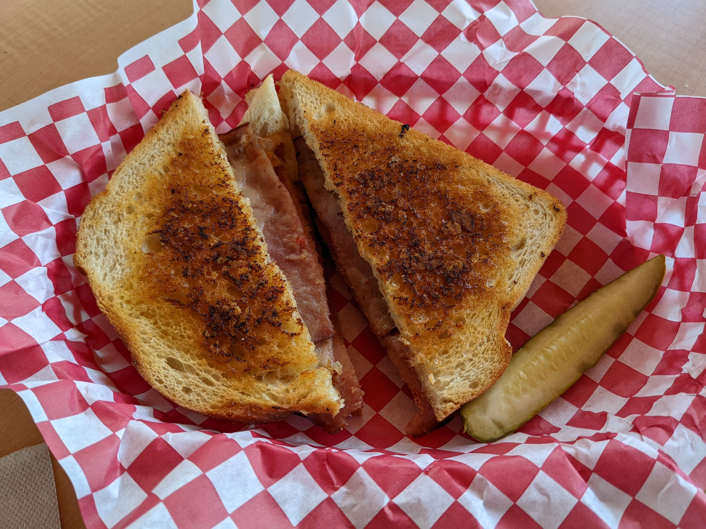
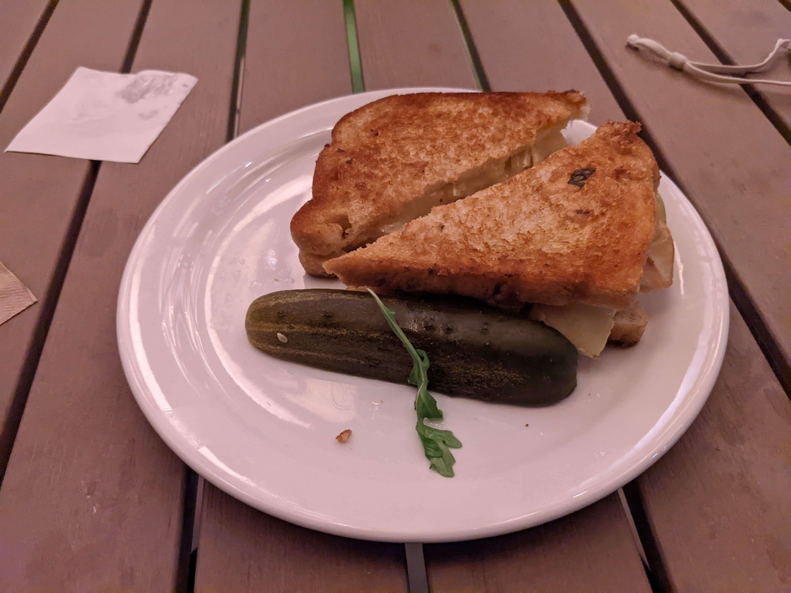
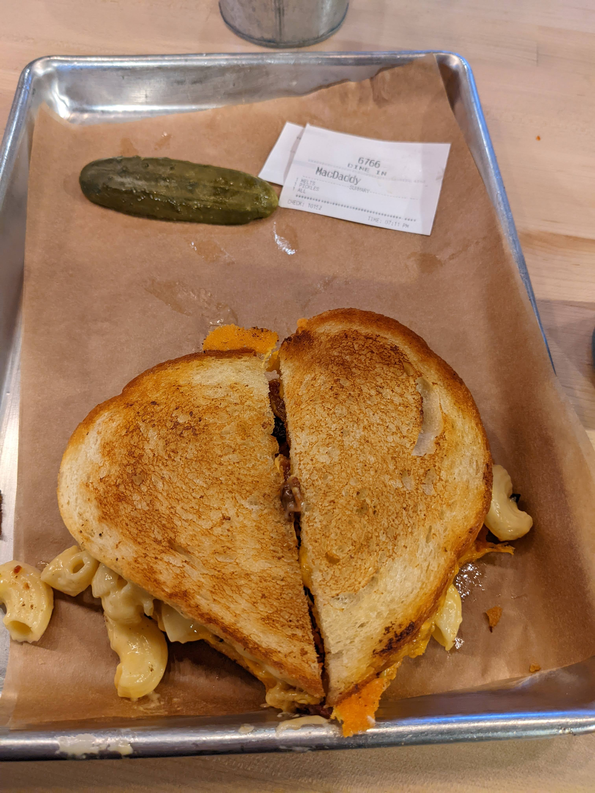

There's a dining hall on campus that has pretty good "Meltz sandwiches," which are grilled cheese sandwiches but fancier. Here's a **BAT Melt**.

Here's a **Buffalo Chicken Melt**.

A **Mac & Cheese Melt**.

A **Melter Skelter**.

A **Spicy Ham and Swiss Melt**.

And a **Turkey Apple Brie Melt**.

There's also a place off campus called [The Melt](https://www.themelt.com/), which I'm pretty sure the dining hall based its sandwiches on. Here's a **Mac Daddy** sandwich.

Seeing all these sandwiches, I noticed something rather peculiar about the dishes. They all come with an entire stick of pickle, cut into quarters lengthwise, delicately placed separately from the sandwich itself. I was a bit confused about the pickles. Was I expected to eat it directly? I've never seen these style of sandwiches before because my family rarely ate outside[^2].

[^2]: It's a waste of money.

This has come up several times among my friends because I've never gotten a satisfactory answer about the pickles. One of my friends in particular was very critical of my question. This article is addressed specifically to them. Apparently, you're just supposed to the eat the pickle. But how? And why?

## The pickle.

The pickle itself is an odd addition. Our dining halls seldom give out sides so freely like this. They're served a la carte, not buffet style, so we have to order and pay for each item we want individually. Usually, sides like French fries, fruit, or fountain drinks must be ordered separately. I would've expected the pickle, mentioned nowhere in the dish's description, to be a separate side listed in the menu like all other sides.

Perhaps the sandwiches normally have pickles in them, but because so many people don't like pickles, they put it separately to allow people who like pickles to put it in their sandwich. This still feels like a waste---the pickle gets thrown away anyways---and inconsistent with burgers, which come with pickles in the sandwich by default. More importantly, though, that doesn't explain how the pickle is supposed to supplement the sandwich. It's one thick and long block of pickle, and the sandwich has melted cheese. Is one supposed to rip the sandwich apart, mush the pickle into the sandwich, then slap it back together?

Personally, I was fine with eating the pickle on its own, but it tasted a bit weird. The sandwiches tasted fine without the pickle. There was no need for the dining halls to go above and beyond to add a pickle when they are so lackluster in other areas.

I didn't see any harm in emailing the campus dining engagement, so I sent them an email.

> ### Subject: Pickles
>
> Hello,
>
> A few weeks ago, I ate the melt sandwiches from Cafe V. They were very good, but each melt sandwich included a lone quarter pickle (lengthwise) on the plate.
>
> I would like to know what the pickle is for.
>
> Thanks, 
> Sean

They replied the next day.

> Hello,
>
> Thank you for reaching out. The pickle is just a side or garnish to compliment the dish.
>
> Dining Engagement

This did not answer anything. So the pickle is a side, sure, but how are we supposed to eat it?

To my friends, apparently this is obvious. You just eat the pickle with the sandwich. That's it.

But it's not that simple. Sure, anyone is free to eat food any way they like. You could eat a burger one slice at a time, first the bun, then its individual contents, then the other bun. But there are commonly established ways of eating food. I do not know what that would be for these pickles, however.

Indeed, while people may be confident that everyone knows how to eat a pickle with the sandwich, they disagree on the specifics. Here is a poll I conducted for _when_ people eat the pickle.

> You are at Cafe V and ordered a melt sandwich. They provide an entire quarter pickle spear with your sandwich. How do you eat the pickle?
>
> 1. Do not eat the pickle. Throw it away. (3 votes)
> 2. Eat the pickle before the sandwich. (5 votes)
> 3. Eat half the sandwich, eat the pickle, then finish the sandwich. (1 vote)
> 4. Eat the sandwich then eat the pickle. (1 vote)
> 5. Take a bite of the sandwich, then take a bite of the pickle, and repeat. (1 vote)
> 6. Insert the pickle inside the sandwich and eat the sandwich. (1 vote)

It didn't surprise me that not everyone ate the pickle the same way, though I wasn't expecting so much diversity: each option had at least one vote. However, to a few people, it was a shocking revelation that some people ate the pickle whole. They insisted that you're supposed to eat the pickle _while_ eating the sandwich. And how, exactly? Is it with alternating bites? Do you keep the pickle and the sandwich bites in your mouth at the same time, so they mix and resemble the pickle embedded in the sandwich? Or do you swallow the sandwich, then cleanse your mouth with the pickle to experience the next bite anew? Or do you put the sandwich and pickle together, either on top or stuffed inside the sandwich, then stretch your mouth open to chomp both simultaneously?

More importantly, how did you expect us to know this? Nothing about the sandwich and the pickle on the plate or tray suggests it has to be eaten together.

Besides, to say that one should eat a food item with another food item is itself practically meaningless. Eating a burger with fries is very different from eating cereal with milk. I'd like to see you pouring fries into your burger or drinking the milk after eating the cereal dry.

## It's not just the pickles.

I think what irritates me most isn't the pickles themselves but rather how the question was received. It's why the pickles get brought up so often. I haven't yet received a satisfactory answer, but people don't seem very keen on finding it out. The critical person mentioned earlier reprimands me because the answer is obvious, but when prompted, they couldn't give a good reason why the pickle is there. They don't know and don't care, to the point where it should not be discussed at all.

Asking about the purpose of pickles, especially the heated debate over them that tends to follow, may be seen as weird, but it's certainly not harmful or unproductive. Would you rather us talk about politics, or climate change, topics we've consumed to death in school essays, social media, and ads? Do you want to gossip about people behind their back? Or do you want us to just sit silently, scrolling on our phones on Discord while eating with greasy fingers?[^3]

[^3]: Which is what it usually comes to.

Sure, I don't _have_ to know why there are pickles, but that doesn't mean I can't talk about it. Does it matter if it matters? We aren't the UN; our conversation won't have much of an impact on the world, so interesting matters matter more for conversation.

Wondering about small things in life, to me, serves as much more interesting and unique conversation topics than overused icebreakers. Just looking around me, have you ever wondered why the rows on the keyboard are slightly offset, or why outlets in newer buildings are upside down, or why 9 on 7-segment displays (like the clock in front of me) usually has a curved tail[^1]?

[^1]: A 9 without a curved tail could help differentiate itself from a 6 when upside down.

This rejection of wonder and curiosity I think is a symptom of maturity and growing up. Childhood was when we ran around, seeing all the cool things in the world and asking what they're for, why they're there. As we grew up, we've started learning enough that it becomes expected that you know what everyone else knows. Now, in the adult world, if you don't know something ("Oh, you're not supposed to microwave plastic?" or "Can I microwave this microwave-safe plastic bowl?"), you could potentially be met with something dismissive and derivsive, along the lines of "How did you not know that already?" We passively yet actively shut down curiosity this way.[^4]

[^4]: It's also possible that the advent of clickbait articles and videos are making us less curious. You can look at a clickbait title, like "How to build a wood skyscraper," but even if it's interesting, you can ignore it and move on.

Some people look forward to maturity and praise it as a good thing, but I don't. I see it as the end of a rare, exciting, innocent moment of life before decades of monotonous adult work life. I see the cessation of curiosity about the little things in life as a sign of the beginning of a slow decline until death. It'll be downhill from here. You'll never be this curious for the rest of your life.

Anyways, I just think it's pretty rude and sad that you don't care about how a pickle should be eaten with a sandwich. Your mind is petrifying, no longer interested in what makes the world interesting, so life has become a chore to you.

---
