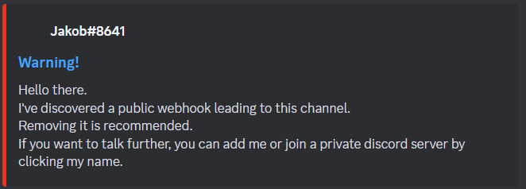
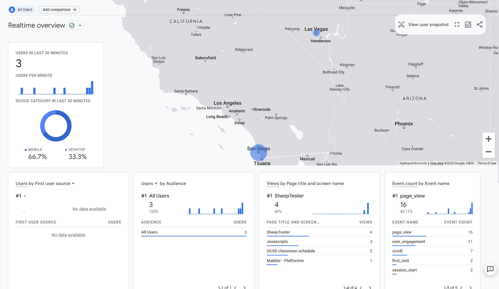

Apparently employers like seeing numbers on a résumé. I'd like to add projects, such as my [UCSD classrooms website][classrooms], to my résumé. However, I currently have no idea how many people use them.

I've added Google Analytics to most pages on this website---if you see a sheep in the corner, Google is watching. I plan on removing it in a month.

[classrooms]: https://sheeptester.github.io/uxdy/classrooms/

## Google Search

Before, the only source of data I had is from [Google Search Console][search-console], which tells me how many people find my website from Google Search. The console gives me graphs over time of how many people see a given URL in their results and how many click it. There's no additional privacy cost for using this feature because Google tracks its Search users regardless of whether I use their console or not.

[search-console]: https://search.google.com/search-console/about

Google Search is not a bad indicator of usage; for my high school schedule app, [UGWA][ugwa], I was able to see swaths of activity during weekdays, with sharp drops during the weekends and spikes during days with alternate schedules. I think a lot of students using UGWA just looked it up every time they wanted to open it.

[ugwa]: https://orbiit.github.io/gunn-web-app/

## Alternatives to tracking users

I've always wanted to avoid adding Google Analytics to my website because there's a lot of privacy concerns with Google, and I know of people on Scratch and one person from my high school who swear off anything related to Google. Also, I don't really trust it fondling things on my website, like leaving those ugly `_ga` cookies everywhere.

### Self-hosted web server

For UGWA, I wanted to have usage numbers for my college apps, so I used my [self-hosted web server][server][^1]. I had previously set up a counter API for a virtual [yearbook signing][yearbook] project, which had a separate counter for each ID. Requesting `POST /counter/<id>/increment` would increment the counter and return the current count.

[^1]: Which is currently down at the time of writing---there is an issue with the domain or my home IP or port forwarding or something.

[server]: https://sheep.thingkingland.app/
[yearbook]: https://sheeptester.github.io/yearbook-signing/

I reused this functionality to count users every ten minutes. Everyone using the app would, every ten minutes, increment a counter named after the current time, rounded to the nearest ten minutes. Then, I had a web page that [retrieved all of the user numbers per time block][graph][^2].

[^2]: This relies on my web server, which, again, does not work right now.

[graph]: https://sheeptester.github.io/hello-world/graph.html

### Discord webhooks

Later, when I shut down UGWA because I was leaving my high school[^3], I wanted to know which links people clicked on[^4] and also to see if there were still people using my app.

[^3]: Because I was graduating.
[^4]: I linked to schedule apps that then-sophomores made, inspired by my app.

This time, I added code to POST to a Discord webhook whenever a user opened the app or clicked on a link. Each entry would be a Discord message in a private channel.

In order to do this, I needed to have the Discord webhook URL accessible in my app. Like anything, I had to be careful because when making an app for a high school in the heart of Silicon Valley, I should expect there to be students with the technical knowledge to find and abuse the webhook URL.

With a Discord webhook URL, one can post whatever they want anonymously to its associated channel. This includes pinging @everyone---Discord does not offer any way of disabling @everyone for webhooks, which makes webhook URLs by nature dangerous. For this reason, I pointed the webhook to a private channel so any @everyone pings wouldn't bother too many people.

However, apparently, there are people who scour online for webhook URLs in GitHub repositories, and Discord lets whoever has access to the URL delete the webhook by its URL, so I had to recreate the webhooks several times. Even base64 encoding the URL didn't seem to work[^5].

[^5]: I tried reversing the string before and after base64 encoding. It seems to have thwarted Antonio.

I'm still thinking of using Discord webhooks for a contact form on my website because it works pretty well except for the fact that anyone can break it.[^6]

[^6]: I expect many of my site's visitors to be bad actors with the technical knowledge to at least attempt to wreak havoc.

## Google Analytics

I am busy, and my web server is down. UCSD's school year is ending soon, so if I want to measure my website's activity, now is the time to do it so my résumé can be prepared for the Summer 2024 internship season this September.

Google Analytics is insanely meticulous. Like Google themselves are insane.

When my colleague, Gamepro5, added Google Analytics to [his website][gp5], he sent a link to his website to some stranger over Steam or something, then spooked them by revealing their location. This is because Google Analytics has a real-time view for users actively using the website, which includes a list of web pages, device types, and a map of users based on IP addresses.

[gp5]: https://gamepro5.github.io/

For example, right after I deployed Google Analytics to my website, I was able to see that my first visitor subjected to Google Analytics is a mobile user from Las Vegas, NV, on my [Platformre editor page][editor]. (All other activity below were from my testing.)

[editor]: https://sheeptester.github.io/platformre/maker/

### Coverage

Implementation-wise, I've added Google Analytics code to all three versions of [sheep.js][sheepjs]. This is a JavaScript file common across all\* web pages on my website. Its main feature is adding the little sheep watermark to the corner of every web page, and since there's only three[^7] files that can control all\* the 600+ web pages at once.

[sheepjs]: https://github.com/SheepTester/sheeptester.github.io/blob/master/sheep.js

[^7]: There are three versions of sheep.js because when I decide to rewrite and modernize the watermark implementation, I keep the old code for historical preservation.

\*Well, not all web pages have sheep.js, usually because they weren't created with my text editor's HTML template, which links sheep.js by default.

- Forks of other projects, like my Scratch mod [E&#32650;icques][mod].
- Test files in my file dump repository [/hello-world/][hello-world] were created in the online editor or on my Chromebook.
- For a bit of anonymity, and also to avoid the watermark blocking the experience, my high school themed games like [Gunn Student Simulator][gunn-sim] and ["Fun" Gunn Run][fgr] had sheep.js intentionally omitted.

[mod]: https://sheeptester.github.io/scratch-gui/
[hello-world]: https://sheeptester.github.io/hello-world/
[gunn-sim]: https://sheeptester.github.io/gunn-student-sim/
[fgr]: https://sheeptester.github.io/fun-gunn-run/

But you're not safe! Particularly, E&#32650;icques is probably fairly high traffic, so I will likely link sheep.js there.

[uBlock Origin][ublock] blocks Google Analytics. You should already have that installed. However, I want ALL THE NUMBERS for my résumé, so some day I will set up or fix my web server to track usage by URL over time. Your ad blocker won't know about it and block it unless you block it yourself.

[ublock]: https://ublockorigin.com/

I contemplated adding a little pop-up that appears letting users across the website know about this change. But I've decided against it, selfishly, because I would rather the activity not drop. I only need data for my résumé, and nothing else. I plan on removing Google Analytics in a month.

Anyhow, I apologize for violating your privacy (and probably GDPR) by suddenly adding Google Analytics to my website, but this was a necessary evil for internships. Thank you for visiting my Web Site.
