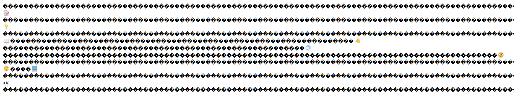
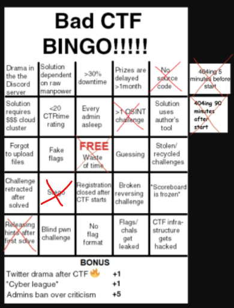

This year, I was part of the challenge writer team for SDCTF. Probably unsurprisingly, I procrastinated to the start of the CTF to write my challenges.

I contributed to these challenges:

- [web/utf-wait](#webutf-wait): A website that renders broken text in your browser.
- [web/open-source](#webopen-source): A web page that seems to have a fake flag in the source code.
- [web/calculator](#webcalculator): A simple arithmetic calculator that spawns a Python process to perform the calculation.

Spoilers ahead! Or [skip to the summary](#summary).

## web/utf-wait



> **utf-wait**: 352 pts, 7 solves
>
> ---
>
> **Author**: Sean<br> **Difficulty**: Medium<br> **Category**: Web
>
> ---
>
> 😊 I'm learning 🧠 how to make my own HTTP server in C! 🗺️ Here's my cool little journal 📖 website. To start 🚶, try looking up `flag` 🚩! It doesn't work 💔 in some browsers, though. 🙇

Only four hours before the end of the CTF (because that's when I woke up), I released this clarification after someone asked about it in a ticket:

> Sorry for not clarifying this earlier 🙏, but making a few hundred 💯💯💯💯 requests in series 🚶 isn't considered fuzzing 👌 by our rules 📜 (I was told this should be obvious 🙄). That may be necessary for this challenge 🎮 because my friend 💃 says my server is a bit ⚠️nondeterministic⚠️! 😵‍💫

[GitHub source](https://github.com/acmucsd/sdctf-2024/tree/main/web/utf-wait)

### Inspiration

For some reason, a few years ago I decided I wanted to read the entire [Unicode Standard](https://www.unicode.org/standard/standard.html). While I never finished it, I did read through the section that explained how Unicode encodes text in binary.

Unicode text is a list of Unicode characters, which have a code value[^1] between U+0000 and U+10FFFF. This means that to encode a character, you may need up to 21 bits, or 3 bytes, to encode each character. But most text falls in the Basic Multilingual Plane (BMP), the range of characters U+0000 to U+FFFF, which only needs 16 bits or 2 bytes per character. And a lot of text, particularly in the English-speaking world, uses exclusively ASCII characters in the U+0000 to U+007F range, which only needs one byte per character.

[^1]: Code values and code points are the same thing. I'm using code value because "value" more strongly implies that it's just a number to me, rather than representing a character.

Unicode defines three text encoding standards that trades off between simplicitly and compactness:

- UTF-32: Use 4 bytes per character, and encode each code value as a 32-bit integer. [Rust's `char` type](https://doc.rust-lang.org/std/primitive.char.html) uses UTF-32.

- UTF-16: Use 2 bytes per character for characters in the BMP. For characters outside the BMP, Unicode has reserved a range of code values in the BMP that can be used as a surrogate pair to represent the rest of the characters from U+10000 to U+10FFFF.

  Languages like Java and JavaScript use UTF-16 for strings. UTF-16 is nice because it uses half the space as UTF-32, but still has a constant number of bytes per character for most characters, so you can easily get a character by index in a string.

  Except it's not so convenient for characters outside the BMP, like emoji. This is why in JavaScript, emojis seem to be two characters long, and trying to index into a string with emoji can result in getting individual code vales of a surrogate pair, which is rendered as �.

  ```js
  > '🚩'.length
  2

  > console.log('🚩'[0])
  �
  ```

- UTF-8: Use a variable number of bytes per character.

  For ASCII characters in the range U+0000 to U+007F, they're encoded the same as they are in ASCII: one byte per character. The byte is just the code value. The benefit of this is that UTF-8 is the same as ASCII for ASCII-only text. I think this might contribute to why programmers often confuse bytes with characters, and code values with characters' byte representation.

  However, for the rest of the characters, UTF-8 uses something reminiscent of a linked list. The bytes for the ASCII range of code values all start with 0, so if it starts with 1, this indicates that the byte is part of a multi-byte sequence:

  - `110xxxxx` means the character is two bytes long.
  - `1110xxxx` means the character is three bytes long.
  - `11110xxx` means the character is four bytes long.
  - `10xxxxxx` is used for the rest of the byte sequence.

  I think [Wikipedia's table](https://en.wikipedia.org/wiki/UTF-8#Encoding) summarizes this best:

  

  The remaining `x` bits are used to store the bits of the code value.

There's two things interesting about UTF-8, both of which Wikipedia has notes about:

- UTF-8 could be extended to support longer byte sequences, such as `111110xx` for 5-byte squences. Wikipedia says this has originally been proposed, but they limited it so there aren't code values that UTF-8 can encode and UTF-16 can't.

- You can use longer byte sequences than is necessary for a character. However, UTF-8 requires that encoders reject these "[overlong encodings](https://en.wikipedia.org/wiki/UTF-8#Overlong_encodings)":

  > Longer encodings are called _overlong_ and are not valid UTF-8 representations of the code point.

So, I wondered, what if I did that anyways?

### Development

My idea was this: make a web server that (purportedly) naively tries to use its own UTF-8 encoder/decoder, except it somehow unintentionally produces overlong encodings. Pretty much any reasonable[^2] UTF-8 decoder, from parsers to programming languages, should reject these encodings, so users will see broken text. I also wanted users to be able to produce overlong encodings on their own, i.e. requiring them to write an overlong UTF-8 decoder and encoder.[^3]

[^2]: And safe? I feel like in general, being too lenient can lead to some security holes, especially if it deviates from the norm. However, I can't imagine a scenario where tolerating overlong encodings leads to a vulnerability, <!-- Hmm. --> so maybe it's fine in this case.
[^3]: I decided pretty early on that my challenge would be called "UTF&mdash;wait." To explain the joke, it rhymes with UTF-8, and it's like a double take when you or a text decoder encounters bytes similar to UTF-8 but aren't valid UTF-8.

I first wrote a [UTF-8 encoder/decoder in JavaScript](https://github.com/acmucsd/sdctf-2024/blob/main/web/utf-wait/polyfill.ts) because I was most familiar with that language. I was thinking that I could spin up a Node or Deno web server, and perhaps claim to use the encoder/decoder as a polyfill. Then, I could just upload the server file as an attachment (but omit polyfill.ts) to hide its implementation.

But as I wrote the server, I realized that it didn't really make sense for me to have to use a polyfilled `TextEncoder` for the server since the language already handles that automatically everywhere. It would look suspect if I did something like `new Response(encoder.encode(html))` instad of just `new Response(html)`.

It made more sense to use a language like C, which may not have UTF-8 handling built in[^4], and C seems like a language where handling bytes directly is far more common (unlike, say, Rust). Also, C is a nice and simple programming language (unlike C++).

[^4]: It probably does, but whatever.

So I wrote the same [UTF-8 encoder/decoder in C](https://github.com/acmucsd/sdctf-2024/blob/main/web/utf-wait/utf8.c), then followed [an online tutorial](https://dev.to/jeffreythecoder/how-i-built-a-simple-http-server-from-scratch-using-c-739) for a C HTTP server. Fortunately, it's fairly convenient and doesn't require as many incantations as, say, WebGL. I risk introducing more vulnerabilities this way, but whatever.

A decision I made was to pre-encode all the static files of the site when the server starts, rather than re-encoding the response on every request. This is because I didn't want to make it too obvious that the encoding was random and nondeterministic, and it would reveal what bytes of the file matter (i.e. don't change) and what don't. I also didn't want the `flag` key for the journal to change while the user is trying to guess its encoding.

Another design problem I had was where to sneak in the requirement for the user to encode text, such as the journal name `flag`, in UTF-wait. For a journal site, it might make sense for the route for retrieving a journal's contents to be at `GET /journal/:name` or something. However, URLs aren't encoded in UTF-8. The only part of a request that is normally encoded in UTF-8 is the request body (so GET requests are out of the question).

I wanted a route for editing journals, but this would require part of the request body to be partitioned for the journal name, and the rest for the journal contents. To be honest, in retrospect I'm not sure why I struggled with designing this. I could've just required a newline or two between the journal name and contents (like a Git commit message), and encoded the whole thing as a Unicode string in UTF-wait. But whatever.

Ultimately, I just kept it simple. For the user doing the challenge, they shall just see the website as a read-only blog. Then, they just have to request the journal entry for `flag`, but since the developer of the website is naive, it takes several attempts to get the right encoding of `flag` to see its journal entry.

```c
struct utf8 response =
    flag_key.n == bytes_received &&
            strncmp(flag_key.bytes, body, flag_key.n) == 0
        ? flag_response
        : no_note_response;
send(client_fd, response.bytes, response.n, 0);
```

As a side note, for some reason I noticed my server was a bit slow, despite being written in C. I wondered how it would scale up to serve the entire CTF, but it ended up not mattering because our platform used an instancing system where each user got a different server instance, so I don't have to handle a large server load.

As for the front-end, I kept the styling minimal. I think I was planning to make it prettier, but I guess no one would've seen it anyways.


For SDCTF, we were thinking about having a dedicated emoji category. My encoder only encodes up to 4-byte sequences, which is how emojis and other non-BMP characters are supposed to be encoded in UTF-8. That means that a normal decoder will fail to decode anything _except_ for emoji, and all the user'd see are just emoji interspersed among replacement characters, which happens to fit the emoji category. Therefore, I tried to use as much emoji I could for this challenge; it would help to hint that the website is indeed in plain text. Ultimately, however, we didn't get around to making the emoji category happen.

### Solution

The way I thought people might go about this challenge is this, with paths off the main trail removed:

1. See that only emoji are rendering on the web page.
2. Open the web page contents in a hex viewer
   - When I tried this, it's actually pretty difficult. Ctrl+S'ing the page in Chrome keeps the replacement characters (`FF FD`) in the file, which makes sense because I know it already does fancy shenanigans like including all the page CSS and JavaScript in a folder. But saving the response as a file from the Network Log also did not preserve the original bytes of the response, and instead stored replacement characters. I had to use `curl` to retain the bytes.
3. Magically realize (perhaps from the challenge name and the headers suggesting it's UTF-8) that the file uses overlong encodings
4. Write a UTF-wait decoder and decode the files served by the server
5. Read the JS file to deduce how to get the flag, by making a `POST /` request with an encoding of `flag` in the body
6. Brute force every possible encoding of `flag`. Each character can be encoded 3&ndash;4 ways (1&ndash;2 bytes to 4 bytes), so that gives between 81 and 256 permutations to brute force.

I was concerned that players might think they aren't allowed to brute force these permutations, so I wanted to clarify that this was fine. I wanted this clarification to be added to the CTF-wide rules rather than specifically for this challenge to avoid giving hints.

However, Nick thought it was obvious that making a few hundred requests, especially with a delay in between, didn't count as brute forcing, and it wasn't necessary to clarify that it was allowed.

For checking that the deployed challenge works, this was my solve script:

```js
class TextDecoder {
  decode (bytes) {
    let expect = 0
    let str = ''
    let codePoint = 0
    for (const byte of bytes) {
      if (expect > 0) {
        if (byte >> 6 === 0b10) {
          codePoint <<= 6
          codePoint |= byte & 0b111111
          expect--
          if (expect === 0) {
            str += String.fromCodePoint(codePoint)
          }
        } else {
          console.warn(
            'expected continuation byte',
            byte.toString(2).padStart(8, '0')
          )
          str += '\ufffd'
        }
      } else {
        if (byte >> 5 === 0b110) {
          expect = 1
          codePoint = byte & 0b11111
        } else if (byte >> 4 === 0b1110) {
          expect = 2
          codePoint = byte & 0b1111
        } else if (byte >> 3 === 0b11110) {
          expect = 3
          codePoint = byte & 0b111
        } else if (byte >> 7 === 0b0) {
          str += String.fromCodePoint(byte)
        } else {
          console.warn('expected first byte', byte.toString(2).padStart(8, '0'))
          str += '\ufffd'
        }
      }
    }
    if (expect > 0) {
      console.warn('expected completed sequence')
      str += '\ufffd'
    }
    return str
  }
}
const gg = char => {
  const codePoint = char.codePointAt(0) ?? 0xfffd
  return [
    // [codePoint],
    [
      0b110_00000 | ((codePoint >> 6) & 0b11111),
      0b100_00000 | (codePoint & 0b111111)
    ],
    [
      0b111_00000 | ((codePoint >> 12) & 0b1111),
      0b100_00000 | ((codePoint >> 6) & 0b111111),
      0b100_00000 | (codePoint & 0b111111)
    ],
    [
      0b111_10000 | ((codePoint >> 18) & 0b111),
      0b100_00000 | ((codePoint >> 12) & 0b111111),
      0b100_00000 | ((codePoint >> 6) & 0b111111),
      0b100_00000 | (codePoint & 0b111111)
    ]
  ]
}
for (const f of gg('f'))
  for (const l of gg('l'))
    for (const a of gg('a'))
      for (const g of gg('g')) {
        console.log(
          await fetch('.', {
            method: 'POST',
            body: new Blob([new Uint8Array([f, l, a, g].flat())])
          })
            .then(r => r.arrayBuffer())
            .then(b => new TextDecoder().decode(new Uint8Array(b)))
        )
      }
```

### Retrospective

UTF-wait wasn't solved until about 5 am, 10 hours into the competition. At that time, I hadn't released my other web challenges yet (because I was working on them 😜), so that was the first and only web solve---all the web challenges were difficult. At the end of the CTF, there were only 7 solves. That was fewer than I expected.

It seems like few people even attempted the challenge, based on the relative lack of tickets opened compared to other challenges, especially on the first day of the CTF.

Maybe I miscategorized the challenge---I think most CTF players who specialize in web are specialized in SQL and DOM injections and the like. Knowing about how text is encoded is probably out of their scope. I think a text encoding challenge like this would be better suited for crypto or rev players.

Based on the tickets, people were able to decode the site. Someone was able to decode it with CyberChef, and another person found that Vim was able to decode it too, which is pretty surprising.

A common theme among the tickets was that while they could decode the site, they didn't know they also had to encode `flag` in a similar way. I had to explain to them that it was nondeterministic, so brute forcing might be necessary.

What concerned me was that a few times, people revealed that they've tried to brute force finding the flag, and a different admin would reprimand them for violating rule 6:

> **Rule 6:**
>
> **Do not run automated tools** on our targets unless given express permission. This includes disruptive software such as bruteforcers, fuzzers, and other software that may disrupt the competition for other players. **You will not require these tools.**

This was the rule I was worried that might discourage players from properly solving the challenge. Nick had assured me that the brute forcing involved didn't fall under these "automated tools," but evidently even other admins didn't think that way.

This was why I decided to release clarification around 4 hours before the end of the CTF.

It also seems some teams solved it just by looking at the patterns in the bytes. Because my encoder exclusively uses 2&ndash;4-byte sequences, the final byte is always of the form `10xxxxxx`, with the last 6 bits of the character's code value. For many characters, including the letters of `flag`, the 7th bit, which is in the byte before, is always 1. Since the rest of the bits are 0, many teams discovered that there are only three types of prefixes for each character:

- `1111_0000 1000_0000 1000_0001 10xx_xxxx` -> `f0 80 81 xx`
- `1110_0000 1000_0001 10xx_xxxx` -> `e0 81 xx`
- `1100_0001 10xx_xxxx` -> `c1 xx`

While this approach works, it is a bit unfortunate that teams could solve the challenge without taking away a better understanding of how UTF-8 works.

Finally, I didn't really realize this until after a fellow admin posted a "bad CTF bingo" meme, but having source code is pretty important for making a CTF challenge enjoyable. I think it is possible for me to adapt at least my [server.c](https://github.com/acmucsd/sdctf-2024/blob/main/web/utf-wait/server.c) file so it can be published without giving everything away.



So, if I could redo this challenge again, my takeaways from this CTF are:

- Randomize the encoding on each request to make it more obvious that it's randomized

  - Alternatively, I could try avoiding randomization because it might lead teams into thinking cryptography is involved

- As I thought, I do need to clarify when brute forcing is acceptable

- Provide as much source code as possible

## web/open-source


> **open-source**: 100 pts, 106 solves
>
> ---
>
> **Author**: Sean<br> **Difficulty**: Easy<br> **Category**: Web
>
> ---
>
> "open source" in the sense that if you open inspect element and go to the source tab all the source code is there!

This challenge was released late. At 6 am, 11 hours into the CTF, I announced:

> @Participant _two_ web challenges just dropped! they're both .. "easy" .. supposedly (~~no web challenges have been solved yet~~ 💀 so who knows)
>
> 👉 **web/calculator** has source files!! devour them as you please
>
> 👉 **web/open-source** is also "open source" ,, just open inspect element and youll see all the code there for you! 😁

[GitHub source](https://github.com/acmucsd/sdctf-2024/tree/main/web/open-source)

### Inspiration

It was clear that SDCTF needed more beginner-friendly challenges. I thought it ought to be pretty easy to make easy challenges, so this was the first one I came up with.

I just wanted to try hiding code by using a source map.

### Development

I wanted the challenge to be straightforward, so I decided to keep the flag in the client's code. However, I didn't want it to be as easy as opening the index.js file and ctrl+F'ing `sdctf`.

So, I spent some time lazily obfuscating the code, largely just by [importing a bunch of libraries](https://github.com/acmucsd/sdctf-2024/blob/main/web/open-source/src/index.js), then using their exports to avoid them being tree shaken away.

```js
import * as wh1t from 'axios'
import * as wh2t from 'lodash'
import * as wh3t from 'moment'
import * as wh4t from 'react'
import * as wh5t from 'react-dom'
import * as wh6t from 'uuid'
import * as what from './important'

console.log(
  `{${Object.keys({
    ...wh1t,
    ...wh2t,
    ...wh3t,
    ...what,
    ...wh4t,
    ...wh5t,
    ...wh6t
  }).join('}{')}}`.length
)
```

For the flag, I just created a bunch of silly functions to output individual characters. The minifier will mangle the function names, but just in case, I gave them silly names.

```js
export const bana = () => 'a'
export const bananana = () => 'a' // this one is to keep them on their toes
export const c = () => 'c'
export const dirby = () => 'd'
export const extremely = () => 'e'
export const orange = () => 'f'
export const teapot = () => 'f'
export const banana = () => 'g'
export const apple = () => 'l'
export const not = () => 'n'
export const particularly = () => 'p'
export const seed = () => 's'
export const torch = () => 't'
export const interesting = () => 'e'
export const obj = { not, particularly, interesting }
```

Finally, the flag is constructed out of these functions:

```js
import { teapot, apple, bana, banana, seed, dirby, c, torch, obj } from './huh'

console.log('Flag checker time!')
what.addEventListener('submit', () => {
  console.log('Checking flag...!')
  alert(
    new FormData(what).get(teapot() + apple() + bana() + banana()) ===
      [seed, dirby, c, torch, teapot, () => `{${Object.keys(obj).join('_')}}`]
        .map(a => a())
        .join('')
      ? 'true!! this is the real flag'
      : 'false'
  )
})
```

For the source map, I first wrote code that could feasibly produce the same observed output in the console. I made it clear that it wasn't the real flag by using a `ctf` instead of `sdctf` prefix, but in the logs, it seems people tried guessing `ctf{this_is_not_the_flag}` anyways.

```js
const form = document.getElementById('form')
form.onsubmit = () => {
  console.log('Checking flag...!')
  alert(
    document.querySelector('[name=flag]').value === 'ctf{this_is_not_the_flag}'
      ? 'true!! this is the FAKE flag'
      : 'false'
  )
}

console.log('Flag checker time!')

//
console.log(require('moment').__LIB_ID)
```

Ideally, I wanted each line of the minified source file to correspond to its line in the fake source code.

However, I was lazy.

The [structure of source maps](https://web.dev/articles/source-maps#understand)[^10] seemed pretty straightforward. The hardest part to understand was the mappings itself. They were based on some base64 encoding involving some "VLQ" of an array of 4-ish numbers, and I wasn't sure what those numbers represented.

[^10]: The article links to [this article](https://developer.chrome.com/blog/sourcemaps#base64-vlq-and-keeping-the-source-map-small) for explaining the "VLQ base64-encoded" stuff, which in turn links back to the first article because it was based on an outdated source map specification. 😵‍💫

I decided to leave that up to [a library](https://www.npmjs.com/package/vlq), which happened to have a [helpful page explaining what the numbers meant](https://github.com/Rich-Harris/vlq/tree/master/sourcemaps). I decided to just map the entire minified line with my code (and other unrelated lines) to the entirety of the source code. This essentially means using `[]` for all lines of the minified index.js except for the line I want, and then use `[0, 0, 0, 0]` for that line:

- The first zero means the mapping for the minified file is for the entire line (column 0 to the end).
- The second zero refers to the first source file defined in the source map's `sources` array.
- The third zero means the mapped source starts on the first line.
- The fourth zero means the mapped source starts on the first character of the first line.

```js
writeFile(
  './static/index.js.map',
  JSON.stringify({
    version: 3,
    sources: ['index.js'],
    sourcesContent: [code],
    mappings: lines
      .map(line =>
        line.includes('this is the real flag') ? encode([0, 0, 0, 0, 0]) : ''
      )
      .join(';'),
    names: ['form']
  })
)
```

Since the mapping only specifies when it starts (its end is implied by the next mapping), this should be enough to map the entire line of the minified file to the entire fake source code.

However, this meant that when I follow the `console.log` statements from the console to the source tab (in both Firefox and Chrome), it would always highlight the first line of the source file rather than the fake `console.log` statement. But I decided people probably wouldn't pay close attention to that.

Finally, I made a pretty little glassmorphic interface. The blur radius seems to get capped on Firefox, but it still looks acceptable.


### Solution

To be honest, I never tried retrieving the flag myself. When testing the challenge, I just pasted the correct flag into the input to make sure it alerts `true!! this is the real flag`. I just assumed that since the flag had to be computed directly to compare it with the input value.

But my approach would be to inspect element the text field, look for its event listeners. Clicking on the `index.js:1` brought me to the fake source code, and clicking on the minified code didn't take me to the function. But right clicking and saving the handler as a global variable did reveal its real contents, which I could search in the minified code.


Then, I would set a breakpoint in the event handler. Except for some reason in Chrome, it would take me back to the source mapped code, and it wouldn't even set the breakpoint on the right line. Interesting!

And in Firefox, because the minified code has a source map associated with it, it refuses to prettify the code.


It's pretty interesting how a broken source map can disrupt devtools. Nonetheless, it's pretty easy to disable them.


Finally, I can set a breakpoint in the form `submit` event handler, try checking a flag on some random input, then evaluate the right-hand side of the `===` expression.


I didn't think the challenge was particularly interesting, and I was feeling uncreative, so I just set the flag to `sdctf{not_particularly_interesting}`.

### Retrospective

Open Source quickly got dozens of solves after it was released, becoming one of the easiest challenges in the CTF. It actually wasn't that hard, and that's because this challenge is contingent on the player using devtools. But some seasoned CTF players might be more used to using the network log, so they will only see the minified code.

Most players saw the fake flag and were quick to find the actual minified code, so the fake source map ended up being a very minor part of the challenge.

Also, despite me trying to obfuscate `sdctf`, I completely forgot to obfuscate the `flag` in `console.log` and `alert` statements. This made it incredibly easy to just ctrl+F "flag" and find the part of the code responsible for the flag. And since all of the dependencies of the expression were right next to the function, rather than relying on a variable defined elsewhere in the minified code, you can just copy and paste the code in the console, and you won't have to deal with any undefined variables.

```js
var kS = () => 'a'
var ES = () => 'c',
  OS = () => 'd'
var M1 = () => 'f',
  TS = () => 'g',
  CS = () => 'l',
  N3 = () => 'n',
  A3 = () => 'p',
  DS = () => 's',
  RS = () => 't',
  L3 = () => 'e',
  MS = { not: N3, particularly: A3, interesting: L3 }
console.log(
  [DS, OS, ES, RS, M1, () => `{${Object.keys(MS).join('_')}}`]
    .map(e => e())
    .join('')
)
// -> sdctf{not_particularly_interesting}
```

Write ups:

- [Siunam](https://siunam321.github.io/ctf/San-Diego-CTF-2024/Web/open-source/): "What we’ve learned: Deobfuscate JavaScript code"

I think deobfuscating JavaScript code is a useful skill, but my challenge isn't a practical case of obfuscated JavaScript code. The most common form of JS obfuscation (beyond just minifcation) replaces most symbols with illegible hex variable names. It's not too hard to deobfuscate it, at least partially enough to get what you want, since they also provide a decoder function. But that's not what this challenge exposes you to.

I'm not sure if obfuscation is great for CTFs, mostly because it's lazy challenge-making and puts unnecessary menial work on the players, while not being very insightful.

Still, by struggling with source maps while trying to prove my challenge was solvable in the [solution](#solution-1), I think that has shown me there is some potential in using source maps for future CTFs. But this challenge was pretty lazy and only exists to exist, and I don't think I should make a similar challenge like this in the future.

## web/calculator


> **calculator**: 100 pts, 46 solves
>
> [Download Attachment](https://github.com/acmucsd/sdctf-2024/tree/main/web/calculator)
>
> ---
>
> **Author:** Sean<br> **Difficulty:** Easy<br> **Category:** Web
>
> ---
>
> I made a calculator! I'm using Python to do the math since I heard it's strongly typed, so my calculator should be pretty safe. Download the source code by clicking the download button above!

Like [web/open-source](#webopen-source), this challenge was released late. At 6 am, 11 hours into the CTF, I announced:

> @Participant _two_ web challenges just dropped! they're both .. "easy" .. supposedly (~~no web challenges have been solved yet~~ 💀 so who knows)
>
> 👉 **web/calculator** has source files!! devour them as you please
>
> 👉 **web/open-source** is also "open source" ,, just open inspect element and youll see all the code there for you! 😁

[GitHub source](https://github.com/acmucsd/sdctf-2024/tree/main/web/calculator)

### Inspiration

Learning Python, I've always been perturbed by many "features" (I don't like Python). For example, Python always likes abbreviating their names to the point where they don't really make sense at first class. For example, the `s` in `json.dumps` means string. Of course.

And `json.dumps` was also interesting because by default, it can output `NaN` and `Infinity`, neither of which are valid JSON, so most other parsers like JavaScript would fail on it. I've always wanted to try exploiting this difference in a CTF.

### Development

I decided to have a JavaScript server that would run Python to evaluate an arithmetic expression, and it would only reveal a flag in the special case when `JSON.parse` fails. And since I started working on the challenge after the CTF started, I knew that open source challenges were much preferred, so I designed the server knowing all its files would be published as attachments to the challenge.

If anything, setting up the server was pretty straightforward. I copied Deno's [static server template](https://examples.deno.land/http-server-files) and my front-end code from [web/open-source](#webopen-source).

Evaluating expressions in Python was very straightforward. I didn't really need to worry about making it foolproof because if it produced any errors, I would just directly report it to the client without giving the flag.

```py
import json
import sys


def evaluate(expression):
    if "value" in expression:
        return expression["value"]
    match expression["op"]:
        case "+":
            return evaluate(expression["a"]) + evaluate(expression["b"])
        case "-":
            return evaluate(expression["a"]) - evaluate(expression["b"])
        case "*":
            return evaluate(expression["a"]) * evaluate(expression["b"])
        case "/":
            return evaluate(expression["a"]) / evaluate(expression["b"])


print(json.dumps({"result": evaluate(json.loads(sys.argv[1]))}))
```

In the Deno server, I would take the expression from the client and somehow parse it into an object.

```ts
export type Expression =
  | { op: '+' | '-' | '*' | '/'; a: Expression; b: Expression }
  | { value: number }
```

```ts
const body = await req.formData()
const expression = body.get('expression')

const parsed = parse(expression)
```

Then, I pass it to Python as JSON and get back the result from Python. If there is anything in Python's stderr, I will report that instead of trying to parse Python's JSON.

```ts
const result = await new Deno.Command('python3.11', {
  args: ['calculate.py', JSON.stringify(parsed)]
}).output()
const error = decoder.decode(result.stderr).trim()
const json = decoder.decode(result.stdout).trim()
if (error.length > 0) {
  output = error
}
```

It's only if Python runs without error that it'll try to parse it. I also made sure to check that it starts and ends with curly braces, in case Python prints out some weird non-JSON like `None`, an empty string, `null`, etc.

```ts
if (json.startsWith('{') && json.endsWith('}')) {
  try {
    output = JSON.parse(json).result
    success = true
  } catch (error) {
    output = `wtf!!1! this shouldnt ever happen\n\n${
      error.stack
    }\n\nheres the flag as compensation: ${
      Deno.env.get('GZCTF_FLAG') ?? 'sdctf{...}'
    }`
  }
}
```

All this code is available for the players, so this challenge makes it very obvious what they have to do: somehow make Python output invalid JSON, without making Python itself have a runtime error.

There's just one thing left to do. Parsing expressions.

[I've parsed math expressions before.](https://scratch.mit.edu/projects/103966945/) In 2016, my approach was to break the expression up into tokens. Then, it would do multiple passes, iterating over the tokens and computing numbers on either side of `*` and `/` first before doing `+` and `-` on a second pass. I was too lazy to do that again (this approach gets more involved with parentheses).

I could also just restrict expressions to only have two operands. It would be much simpler, but my Python script can handle so much more, so it would be a shame to let that go to waste.

I asked ChatGPT for an expression parser. It gave me some pretty convincing code. Except it didn't work.

Deno's third party modules has an [applicative_parser module](https://deno.land/x/applicative_parser@1.0.23), which I've looked into before for parsing s-expressions. It seemed pretty convincing, except it couldn't handle left-recursive grammars.

I ended up just writing a parser myself. I needed left-recursive grammars because my operations `+-*/` are evaluated from left to right. To get around this, I just consumed the input string from right to left. I used generators to lazily evaluate all possible parse results. Thanks, [CSE 230](https://ucsd-cse230.github.io/fa23/).

```ts
// LitExpr = Float
//         | "(" AddExpr ")"
function * parseLitExpr (string: string): ParseResult {
  yield * parseFloat(string)
  if (string[string.length - 1] === ')') {
    for (const result of parseAddExpr(string.slice(0, -1))) {
      if (result.string[result.string.length - 1] === '(') {
        yield { ...result, string: result.string.slice(0, -1) }
      }
    }
  }
}

// MulExpr = MulExpr ("*" | "/") LitExpr
//         | LitExpr
function * parseMulExpr (string: string): ParseResult {
  for (const right of parseLitExpr(string)) {
    const op = right.string[right.string.length - 1]
    if (op === '*' || op === '/') {
      for (const left of parseMulExpr(right.string.slice(0, -1))) {
        yield { ...left, expr: { op, a: left.expr, b: right.expr } }
      }
    }
  }
  yield * parseLitExpr(string)
}

// AddExpr = AddExpr ("+" | "-") MulExpr
//         | MulExpr
```

That's pretty cool, except parsing expressions was why I ended up going to bed at 08:30 that "night."

### Solution

My solution is extremely straightforward: `1 / 5e-324`.


I was hoping to take advantage of another Python quirk here. Python is unusual compared to pretty much all other programming languages in that float division by zero is a runtime error, so you can't just do `1.0 / 0.0`. However, dividing by the smallest positive double-precision floating point value still produces `inf` in Python. You can easily get this value by running `Number.MIN_VALUE` in JavaScript.

### Retrospective

Calculator also got many solves fairly quickly, which is good: it's an actually easy challenge. The CTF had many challenges classified as "easy" but had fewer solves than some "hard" challenges, so I was worried these challenges were under that curse.

And there were fewer solves for web/calculator than web/open-source, which also made sense. Open Source just relies on manually digging through JavaScript code, while Calculator solely relies on Python quirks knowledge.

The most common issue people ran into with this challenge is that they managed to get Infinity, but on the JavaScript side. Their approach was to multiply together a bunch of large ints, like `99999 * 99999 * ... * 99999`.

The reason why this doesn't work is because JavaScript will serialize each of these numbers as `99999`, rather than `99999.0`, because that's how those numbers are stringified in JS. However, Python has a distinction between the two when parsing; `99999` becomes an `int`, while `99999.0` becomes a float.

Python `int` objects are equivalent to `BigInt` in JavaScript, so they can be multiplied ad nauseam without producing Infinity. Python will happily turn the int product back into a super long string of digits in JSON, which JavaScript can parse without throwing a syntax error. However, it'll then cast the string of digits to a number (i.e. a float), so it becomes Infinity.

```js
> JSON.parse(`{"result": ${'9'.repeat(400)}}`)
{result: Infinity}
```

The simplest fix to that problem would just be to force Python to cast the int to a float by multiplying by `1.0`.

Write ups:

- [@ky28059](https://gist.github.com/ky28059/e8fc98d5b0be999b1409cc80a9077c54): "This challenge is pretty trivial if you know about how Python's `json.dumps` is JSON spec noncompliant. In particular, Python will successfully serialize `NaN` and `Infinity`, despite neither of those values being valid JSON."
- [Siunam](https://siunam321.github.io/ctf/San-Diego-CTF-2024/Web/calculator/): "For some weird reason? Python’s JSON library does NOT comply with RFC 4627’s infinity floating number."

I'm overall pretty happy about this challenge. It's nice and simple, and introduced people to quirks with floats and Python. The source code was also provided.

That said, it's possible people would rather see challenges based on potential vulnerabilities. For example, people seemed pretty interested in the other web challenges' use of prototype pollution and DOMPurify intentionally not preventing CSS injections.

Python's float quirks could result in a denial-of-service when it produces invalid JSON, but it's otherwise just a piece of trivia and not particularly useful. I personally would rather come away from a challenge learning something more meaningful, like new approaches to CSS injections as seen in [LA CTF](./2024-02-18-lactf.md#webquickstyle).

## crypto/RaccoonRun

I didn't write this challenge, but I did contribute to the front end.


I'm not sure why we put so much effort into designing the front end and drawing raccoons since most solutions involved writing scripts to directly interface with the WebSocket backend. Oh well.

## Summary

[web/utf-wait](#webutf-wait) uses spec-noncompliant UTF-8 to avoid being decoded properly by most browsers and programming languages. I learned that it is indeed necessary to make clear how much brute forcing is allowed, that I should design my challenges so they can provide source code, and to make it more clear when things are randomized.

[web/open-source](#webopen-source) uses a source map to try to hide the real flag. I learned that there is more potential in using source maps for future challenges, and obfuscation challenges are pretty boring.

[web/calculator](#webcalculator) is my favorite challenge and relies on Python's `json.dumps` producing invalid JSON for `inf` and `nan` values. I learned that providing source code makes the challenge more approachable and enjoyable.

On CTFtime, a [commenter noted](https://ctftime.org/event/2325#c6455) that admins have acknowledged that they didn't playtest challenges and some challenges were written during the CTF. That was probably me spewing stuff on the Discord. While it's true that we should've managed our time better, and this was just one issue among many, maybe I should be a little more secretive next time about my shenanigans behind the scenes. 🤭

Another commenter said that [some web challenges were better fit for rev](https://ctftime.org/event/2325/weight). That might be in reference to web/utf-wait or even web/open-source, and I agree that they aren't really web.

I still have some ideas that I came up with for this CTF but never finalized by the time it started. And now I think I have some more ideas I could explore. I'll probably be around for next year's SDCTF, so hopefully I'll be better prepared then.

---
