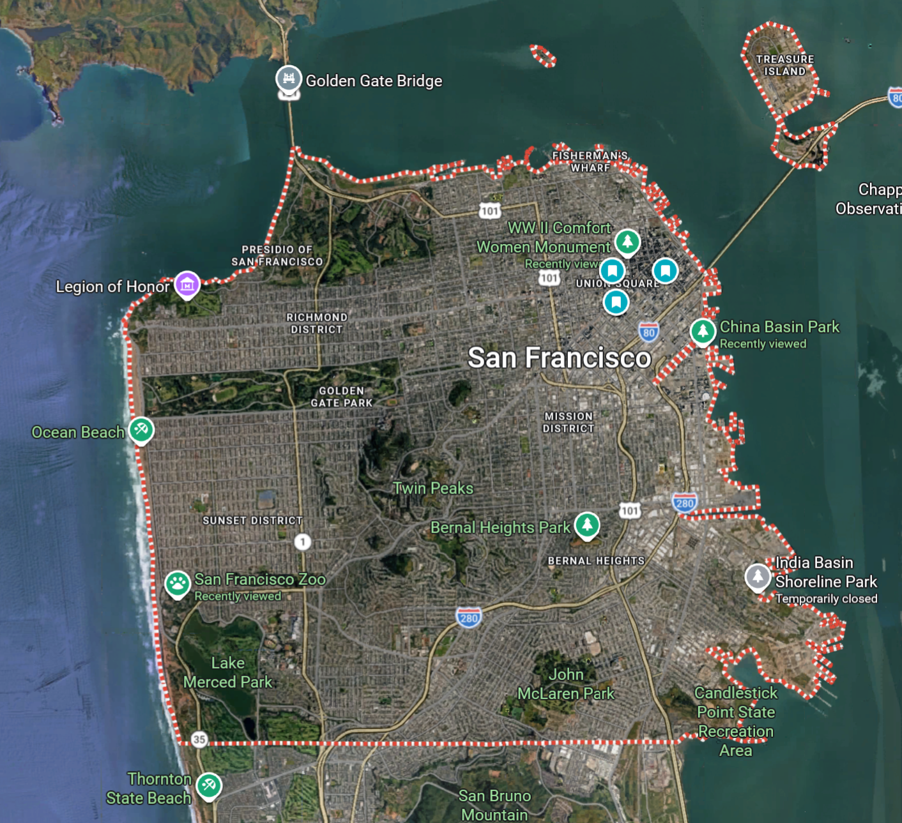
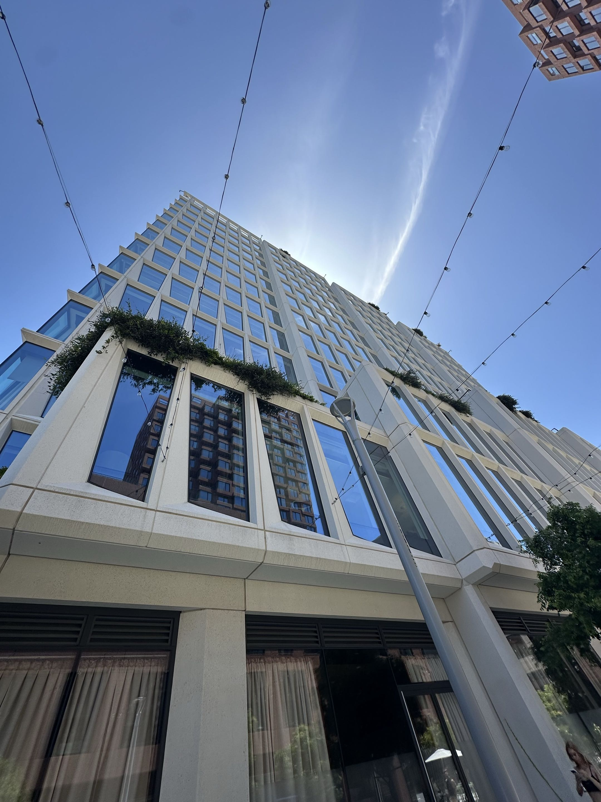
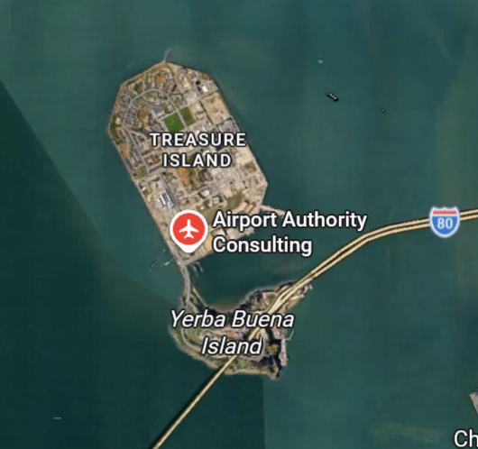
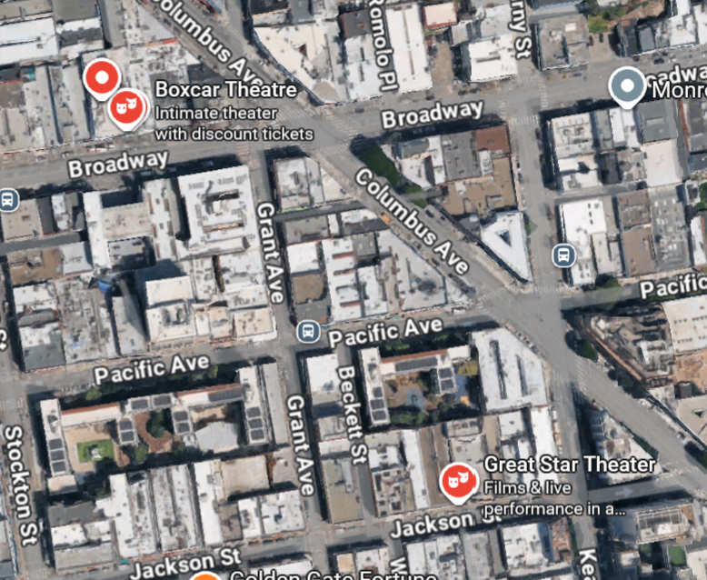
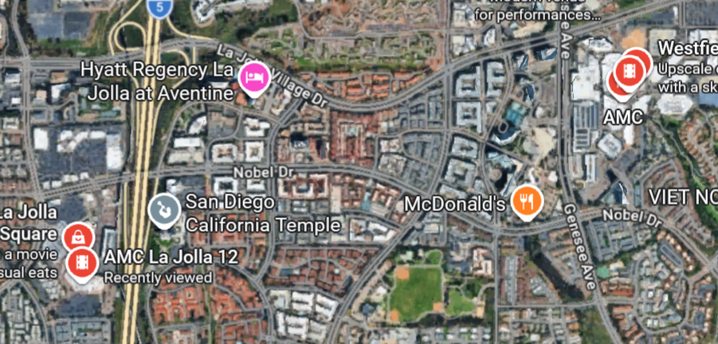

We played hide and seek across the entirety of San Francisco!

[_Hide + Seek_][game] is a game by [_Jet Lag: The Game_][videos] (the series by [Wendover Productions][wendover]) where an entire country is the board. It's designed to scale from a borough of New York (considered "small," est. 3–4 hours) to the entirety of Japan or the E.U. (considered "large," est. 2–4 days). The hiders have the seekers' location, and the seekers can ask from a limited question bank to narrow down their search space. The hiders draw cards for each question the seekers ask, which can grant them time bonuses, and they're scored based on how long they stay hidden. Then, they swap roles and the highest score wins.

Of course, we aren't content creators and have our cushy tech jobs to return to on Monday. And we're in the US, and because the game is centered around public transit, the only enjoyable region near us is the City of San Francisco: the game bounds are the city limits, and the valid stations that hiding spots center on are any Muni, Bart, or Caltrain stop.

<figure>

<figcaption>
The city limits of San Francisco.
</figcaption>
</figure>

[game]: https://store.nebula.tv/products/jet-lag-the-game-hide-and-seek-transit-game
[videos]: https://www.youtube.com/playlist?list=PLB7ZcpBcwdC7gTO_IVdiBv8nVPLKbqNa4
[wendover]: https://www.youtube.com/wendoverproductions

## Games

I'm only writing this after playing two proper games. We've played a few practice rounds, where we essentially skip to the end game and define the hiding area to some fraction of a mile radius:

1. Mission district: The hiders were found in some thrift store.

2. SF Caltrain stop: The hiders were found by China Basin Park because I recognized the unique windows of the building they were next to.

   

3. SF Caltrain stop: The hiders were eventually found by an apartment building near SPARK Social, but the seekers went the wrong direction because the hiders considered Google Maps' airplane icon on Treasure Island as an airport, while the seekers assumed the closest airport would be SFO.

And our full, "small" games:

1. With good timing, the hiders reached a nondescript M-line stop near the southern end of SF. The seekers were misled by a photo of a highway and spent the day in Golden Gate Park before giving up.

2. The hiders blundered by hiding in Chinatown at the end of the T line, the same line where they started. The seekers identified that they were on the same line and eventually found the hiders in an alleyway.

## Issues

Playing the game, I've noticed a few issues with how our particular playstyle interacted with the game's rules. These aren't necessarily issues with the game itself, just how we've chosen to play it.

### The game takes a while

The game is not for the faint of heart. It was designed to last days, to provide plenty of content for Wendover Productions, and I suspect it was retrofitted to a smaller scale for their viewers.

However, if we want to get more people to want to play, we can't say that the game will take hours. People are busy and have to leave in the evening, and they get impatient.

### The game is not designed to be skipped

Our practice rounds, where we essentially skipped to the end game and searched in a quarter-mile radius, tipped the balance of the game. Two entire sets of questions were essentially unusable because the minimum distance you must travel to use them is a quarter mile.

### Walking is tiring

While we invited people to play the game with the proposition that it would be played by riding transit, our practice rounds involved no transit and was played entirely on foot. While this is fine (and allows us to explore the city), it does get frustrating and takes time when the seekers walk the wrong direction and have to turn back, and it takes time for them to get to the right spot to ask a particular question.

### It's difficult to agree on points of interest

In several instances, we had minor disagreements on what places counted as points of interest:

1. The seekers asked about the closest airport, but the rules say places outside the game boundaries effectively do not exist. San Francisco International Airport is not in San Francisco, so there are no airports in our game area.

2. Even then, the hiders saw a place with a plane icon on Treasure Island ([Airport Authority Consulting][treasure-island]) and considered it an airport, but the rules say a commercial airport must be one whose flights are listed on Google Flights.

   

3. In Chinatown, the seekers marked places with drama mask icons as theaters, although the question specifically specify "movie theater." Google Maps apparently has separate icons for performing arts theaters and movie theaters.

   

   
   
   

While we tolerated these infractions to keep the game fun, it would be nice to have agreed on points of interest beforehand.

[treasure-island]: https://maps.app.goo.gl/58pMxHFvWyr2bGYF9

### Hiding is a bit boring

In the end game, hiders are not supposed to move. However, the end game takes a while, during which the hiders just idle waiting for seekers to ask a question.

### Seekers don't ask enough questions

In our first full game, the seekers only asked a few questions before confidently embarking on a trek to nowhere. This led to the seekers forfeiting, and left the hiders bored.

The penalty of asking questions is pretty weak (hiders can only hold up to at most six cards), and while questions give limited information, they're great for eliminating large swaths of the game area in a full game. We should encourage seekers to ask too much rather than too little.

### Hiders often did not draw cards

It was easy to forget to draw cards after seekers ask a question, or even bring the card deck itself. The deck is also unwieldy to carry and use.

Because our players and teams vary from day to day and round to round, we didn't really keep track of the score, so the time bonuses were relatively unimportant. However, the hiders were looking forward to using curses, which are also available in the deck, on the seekers.

## Potential solutions

We're thinking of constructing a game map of San Francisco based on OpenStreetMap, preemptively flagging points of interest (POI) and valid train stations. This way, not only do we have a common basis for POI-related questions, but hiders also know and can plan out where they can hide.

### App

The map could be an app or website, which could automatically eliminate regions based on responses to questions, or adjudicate when the difference in our distances to a POI is very close.

We could add more features to help enforce the rules of the game, like enforcing response time limits or incorporating the phone's GPS. However, this potentially takes away some of the charm from the game.

The app would be particularly useful for letting the hiders have access to the cards without needing the physical deck.

### Paper map

We could print out a paper version of our map, either as a packet of quadrants, or a large sheet printed at UPS. I personally like this option because it feels whimsical, and it lets us use our phones less rather than staring at Google Maps all the time. We could even use a ruler and/or compass to measure distances and mark out quarter-mile radii.

However, dealing with paper while out and about is pretty unwieldy.

### Splitting the game

The map aside, we've found in our practice rounds that people would rather play shorter games. Our practice rounds were essentially the second half of the game, the end game when seekers reach the hiders' transit station, but the first half of the game is just as interesting.

We should find a way to make each half of the game playable on its own:

1. Transit-only (the first half): The hiders can hide anywhere in SF, and the seekers only have to find the hiders' transit stop. We haven't tried this yet, so maybe we'll try this on future days.

2. Walking-only (the second half): The hiders hide in a quarter mile from the starting point. Because we've found the current question set to be inadequate for this, we'll have to modify or design new questions to support this playstyle.

## Final thoughts

It's pretty reassuring that there's plenty of people who do want to ride transit for fun.

<!--

outline:

- overview
  - game: https://store.nebula.tv/products/jet-lag-the-game-hide-and-seek-transit-game
  - videos: https://www.youtube.com/playlist?list=PLB7ZcpBcwdC7gTO_IVdiBv8nVPLKbqNa4
- our rules
  - why sf
  - sf bounds, train stations
- games
  - practice round in mission
  - hiding in south h mart
  - more practice rounds
  - hiding in chinatown
- issues
  - to get more players, we cant say that the game will take hours. people are busy and impatient
  - questions are not designed for end game. thermometer and radar questions' minimum distance is quarter mile
  - walking is tiring, especially when walking the wrong way
  - hiding is a bit boring waiting for seekers to ask a question
  - seekers don't ask enough questions
  - difficult to agree on/identify POI
    - we may end up metagaming by knowing which POI to use (aquariums for north-south, zoo for east-west) by playing SF repeatedly
  - we did not draw cards
  - different players on different days means score is less important
- ideas
  - openstreetmap
  - flag POI and train stations
  - app
    - can automatically compute remaining area
    - potentially ruins the charm
  - paper map (packet of quadrants)
    - easier to measure distances
    - whimsical, less phone use
    - unwieldy
  - split game into transit-only or endgame walking-only for shorter games
    - transit-only: just need to find the train station
    - walking-only: may need to overhaul question set
- other notes
  - seems many people do like taking transit

-->
