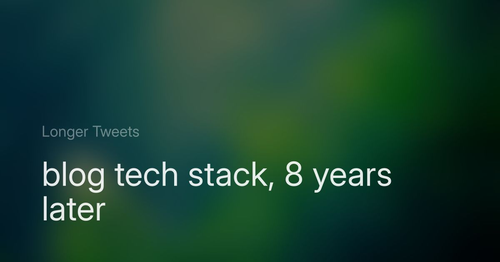
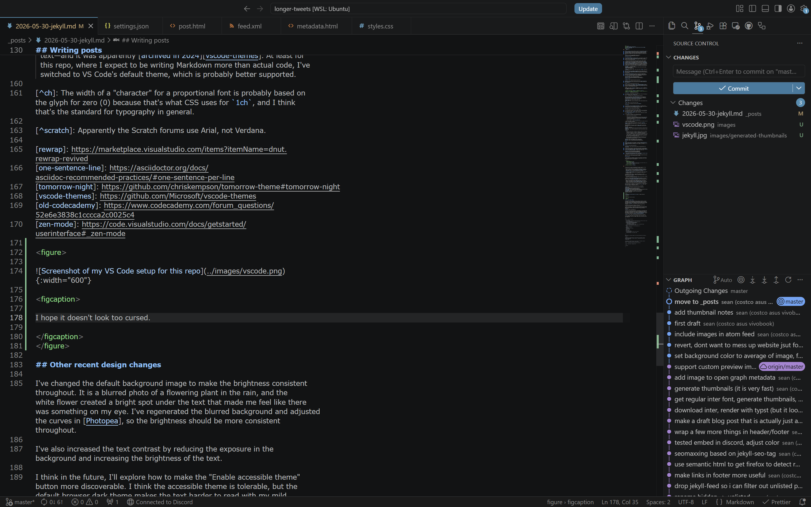
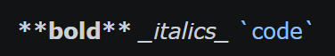
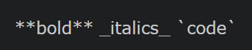

Recently, I made a thing that updates my friends in Discord whenever someone in [our webring][webring] releases a new blog post, by [scraping our RSS/Atom feeds][rss]. Because I'm expecting an actual audience now—and these people _know_ me—I've been working on some miscellaneous updates to my blog, and I'd like to give an update on the current state of my blog's tech stack after 8 years.

[rss]: https://github.com/pink10000/ringfairy/pull/18
[webring]: https://pink10000.github.io/ringfairy/

## Switching to Jekyll

In my [initial post about the blog][first-post], I described how I used a Node.js build script to update my blog. However, three years after, in 2021, I decided to switch my blog to [Jekyll]. The reasons for this switch have been lost to time, but my best guess is:

- I got too lazy to have to run a build script every time I made a change.
- The repo's file tree was getting increasingly long because every post's generated HTML was in its own folder at the top level of the repo.[^gh-pages]
- Having any number of npm dependencies was annoying because [I kept getting Dependabot notifications][dependabot]—I hadn't yet realized I could turn those off. Plus, every Markdown feature I wanted had to be a separate npm dependency.
- Having a build script offered flexibility, but in general it's a pain to maintain scripts over many years because I end up having to re-figure out how everything works, my coding styles change, and dependencies become abandoned.

[first-post]: ../creating-this-blog/
[dependabot]: https://github.com/SheepTester/longer-tweets/issues?q=is%3Apr+author%3Aapp%2Fdependabot
[jekyll]: https://jekyllrb.com/

[^gh-pages]: For whatever reason, I wasn't able to get `gh-pages` working with my build script back then.

Some of these issues can nowadays be mitigated by using a GitHub workflow, but [that wasn't yet an option][gh-actions-pages] back when I made the switch to Jekyll. Back then, Jekyll was the only static site generator natively supported by GitHub Pages.

[Switching to Jekyll][jekyll-pr] turned out to be fairly straightforward because my build script had ultimately been reimplementing Jekyll's features from scratch, like Markdown rendering, code highlighting, and templating, so not too many changes were needed to my posts and templates.

[gh-actions-pages]: https://github.blog/changelog/2022-07-27-github-pages-custom-github-actions-workflows-beta/
[jekyll-pr]: https://github.com/SheepTester/longer-tweets/pull/4

## Jekyll features

[kramdown]: https://kramdown.gettalong.org/syntax.html

Despite the lack of arbitary scripting, Jekyll and its [plugins supported by GitHub Pages][plugins] offer far more than just basic Markdown rendering and HTML templating.

[plugins]: https://pages.github.com/versions.json

Jekyll, by default, uses [Kramdown's flavor of Markdown][kramdown]. Recently, I discovered that Kramdown introduces [several Markdown features][test-syntax] not seen in GitHub-flavored Markdown, including "inline attribute lists," which allows you to syntax highlight inline code:

```md
Minifiers often convert `undefined`{:.language-js} to `void 0`{:.language-js}, even though they could just declare a valueless variable once (e.g. with `var u`{:.language-js}) and reuse it.
```

> Minifiers often convert `undefined`{:.language-js} to `void 0`{:.language-js}, even though they could just declare a valueless variable once (e.g. with `var u`{:.language-js}) and reuse it.

[test-syntax]: ../test/#kramdown-syntax-testing

I've retroactively applied this to all previous posts, and my CTF writeups now have new splashes of color ([example][ctf]).

[ctf]: ../ctf/#appendix-how-i-created-my-payload-for-symcalcjs

Jekyll also has a plugin, [Jekyll Feed][jekyll-feed], that can generate an [Atom feed][feed][^atom] for the posts in my blog. I've since dropped the plugin and [copied the template they use][feed-template] so I can have full customizability over it without needing to read their docs.

[jekyll-feed]: https://github.com/jekyll/jekyll-feed
[feed]: ../feed.xml
[feed-template]: https://github.com/SheepTester/longer-tweets/blob/master/feed.xml

[^atom]: [Atom] is like a newer version of RSS.

[atom]: https://en.wikipedia.org/wiki/Atom_(web_standard)

## Commenting

I was inspired by [Matt's Minesweeper][minesweeper] in his GitHub profile readme, which uses a prefilled GitHub issue link and a GitHub Actions workflow to let anyone persist their Minesweeper changes to the repo.

[minesweeper]: https://github.com/mtfn/mtfn#readme

The comments system on my website uses a similar setup:

1. At the bottom of each post, "Write a comment" links to a pre-filled GitHub issue that stores the post ID in the issue title and body. It also selects an issue template that adds a `comment` label to the issue.

1. A [GitHub workflow][workflow] runs when an issue is created, and it checks for the `comment` label.

1. If the issue is a comment, it runs a Node script that,
   1. Extracts the post ID from the issue title or body.

   1. Renders the issue body to Markdown.

      This essentially reintroduces a Markdown build script back into my blog, but because I'm injecting untrusted user input into my blog[^md-xss], I felt that it was better to store the generated HTML in my repo rather than letting Jekyll render it.

   1. Adds the comment to a [YAML file][comments-yml].

1. The workflow pushes the changes, which in turn closes the original issue and triggers a GitHub Pages deployment.

The entire comments YAML file is available in Jekyll under `site.data.comments`, so my post page template uses it to render the comments under the corresponding post.

While the comments feature hasn't seen much usage, I ended up pulling the implementation out to a separate project, my [guestbook], which did receive more usage.

[guestbook]: /guestbook/
[workflow]: github.com/SheepTester/longer-tweets/blob/master/.github/workflows/comment.yml
[comments-yml]: https://github.com/SheepTester/longer-tweets/blob/master/_data/comments.yml

[^md-xss]:
    Rendering untrusted input as Markdown is generally unsafe for two reasons:

    - Markdown is essentially a [superset of HTML][md-html]. Users can easily inject arbitary code with a `<script>`{:.language-html} tag because [`<script>`{:.language-html} tags are explicitly valid Markdown][md-script].

    - YAML frontmatter is a commonly supported Markdown extension, but parsing untrusted YAML is also generally unsafe. With some parsers, parsing YAML [can lead to remote code execution][yaml-rce].

    Both unsafe features are enabled when rendering my blog because, well, I trust my blog posts, but they should not be enabled for the untrusted comments people can post under my blog.

[md-html]: https://spec.commonmark.org/0.31.2/#html-blocks
[md-script]: https://spec.commonmark.org/0.31.2/#example-170
[yaml-rce]: https://ctf.support/web/python/yaml-deserialization/

## SEO

Similar to what I did for the Atom feed, I copied the [Jekyll SEO Tag plugin's template][seo-template] and customized it for my blog. The template is allegedly battle-tested for SEO[^seo], but this change is too recent for me to confirm.

[^seo]: SEO = search engine optimization

[seo-template]: https://github.com/jekyll/jekyll-seo-tag/blob/master/lib/template.html

I also wanted to add support for Open Graph preview images to my blog posts, but most of my blog posts don't need or have any images. I decided to generate a default preview image using [Typst CLI][typst-cli], which is what [Cargo uses for its preview images][cargo-typst]. I think it looks pretty nice.

[typst-cli]: https://typst.app/open-source/#download
[cargo-typst]: https://blog.rust-lang.org/2025/07/11/crates-io-development-update-2025-07/#opengraph-images

{:width="800"}

Unfortunately, this requires me to run a build command to generate the preview image, so in a way, I've circled back where I started.

## Writing posts

I author these posts in Markdown in VS Code, but I personally find monospace prose difficult to read. Since VS Code supports proportional fonts, I've set the following settings for this workspace:

```jsonc
{
  "[markdown]": {
    "editor.wordWrapColumn": 80,
    "editor.wordWrap": "bounded",
    // This font reminds me of early 2010s websites, like Scratch forums, so I
    // think it's the most legible sans serif font
    "editor.fontFamily": "Verdana"
  },
  "workbench.colorTheme": "Dark 2026"
}
```

<figure markdown="1">

{:width="800"}

<figcaption markdown="1">

I hope it doesn't look too cursed.

</figcaption>
</figure>

- I set the text to wrap at 80 characters[^ch] because long lines of text, especially for a more dense font like Verdana, are hard to read.

  This also reduces the need for me to manually wrap text in the Markdown source. In the past, I've tried wrapping text with [Rewrap], but the diffs become messy, so then I tried [writing one phrase or sentence per line][one-sentence-line], but I found it affected my writing style.

  [VS Code's zen mode][zen-mode] could work for this, but I don't want to have to explicitly switch in and out of it, and apparently its width is not configurable.

- As alluded to in the comment, I chose Verdana because it's a bland, inoffensive font that I'm used to reading on older-designed forums, like Old Reddit and Hacker News.[^scratch]

  One downside of proportional fonts is that spaces are very narrow, so nested lists are even more difficult to follow.

- Normally, I use the [Tomorrow Night theme][tomorrow-night] for code, which is also the color scheme used on this blog, because I grew up with it as the default scheme on [Codecademy][old-codecademy], where I first learned to code.

  However, VS Code's built-in Tomorrow Night theme doesn't seem to be as featureful for Markdown—it doesn't highlight bold, italic, or inline code text—and it was apparently [archived in 2024][vscode-themes]. At least for this repo, where I expect to be writing more Markdown than actual code, I've switched to VS Code's default theme, which is probably better supported.

  | Dark 2026                                                                                              | Tomorrow Night                                                                                           |
  | ------------------------------------------------------------------------------------------------------ | -------------------------------------------------------------------------------------------------------- |
  |  |  |

[^ch]: The width of a "character" for a proportional font is probably based on the glyph for zero (0) because that's what CSS uses for `1ch`, and I think that's the standard for typography in general.

[^scratch]: Apparently the Scratch forums use Arial, not Verdana.

[rewrap]: https://marketplace.visualstudio.com/items?itemName=dnut.rewrap-revived
[one-sentence-line]: https://asciidoctor.org/docs/asciidoc-recommended-practices/#one-sentence-per-line
[tomorrow-night]: https://github.com/chriskempson/tomorrow-theme#tomorrow-night
[vscode-themes]: https://github.com/Microsoft/vscode-themes
[old-codecademy]: https://www.codecademy.com/forum_questions/52e6e3838c1cccca2c0025c4
[zen-mode]: https://code.visualstudio.com/docs/getstarted/userinterface#_zen-mode

## Other recent design changes

I've changed the default background image to make the brightness more consistent throughout. It is a blurred photo of a flowering plant in the rain, and the white flower created a bright spot under the text that made me feel like there was something in my eye. I've regenerated the blurred background and adjusted the curves in [Photopea] to dim the bright spot.

I've also increased the text contrast by dimming the background and making the text brighter.

I think in the future, I'll explore how to make the "Enable accessible theme" button more discoverable. I think the accessible theme is tolerable, but the default browser dark theme makes the text harder to read with my mild astigmatism.

[photopea]: https://www.photopea.com/

In iOS 26, the new Safari design doesn't allow websites to put anything under the browser UI, even though it shows the rest of the page content under it as you scroll, resulting in an ugly black background at the top and bottom edges of the website. I don't think I'll bother addressing this for now until iOS Safari fixes itself, e.g. by accepting `viewport-fit=cover`, which ironically Apple themselves [invented for the iPhone X][iphone-x].

[iphone-x]: https://webkit.org/blog/7929/designing-websites-for-iphone-x/

I've also added semantic HTML to the blog pages, which allow browsers like Firefox and Safari to detect and suggest reader mode as an alternative to the accessible theme.

<!--

things i want to talk about:

- why i switched
  - https://github.com/SheepTester/longer-tweets/pull/4 "That way I don't have to build thingsmanually"
  - https://github.com/SheepTester/longer-tweets/tree/d475e39aaf46b367fdbd7ea115d9bf330507eb99
    - maybe a folder per post got messy
    - and dependabot is annoying
  - https://sheeptester.github.io/longer-tweets/creating-this-blog/
    - not sure why gh-pages didn't work
- jekyll
  - special kramdown syntax: inline highlighting, etc
  - feed
  - drafts and unlisted
- commenting
  - github issues and actions
  - jekyll data
- vscode settings
  - font
  - color theme
- other design changes
  - new blurred background, better text contrast
    - ios 26 caveat
  - reader mode support with semantic HTML

-->

<!--
IALs allow me to annotate images with a width and height while sticking to Markdown's

```md

{:width="250"}
```

![Screenshot of Google Maps with a red airplane icon labelled 'Airport Authority Consulting' on Treasure Island.][test]

[test]: ../images/hide-seek-review/treasure-island.png

{:style="--width: 250; --height: 250"}

> test
> {:.test}

-->
