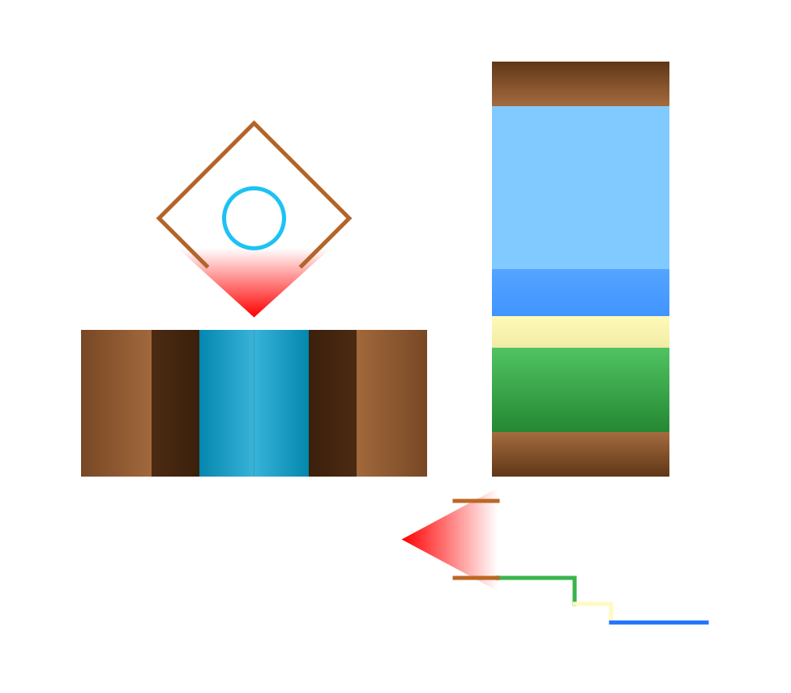
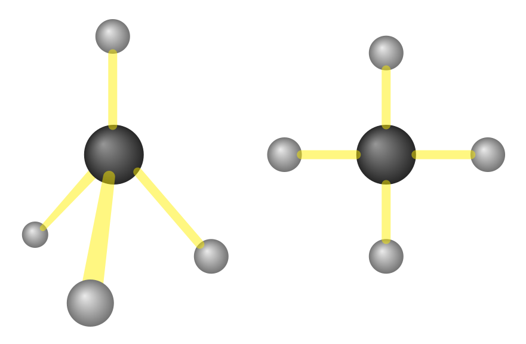
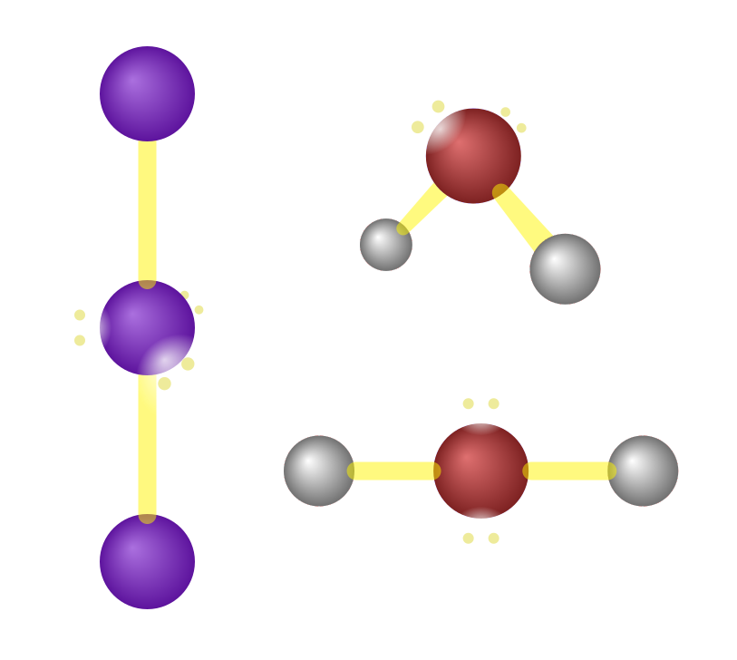

I was reminded about a statement I heard somewhere regarding [Flatland](https://en.wikipedia.org/wiki/Flatland), a book which I have not yet read, but I have heard of. I don't remember who said this---probably the author of the book---but they said that in Flatland, the characters couldn't have a digestive tube from their mouth to their anus because such would split their body into two separate pieces. However, I thought that a being could still be split into multiple pieces if some attraction held them together, like velcro. Our cells are semipermeable, according to biology class; perhaps the Flatland creatures could absorb nutrients somehow though selective pores in their membrane. I pondered a different style of cuisine for these nutrient-absorbing [unicellular organisms](https://en.wikipedia.org/wiki/Valonia_ventricosa). This wouldn't be very different from Agar.io.

I wondered if gravity could work in Flatland. I believe in Flatland, the characters move around as if there was no gravity, so one could imagine that what they saw was like a simple raycaster maze with walls of infinite height. However, I think gravity could still work. [There are 2D gravity simulations, after all.](https://moomath.com/programs/0005/) Planets would just be circles, and the creatures on it would exist as if the world was a side-scrolling game (think Mario, Terraria, Blockheads).

*How creatures in a 2D world would see (left) with no gravity (like Flatland) or (right) with gravity. (Not exactly to scale.)*

I wasn't sure how they would deal with walls though. I wondered if perhaps simulating evolution could help. Then I was reminded of something else.

## 2D chemistry

Would only two spatial dimensions have any implications on molecular structure? Probably. However, there would still be two electron spin states, and the orbital classes would probably hold the same number of electron pairs (*s* orbitals hold 1 pair, *p* holds 3, *d* holds 5, and so on for each odd number); I don't think they're dependent on a third axis. Electrons can still do probability clouds in 2D, though the orbital arrangements will probably look a bit different. Thus, I think in 2D, all the atoms will be the same.

However, I think molecular shapes would be rather different. VSEPR is based on the idea that bonds and lone pairs repel each other, so they distribute themselves as far away from each other as possible. In 2D, bonds and lone pairs can only distribute themselves evenly around a circle---this might put stress on an atom with many bonds and lone pairs because they would all be cramped around the molecule, so larger atoms might form less stable molecules, I'm not sure.

*$\text{CH}_4$ in (left) 3D and (right) 2D. In three dimensions, a tetrahedron spreads four points the furthest apart from each other. When limited to two dimensions, the points will arrange in a square.*

However, I think this would be a big deal because water might not be polar anymore. In 3D, the bonds and lone pairs would have distributed themselves in a tetrahedral shape because that spreads them as far apart from each other. In 2D, they would arrange themselves around the corners of a square. Water has two bonds and two lone pairs. I think the bonds would be on opposite sides of each other rather than forming a right angle because that's how molecules with 3 lone pairs and 2 bonds behave in 3D: the bonds stay on opposite sides of each other, and the shape is linear (an example of such a shape would be the [triiodide ion](https://en.wikipedia.org/wiki/Triiodide)).

*Left: a 3D linear shaped molecule with 2 bonds and 3 lone pairs. Top right: $\text{H}_2\text{O}$ has a bent shape in 3D because with four orbitals, they follow the tetrahedral shape. Bottom right: $\text{H}_2\text{O}$ in 2D probably has the bonds on either side, making it linear.*

Thus, I think water would be linear and thus nonpolar (its polar bonds would cancel each other out), which would have a large impact on its properties. It would probably be a gas at room temperature, like methane ($\text{CH}_4$), and it won't experience surface tension. In our world, plants rely on that property for transpiration, which allows water evaporating from its leaves to pull up water from its roots. It also can't dissolve ionic compounds, though it would be able to dissolve oil. Fortunately, ammonia ($\text{NH}_3$) and hydrofluoric acid ($\text{HF}$) would still be polar, so plants could perhaps use one of those instead and adapt accordingly. The difference in electronegativity between the oxygen and hydrogen atoms in water would still be the same, so the oxygen would still attract more of the electrons in its covalent bond with hydrogen towards itself, making the H+ slightly easier to pull apart when dissociating. This means water (and other compounds) would still have the same acid dissociation constant of $10^{-7}$ and thus a pH of $7$.

However, I don't think water would be the main solvent anymore since it can't even dissolve salts. I don't know much about ammonia, but it might be a viable alternative. It is amphoteric: as an acid, it can donate a proton and become NH2-, or more likely, as a base, it can accept a proton and become NH4+. This could be like $\text{OH}^-$ and $\text{H}_3\text{O}^+$ for water. If this is the case, then the neutral pH would probably be a bit higher because ammonia is more basic than water, but I'm not entirely sure.

As a final note, I don't think nitrogen gas can exist in 2D. In 3D, a triple bond can be done by having the first sigma bond be between the atoms, and the other two pi bonds around it, as shown in the figure. There's no space left for another pi bond, which is why quadruple bonds don't really exist between nonmetals. In 2D, there wouldn't be space for a second pi bond, so I don't think a triple bond would be as common. However, this might suggest that in 4D, a quadruple bond between two carbon atoms might be possible.

*Top: a triple bond's orbitals. The pink orbital (the third bond, or second pi bond) is perpendicular to the purple orbital (the second bond, or the first pi bond) in 3D space, so it cannot be formed in a plane. Bottom: a double bond's orbitals. This arrangement could work in a 2D plane as well.*

## Physics

A lot of things in physics---at least the parts of physics that I have learned---can be modelled in two dimensions, so I don't think two-dimensional physics would be very different. However, one thing to note is that while things can rotate, their centre axis can't attach to anything, so axles aren't a thing.

## Biology

It's been a while since I've learned biology, but I still remember that the mitochondria is the powerhouse of the cell. They would still exist in 2D; a star at the centre of their solar system could provide light energy to the mitochondria, and through some processes that I have forgotten but remember seeing 2D models of (so they can occur in 2D), the energy is stored in glucose.
I'm pretty sure most of our cells can exist in the same way, though DNA would have to take up more space since you can't really fold it over itself in 2D.

## Other things

A writing system in Flatland would probably look like morse code. If there is gravity, then it would be a vertical script, which is pretty cool.

Having an extra eye doesn't necessarily allow us to see in another dimension. Although having only one eye seems like you're seeing in 2D and having two eyes allows us to see in 3D, our second eye only gives us the ability to perceive depth. We can't see through walls with our second eye, and a third eye won't make you see things four-dimensionally. Thus, a 2D world would still require two eyes to perceive depth, though in the end, creatures would still see things in 1D.

A lot of things I've mentioned here might seem like limitations, but this also suggests that compared to a four-dimensional world, our world has many limitations due to a lack of a fourth spatial axis. Perhaps multidirectional ball-shaped wheels are possible in 4D.
