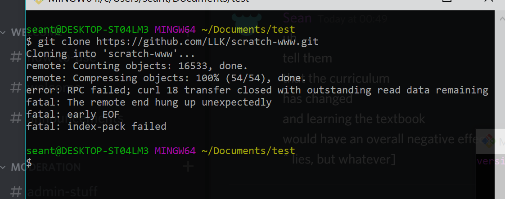
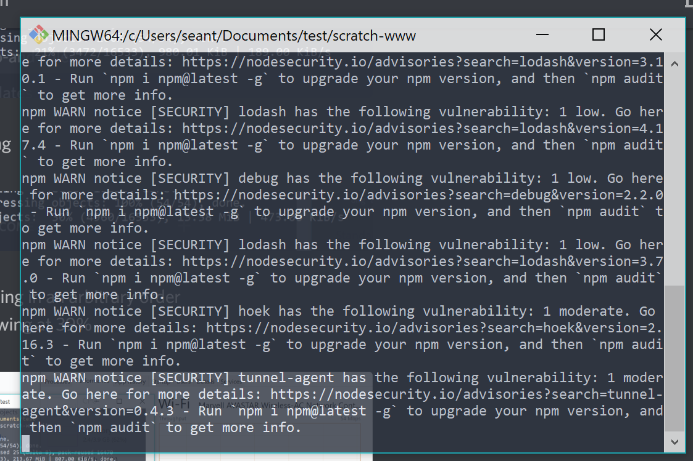
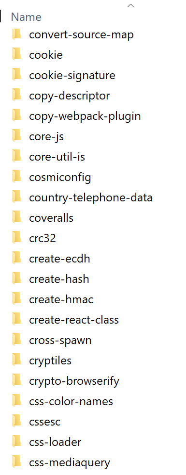
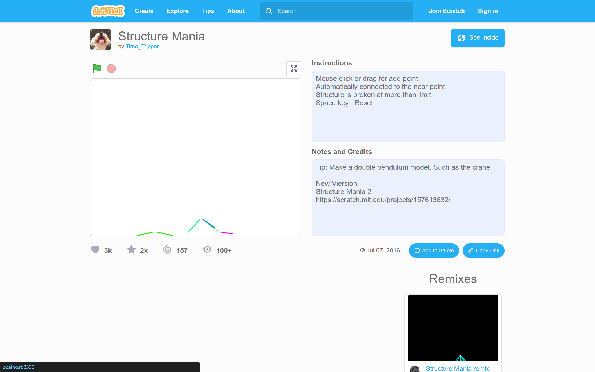

One day, I decided to see if I could see the progress on the project page redesign.

It shouldn't be too hard, I thought. I just had to clone their repository and follow their very helpful and detailed steps to build it somehow. And it would have worked. But there were a few problems.

# cloning the repository
```
git clone https://github.com/LLK/scratch-www.git
```
I did, after making a `test` folder in my Documents (because I didn't intend on keeping it; I imagined it would be pretty big in terms of file size).

It didn't take too long for it to reach 22%, and then it stopped. It was probably the bad internet, I thought, since we were on vacation.

And then it failed.



So I tried again multiple times, and it still didn't work. As it was loading, I decided to try out Vim, and every time I checked back on it, it had failed. Oh well.

After a lot of time, I decided to switch to my mom's apparently unlimited data plan thing, which was a lot faster. The cloning took quite a long time at 39% (probably a large file?), but it finished with no problems. Yay!

# following their very helpful steps
## getting the packages
The [`scratch-www`](https://github.com/LLK/scratch-www) README said to run
```
npm install
```
which I did. It took a while, and Node outputted a bunch of security vulnerabilities that didn't concern me much at this point in time.



Now I see why people joke about the sheer amount of dependencies in a single Node project.



## building the things
Then they told me to run
```
npm run build
```
and so I did. Amongst the errors, there was:
```
'make' is not recognized as an internal or external command,
operable program or batch file.
```
I tried running the next step (the README said building wasn't necessary), but the same error arose.

It turned out I didn't have some `make.exe` thing, which Unix system things have but Windows 10 doesn't. There are ways to get it, but it's rather complicated and would require too many (more than 1) administrator password, I imagined.

At this point I decided that doing this was hopeless. It's impossible to do this on a Windows, I thought.

Suddenly, after some more Googling, I found a [`make` Node package](https://www.npmjs.com/package/make). It looked promising, so I installed it.

It seemed to add the `make` command to the bash thingy.
```
npm run build
```
worked! It didn't seem to do anything, so I continued with the steps.

## running the things
I ran
```
make translations
npm start
```
and an error came up. As I expected, the Node `make` package wasn't perfect.

However, I found a `Makefile` file which seemed to define the "functions" that the commands called.
```makefile
translations:
	./bin/get-localized-urls localized-urls.json
	./bin/build-locales node_modules/scratchr2_translations/www/translations intl
```
```makefile
start:
	$(NODE) ./dev-server/index.js
```
I tried running each line separately, and surprisingly, that worked.
```
./bin/get-localized-urls localized-urls.json
./bin/build-locales node_modules/scratchr2_translations/www/translations intl
node ./dev-server/index.js
```
Scratch build successfully. Non-redesigned pages gave an error, but I ignored them thinking they wouldn't be a big deal.

# fixing the project page
There was just one problem: when I tried to open a preview project page (at `/preview/115618276/`), it was empty. I would expect that if they were working on the project pages (as evidenced by the issues), it would work here too (there was only one branch).

The console gave a 404 error trying to GET `/session/`, which I assumed was a non-redesigned page. Thus, I needed to somehow make non-redesigned pages work.

The README had something to say about a "fallback," which I assumed was relevant.

> Blah `FALLBACK=https://scratch.mit.edu` blah blah blah blah blah blah blah blah blah blah blah blah blah blah blah.

I reran the last command but with the `FALLBACK` thing appended to it. Surprisingly there were no errors:
```
node ./dev-server/index.js FALLBACK=https://scratch.mit.edu
```
However, it still didn't work.

Looking back at the `Makefile` file from earlier, it seemed these "environment variables" are put before the command name, a foreign concept to me.
```makefile
NODE= NODE_OPTIONS=--max_old_space_size=8000 node
```
Nonetheless, I tried putting the `FALLBACK` thing before `node`, and surprisingly, there still were no errors.
```
FALLBACK=https://scratch.mit.edu node ./dev-server/index.js
```
And it worked! Yay.

# the result
Here's the long-awaited project page redesign:

*(not included: the studios sidebar section)*

Changes I see:
- the view count is capped at 100 (similar to studio projects). I knew this already from the issues
- profile picture of the creator
- no more last changed date (or did they remove the shared date?)
- a copy link button, which I'd assume would be very helpful

Of course, it may look like they're removed the remix tree, report button, share button, comment section, etc, but because they're still working on it, I wouldn't assume their removal this early.

# what I learned from this experience
Nothing lol

jk I learned that there really is a lot of Node dependencies in a Node project. Yikes!
